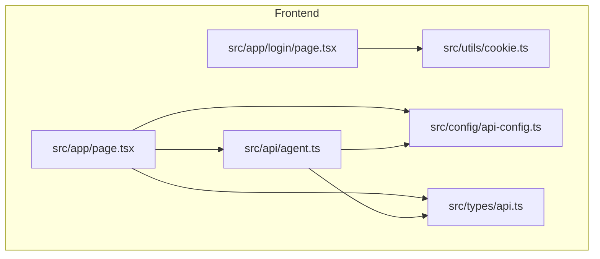
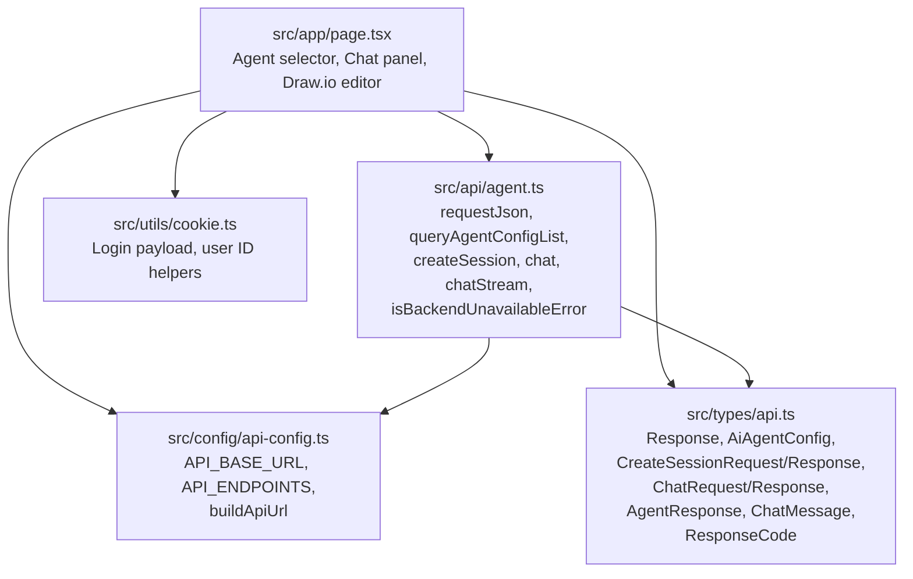
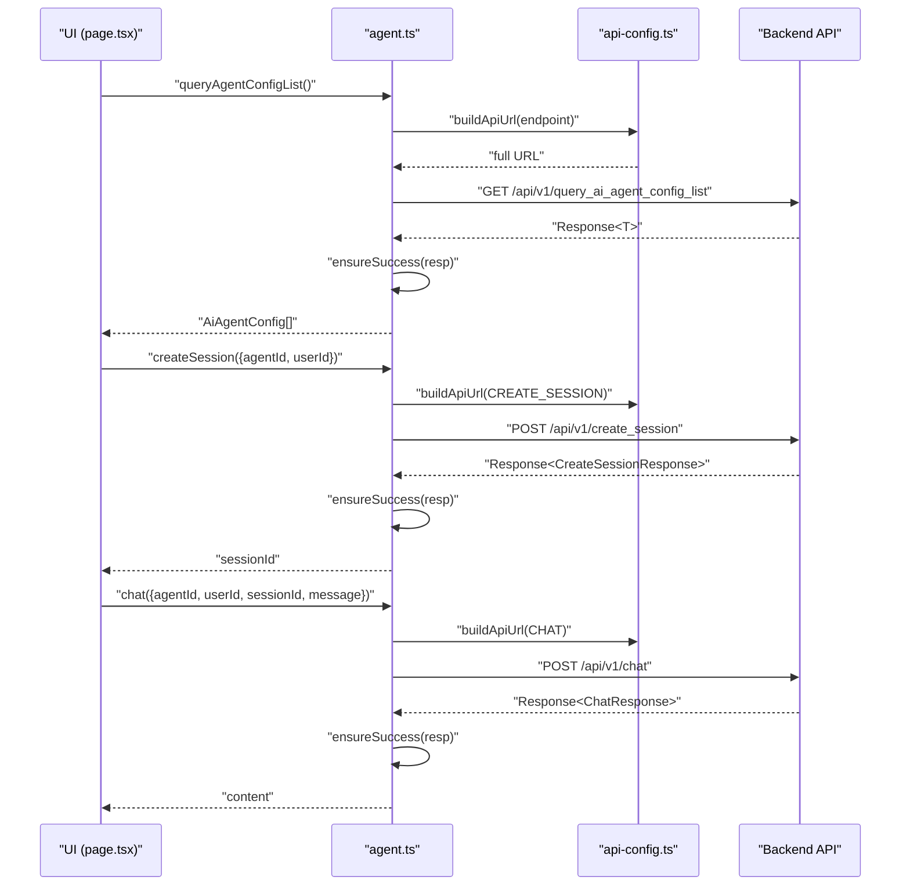
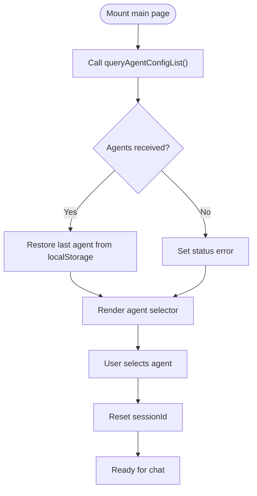
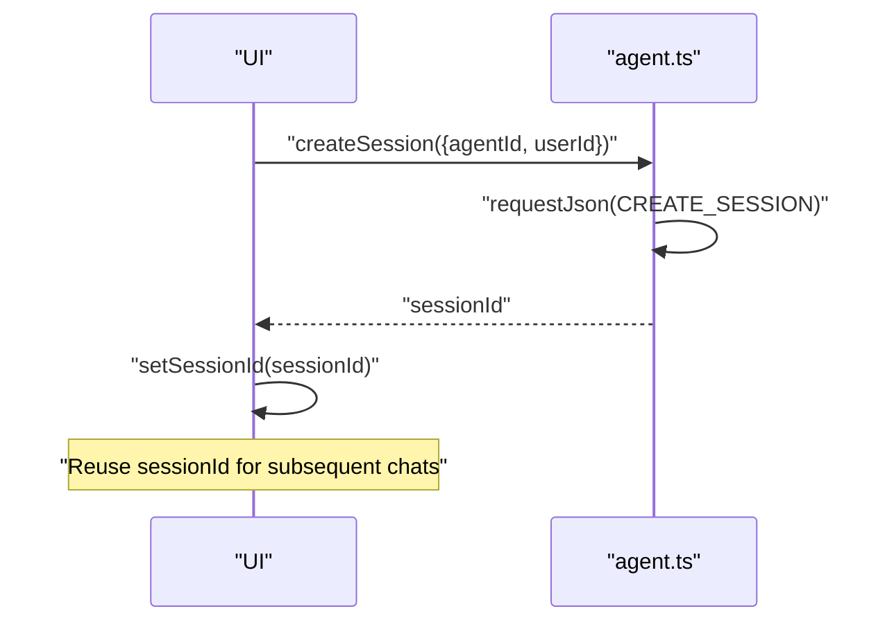
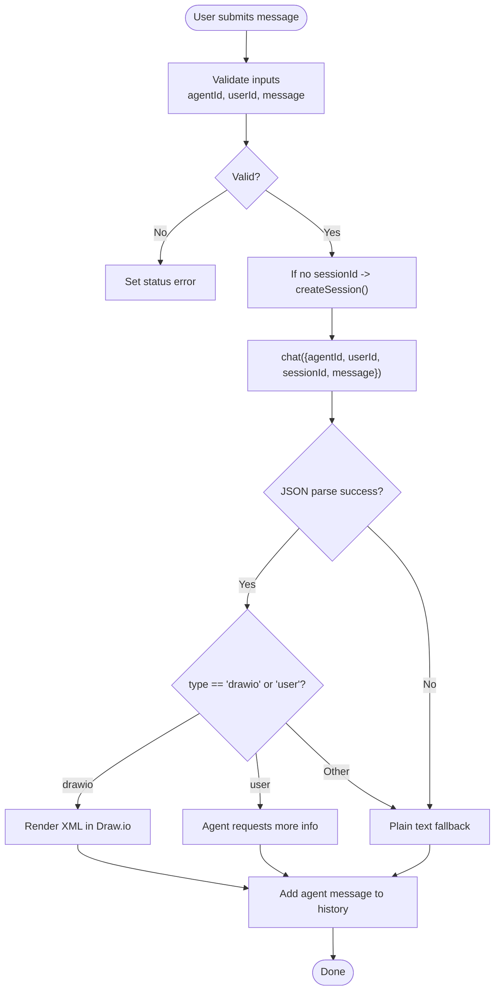
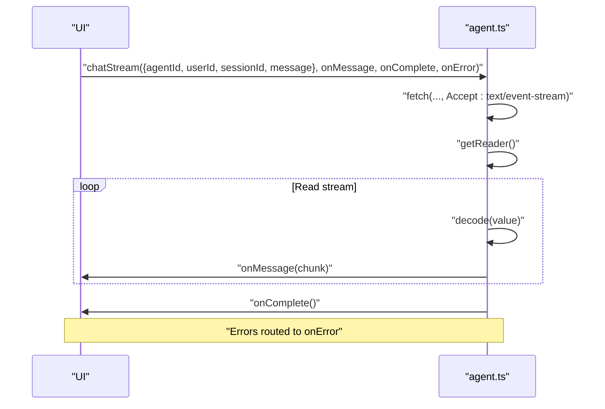
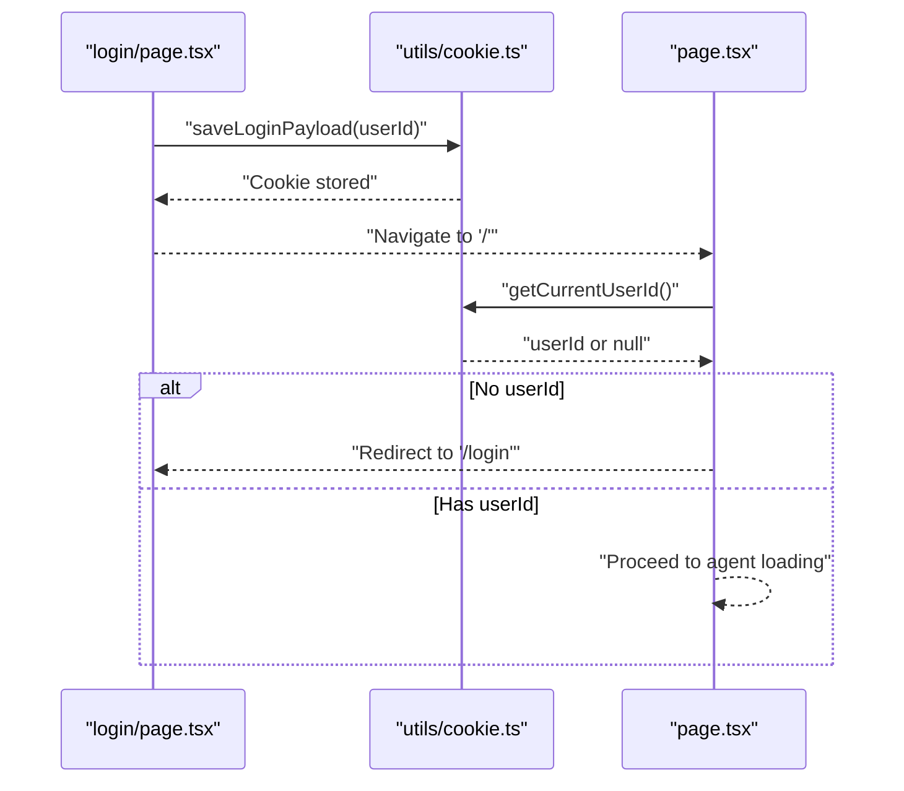
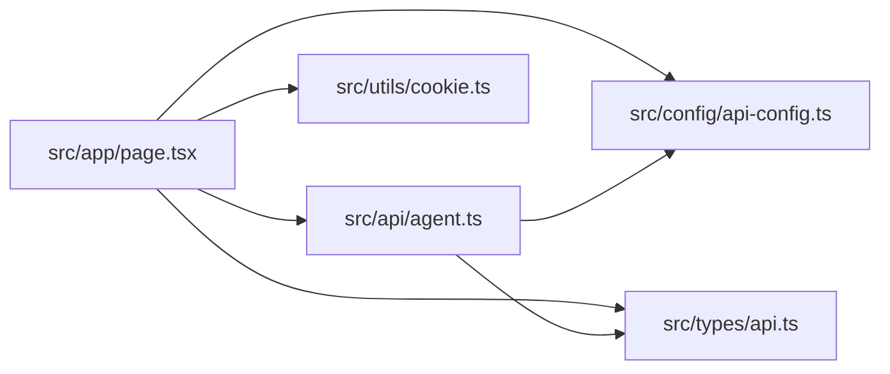

# AI Agent Integration

<cite>
**Referenced Files in This Document**
- [README.md](file://README.md)
- [AGENTS.md](file://AGENTS.md)
- [src/api/agent.ts](file://src/api/agent.ts)
- [src/config/api-config.ts](file://src/config/api-config.ts)
- [src/types/api.ts](file://src/types/api.ts)
- [src/app/page.tsx](file://src/app/page.tsx)
- [src/app/login/page.tsx](file://src/app/login/page.tsx)
- [src/utils/cookie.ts](file://src/utils/cookie.ts)
- [src/app/layout.tsx](file://src/app/layout.tsx)
- [package.json](file://package.json)
</cite>

## Table of Contents

1. [Introduction](#introduction)
2. [Project Structure](#project-structure)
3. [Core Components](#core-components)
4. [Architecture Overview](#architecture-overview)
5. [Detailed Component Analysis](#detailed-component-analysis)
6. [Dependency Analysis](#dependency-analysis)
7. [Performance Considerations](#performance-considerations)
8. [Troubleshooting Guide](#troubleshooting-guide)
9. [Conclusion](#conclusion)
10. [Appendices](#appendices)

## Introduction

This document describes the AI Agent Integration system implemented in the frontend. It covers how agents are discovered
and selected, how sessions are created and managed, and how chat interactions are handled with support for both
non-streaming and streaming responses. It also documents the API service layer, request/response handling, error
management, and real-time communication patterns. Practical examples illustrate agent selection, chat message
processing, and handling different response types from AI services. Finally, it addresses performance considerations,
retry mechanisms, and error recovery strategies.

## Project Structure

The project is a Next.js application with a focused AI agent integration UI. Key areas:

- API service layer: centralized HTTP calls and response parsing
- Configuration: base URL and endpoint constants
- Types: shared request/response models and enums
- Application pages: login and main dashboard with agent selector, chat panel, and Draw.io editor
- Utilities: cookie helpers for login persistence

**Diagram sources**

- [src/app/login/page.tsx:1-173](file://src/app/login/page.tsx#L1-L173)
- [src/app/page.tsx:1-600](file://src/app/page.tsx#L1-L600)
- [src/api/agent.ts:1-191](file://src/api/agent.ts#L1-L191)
- [src/config/api-config.ts:1-28](file://src/config/api-config.ts#L1-L28)
- [src/types/api.ts:1-74](file://src/types/api.ts#L1-L74)
- [src/utils/cookie.ts:1-111](file://src/utils/cookie.ts#L1-L111)

**Section sources**

- [README.md:1-37](file://README.md#L1-L37)
- [package.json:1-28](file://package.json#L1-L28)

## Core Components

- API service module: encapsulates HTTP calls, JSON parsing, success checks, and streaming
- Configuration module: centralizes base URL and endpoint constants
- Type definitions: shared models for agent configs, sessions, chat requests/responses, and UI messages
- Application pages: login page for user identity and main page for agent selection, chat, and diagram rendering
- Cookie utilities: manage login payload persistence

Key responsibilities:

- Agent discovery: fetch agent configurations and present them in a selector
- Session management: create sessions per agent and user, reuse session IDs during a chat session
- Chat processing: send messages, parse JSON responses, and render either plain text or Draw.io diagrams
- Streaming: optional streaming mode for incremental updates
- Error handling: distinguish backend availability errors and surface actionable messages

**Section sources**

- [src/api/agent.ts:1-191](file://src/api/agent.ts#L1-L191)
- [src/config/api-config.ts:1-28](file://src/config/api-config.ts#L1-L28)
- [src/types/api.ts:1-74](file://src/types/api.ts#L1-L74)
- [src/app/page.tsx:1-600](file://src/app/page.tsx#L1-L600)
- [src/utils/cookie.ts:1-111](file://src/utils/cookie.ts#L1-L111)

## Architecture Overview

The system follows a layered architecture:

- UI layer: Next.js pages and components
- Service layer: API service module handles HTTP requests and response parsing
- Configuration layer: endpoint constants and base URL
- Types layer: shared TypeScript interfaces and enums
- Persistence layer: cookie utilities for login state

**Diagram sources**

- [src/app/page.tsx:1-600](file://src/app/page.tsx#L1-L600)
- [src/api/agent.ts:1-191](file://src/api/agent.ts#L1-L191)
- [src/config/api-config.ts:1-28](file://src/config/api-config.ts#L1-L28)
- [src/types/api.ts:1-74](file://src/types/api.ts#L1-L74)
- [src/utils/cookie.ts:1-111](file://src/utils/cookie.ts#L1-L111)

## Detailed Component Analysis

### API Service Layer

The API service module centralizes HTTP interactions and response handling:

- requestJson: builds full URLs, performs fetch, parses JSON, and throws on non-OK responses
- ensureSuccess: validates response code and extracts data
- queryAgentConfigList: retrieves agent configurations
- createSession: creates a session bound to agent and user
- chat: sends a non-streaming chat message and returns content
- chatStream: streams server-sent events and invokes callbacks for each chunk
- isBackendUnavailableError: detects network/CORS/unavailable backend errors

**Diagram sources**

- [src/api/agent.ts:75-113](file://src/api/agent.ts#L75-L113)
- [src/config/api-config.ts:24-27](file://src/config/api-config.ts#L24-L27)
- [src/types/api.ts:26-42](file://src/types/api.ts#L26-L42)

**Section sources**

- [src/api/agent.ts:17-191](file://src/api/agent.ts#L17-L191)
- [src/config/api-config.ts:6-27](file://src/config/api-config.ts#L6-L27)
- [src/types/api.ts:6-74](file://src/types/api.ts#L6-L74)

### Agent Discovery and Selection

- On mount, the main page loads agents and restores the last selected agent from local storage
- The agent selector dropdown lists available agents and triggers session reset on change
- Agent configurations include identifiers and descriptions for user selection

**Diagram sources**

- [src/app/page.tsx:53-85](file://src/app/page.tsx#L53-L85)
- [src/api/agent.ts:75-81](file://src/api/agent.ts#L75-L81)

**Section sources**

- [src/app/page.tsx:53-100](file://src/app/page.tsx#L53-L100)
- [src/api/agent.ts:75-81](file://src/api/agent.ts#L75-L81)

### Dynamic Agent Configuration Loading

- Endpoint: query_ai_agent_config_list
- Response model: array of AiAgentConfig with agentId, agentName, agentDesc
- UI integrates with agent selector and persists last selection

**Section sources**

- [src/config/api-config.ts:10-22](file://src/config/api-config.ts#L10-L22)
- [src/types/api.ts:13-18](file://src/types/api.ts#L13-L18)
- [src/app/page.tsx:58-78](file://src/app/page.tsx#L58-L78)

### Session Management

- Session creation: create_session with agentId and userId
- Session reuse: maintain sessionId during a chat session; reset when agent changes
- Session state displayed in chat header for transparency

**Diagram sources**

- [src/api/agent.ts:87-100](file://src/api/agent.ts#L87-L100)
- [src/app/page.tsx:144-153](file://src/app/page.tsx#L144-L153)

**Section sources**

- [src/api/agent.ts:87-100](file://src/api/agent.ts#L87-L100)
- [src/app/page.tsx:144-153](file://src/app/page.tsx#L144-L153)

### Chat Interface Implementation and Message History

- Message composition: user input captured, sanitized, and appended to history
- Message types: plain text, Draw.io diagram, or user-requested information
- Message rendering: distinct styles for user vs agent; typing indicators; timestamps; session IDs
- Preset prompts: contextual suggestions when chat is empty

**Diagram sources**

- [src/app/page.tsx:118-233](file://src/app/page.tsx#L118-L233)
- [src/types/api.ts:44-50](file://src/types/api.ts#L44-L50)

**Section sources**

- [src/app/page.tsx:118-233](file://src/app/page.tsx#L118-L233)
- [src/types/api.ts:58-68](file://src/types/api.ts#L58-L68)

### Real-Time Communication Patterns

- Non-streaming: chat returns a single content string
- Streaming: chatStream reads server-sent events, decodes chunks, and emits incremental updates
- Event loop: reads stream chunks, splits by newline, buffers partial lines, and dispatches callbacks

**Diagram sources**

- [src/api/agent.ts:120-176](file://src/api/agent.ts#L120-L176)

**Section sources**

- [src/api/agent.ts:120-176](file://src/api/agent.ts#L120-L176)

### Agent Configuration Types and Unified Interface

- AiAgentConfig: agentId, agentName, agentDesc
- CreateSessionRequest/Response: agentId, userId, sessionId
- ChatRequest/Response: agentId, userId, sessionId, message, content
- AgentResponse: type discriminator ("user" | "drawio") and content
- ChatMessage: UI model for rendering, including optional agentId/sessionId/type

**Section sources**

- [src/types/api.ts:13-68](file://src/types/api.ts#L13-L68)

### Login and Identity Management

- Login page captures user ID and stores it in a cookie payload
- Main page checks for existing login and redirects to login if missing
- Cookie utilities provide safe JSON parsing and formatting helpers

**Diagram sources**

- [src/app/login/page.tsx:13-36](file://src/app/login/page.tsx#L13-L36)
- [src/utils/cookie.ts:63-101](file://src/utils/cookie.ts#L63-L101)
- [src/app/page.tsx:37-51](file://src/app/page.tsx#L37-L51)

**Section sources**

- [src/app/login/page.tsx:1-173](file://src/app/login/page.tsx#L1-L173)
- [src/utils/cookie.ts:1-111](file://src/utils/cookie.ts#L1-L111)
- [src/app/page.tsx:37-51](file://src/app/page.tsx#L37-L51)

## Dependency Analysis

- UI depends on API service, configuration, types, and cookie utilities
- API service depends on configuration and types
- Configuration provides base URL and endpoints
- Types define the contract for all requests and responses

**Diagram sources**

- [src/app/page.tsx:1-600](file://src/app/page.tsx#L1-L600)
- [src/api/agent.ts:1-191](file://src/api/agent.ts#L1-L191)
- [src/config/api-config.ts:1-28](file://src/config/api-config.ts#L1-L28)
- [src/types/api.ts:1-74](file://src/types/api.ts#L1-L74)
- [src/utils/cookie.ts:1-111](file://src/utils/cookie.ts#L1-L111)

**Section sources**

- [src/app/page.tsx:1-600](file://src/app/page.tsx#L1-L600)
- [src/api/agent.ts:1-191](file://src/api/agent.ts#L1-L191)
- [src/config/api-config.ts:1-28](file://src/config/api-config.ts#L1-L28)
- [src/types/api.ts:1-74](file://src/types/api.ts#L1-L74)
- [src/utils/cookie.ts:1-111](file://src/utils/cookie.ts#L1-L111)

## Performance Considerations

- Network reliability: detect backend unavailability early to avoid retries and reduce wasted UI updates
- Streaming efficiency: stream decoding and incremental rendering minimize perceived latency
- UI responsiveness: disable inputs during sending, show typing indicators, and auto-scroll to latest messages
- Local caching: persist last agent selection to reduce repeated agent queries
- Endpoint reuse: reuse sessionId to avoid unnecessary session creation overhead

[No sources needed since this section provides general guidance]

## Troubleshooting Guide

Common issues and remedies:

- Backend unavailable: detect via isBackendUnavailableError and prompt checking API base URL
- Session creation failure: ensure agentId and userId are valid; verify backend endpoint availability
- Chat failures: inspect error messages and surface actionable status; consider retry logic for transient errors
- Streaming errors: ensure Accept: text/event-stream and handle reader errors gracefully

Operational tips:

- Verify NEXT_PUBLIC_API_BASE_URL environment variable
- Confirm agent endpoints exist and return expected JSON structure
- Monitor status bar messages for immediate feedback

**Section sources**

- [src/api/agent.ts:181-190](file://src/api/agent.ts#L181-L190)
- [src/app/page.tsx:69-78](file://src/app/page.tsx#L69-L78)
- [src/app/page.tsx:213-229](file://src/app/page.tsx#L213-L229)

## Conclusion

The AI Agent Integration system provides a cohesive frontend experience for agent discovery, session management, and
chat interactions. It supports both non-streaming and streaming responses, robust error handling, and a unified
interface for diverse agent behaviors. The modular design enables straightforward extension to additional agents and
response types.

[No sources needed since this section summarizes without analyzing specific files]

## Appendices

### Practical Examples

- Agent selection
    - Load agents on mount and restore last selection
    - Example path: [src/app/page.tsx:53-85](file://src/app/page.tsx#L53-L85)

- Chat message processing
    - Validate inputs, create session if needed, send chat, parse JSON response, and update message history
    - Example path: [src/app/page.tsx:118-233](file://src/app/page.tsx#L118-L233)

- Handling response types
    - Render Draw.io diagrams when type is "drawio"
    - Handle "user" type for agent-requested information
    - Fallback to plain text otherwise
    - Example
      path: [src/app/page.tsx:163-211](file://src/app/page.tsx#L163-L211), [src/types/api.ts:44-50](file://src/types/api.ts#L44-L50)

- Streaming capabilities
    - Establish SSE connection, decode chunks, and emit incremental updates
    - Example path: [src/api/agent.ts:120-176](file://src/api/agent.ts#L120-L176)

- Error recovery
    - Detect backend unavailability and show actionable status
    - Example
      path: [src/api/agent.ts:181-190](file://src/api/agent.ts#L181-L190), [src/app/page.tsx:73-75](file://src/app/page.tsx#L73-L75)