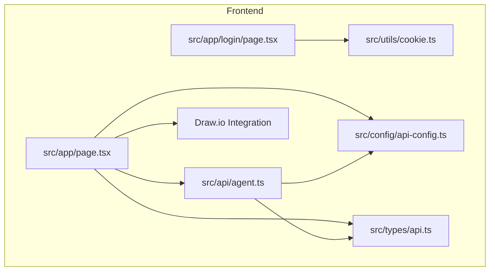
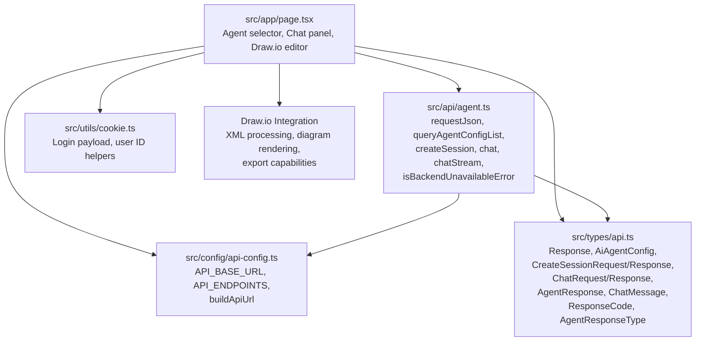
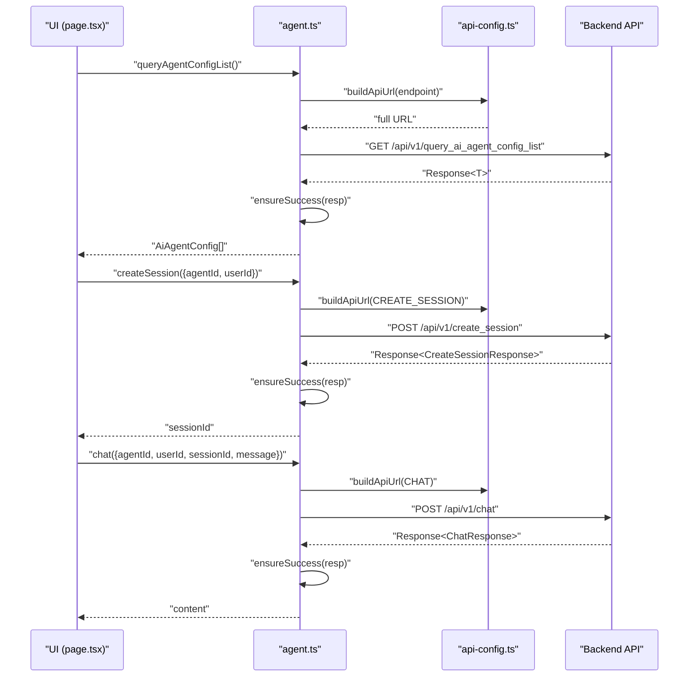
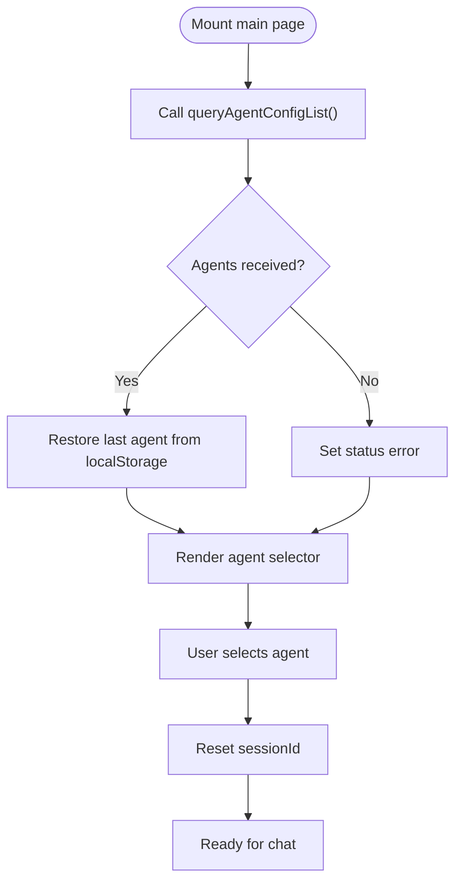
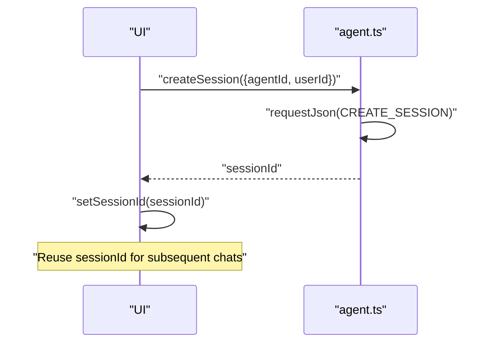
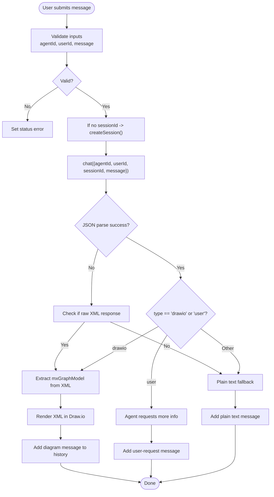
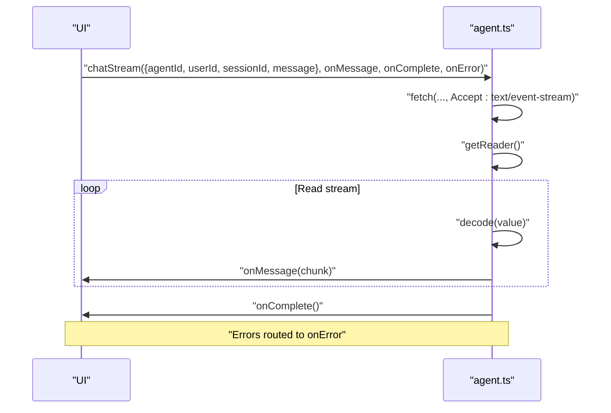
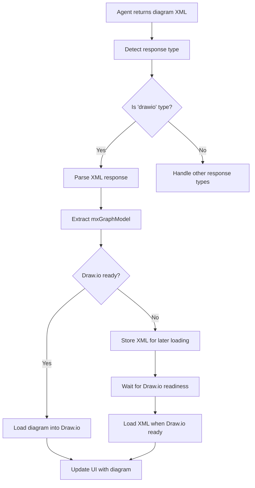
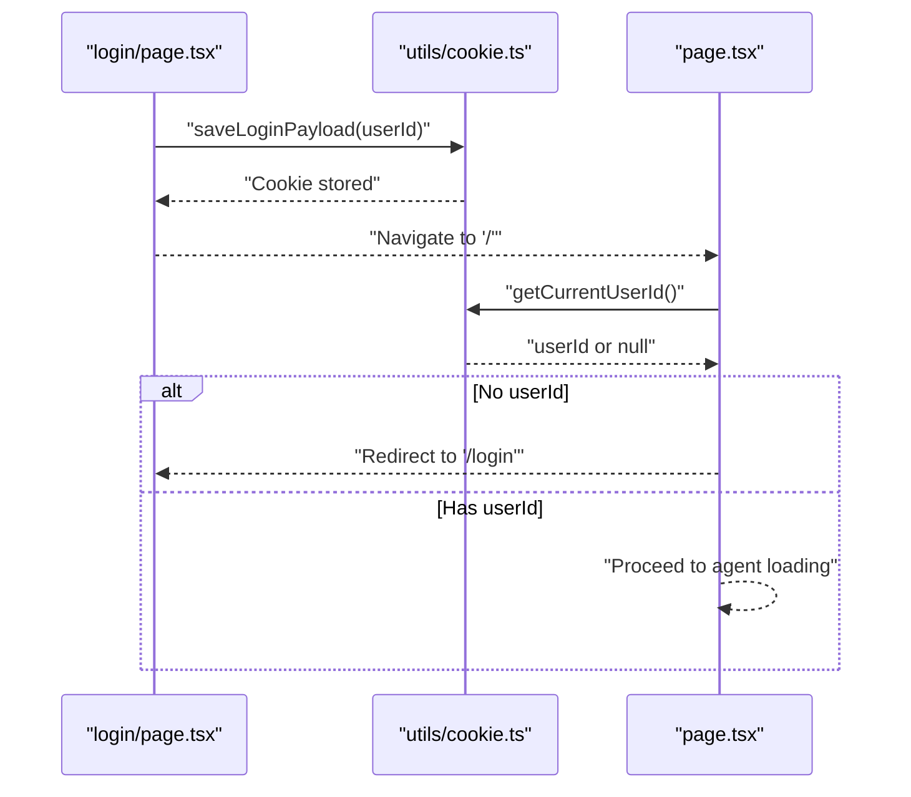
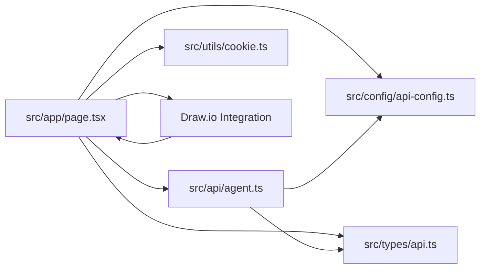

# AI Agent Integration

<cite>
**Referenced Files in This Document**
- [README.md](file://README.md)
- [AGENTS.md](file://AGENTS.md)
- [src/api/agent.ts](file://src/api/agent.ts)
- [src/config/api-config.ts](file://src/config/api-config.ts)
- [src/types/api.ts](file://src/types/api.ts)
- [src/app/page.tsx](file://src/app/page.tsx)
- [src/app/login/page.tsx](file://src/app/login/page.tsx)
- [src/utils/cookie.ts](file://src/utils/cookie.ts)
- [src/app/layout.tsx](file://src/app/layout.tsx)
- [package.json](file://package.json)
- [docs/react-drawio.md](file://docs/react-drawio.md)
</cite>

## Update Summary
**Changes Made**
- Enhanced AgentResponse types with new "drawio" and "user" response types
- Added structured JSON response parsing with AgentResponse interface
- Integrated interactive Draw.io editor with XML processing capabilities
- Implemented diagram rendering pipeline with mxGraphModel extraction
- Added support for raw XML responses and fallback rendering strategies
- Expanded chat message handling to support diagram-based AI responses

## Table of Contents
1. [Introduction](#introduction)
2. [Project Structure](#project-structure)
3. [Core Components](#core-components)
4. [Architecture Overview](#architecture-overview)
5. [Detailed Component Analysis](#detailed-component-analysis)
6. [Dependency Analysis](#dependency-analysis)
7. [Performance Considerations](#performance-considerations)
8. [Troubleshooting Guide](#troubleshooting-guide)
9. [Conclusion](#conclusion)
10. [Appendices](#appendices)

## Introduction

This document describes the AI Agent Integration system implemented in the frontend. It covers how agents are discovered
and selected, how sessions are created and managed, and how chat interactions are handled with support for both
non-streaming and streaming responses. The system now includes enhanced capabilities for interactive diagram generation
and rendering through an integrated Draw.io editor. It documents the API service layer, request/response handling, error
management, and real-time communication patterns. Practical examples illustrate agent selection, chat message
processing, and handling various response types from AI services including structured JSON responses and raw XML diagram
data. Finally, it addresses performance considerations, retry mechanisms, and error recovery strategies.

## Project Structure

The project is a Next.js application with a focused AI agent integration UI featuring an integrated Draw.io editor. Key
areas:
- API service layer: centralized HTTP calls and response parsing
- Configuration: base URL and endpoint constants
- Types: shared request/response models and enums
- Application pages: login and main dashboard with agent selector, chat panel, and Draw.io editor
- Utilities: cookie helpers for login persistence
- Draw.io integration: interactive diagram rendering and export capabilities

**Diagram sources**
- [src/app/login/page.tsx:1-173](file://src/app/login/page.tsx#L1-L173)
- [src/app/page.tsx:1-648](file://src/app/page.tsx#L1-L648)
- [src/api/agent.ts:1-191](file://src/api/agent.ts#L1-L191)
- [src/config/api-config.ts:1-28](file://src/config/api-config.ts#L1-L28)
- [src/types/api.ts:1-74](file://src/types/api.ts#L1-L74)
- [src/utils/cookie.ts:1-111](file://src/utils/cookie.ts#L1-L111)

**Section sources**
- [README.md:1-37](file://README.md#L1-L37)
- [package.json:1-28](file://package.json#L1-L28)

## Core Components
- API service module: encapsulates HTTP calls, JSON parsing, success checks, and streaming
- Configuration module: centralizes base URL and endpoint constants
- Type definitions: shared models for agent configs, sessions, chat requests/responses, and UI messages
- Application pages: login page for user identity and main page for agent selection, chat, and diagram rendering
- Cookie utilities: manage login payload persistence
- Draw.io integration: interactive diagram editor with XML processing and export capabilities
- Structured response handling: JSON parsing for AgentResponse types with "drawio" and "user" variants

Key responsibilities:
- Agent discovery: fetch agent configurations and present them in a selector
- Session management: create sessions per agent and user, reuse session IDs during a chat session
- Chat processing: send messages, parse structured JSON responses, and render either plain text, Draw.io diagrams, or
  user-requested information
- Streaming: optional streaming mode for incremental updates
- Error handling: distinguish backend availability errors and surface actionable messages
- Diagram processing: extract mxGraphModel from XML responses and render in Draw.io editor
- Response type discrimination: handle different AI response formats dynamically

**Section sources**
- [src/api/agent.ts:1-191](file://src/api/agent.ts#L1-L191)
- [src/config/api-config.ts:1-28](file://src/config/api-config.ts#L1-L28)
- [src/types/api.ts:1-74](file://src/types/api.ts#L1-L74)
- [src/app/page.tsx:1-648](file://src/app/page.tsx#L1-L648)
- [src/utils/cookie.ts:1-111](file://src/utils/cookie.ts#L1-L111)

## Architecture Overview
The system follows a layered architecture with enhanced diagram processing capabilities:
- UI layer: Next.js pages and components with integrated Draw.io editor
- Service layer: API service module handles HTTP requests and response parsing
- Configuration layer: endpoint constants and base URL
- Types layer: shared TypeScript interfaces and enums including AgentResponse types
- Persistence layer: cookie utilities for login state
- Diagram processing layer: XML extraction and Draw.io rendering pipeline

**Diagram sources**
- [src/app/page.tsx:1-648](file://src/app/page.tsx#L1-L648)
- [src/api/agent.ts:1-191](file://src/api/agent.ts#L1-L191)
- [src/config/api-config.ts:1-28](file://src/config/api-config.ts#L1-L28)
- [src/types/api.ts:1-74](file://src/types/api.ts#L1-L74)
- [src/utils/cookie.ts:1-111](file://src/utils/cookie.ts#L1-L111)

## Detailed Component Analysis

### API Service Layer
The API service module centralizes HTTP interactions and response handling with enhanced error management:
- requestJson: builds full URLs, performs fetch, parses JSON, and throws on non-OK responses
- ensureSuccess: validates response code and extracts data
- queryAgentConfigList: retrieves agent configurations
- createSession: creates a session bound to agent and user
- chat: sends a non-streaming chat message and returns content with enhanced response parsing
- chatStream: streams server-sent events and invokes callbacks for each chunk
- isBackendUnavailableError: detects network/CORS/unavailable backend errors

**Diagram sources**
- [src/api/agent.ts:75-113](file://src/api/agent.ts#L75-L113)
- [src/config/api-config.ts:24-27](file://src/config/api-config.ts#L24-L27)
- [src/types/api.ts:26-42](file://src/types/api.ts#L26-L42)

**Section sources**
- [src/api/agent.ts:17-191](file://src/api/agent.ts#L17-L191)
- [src/config/api-config.ts:6-27](file://src/config/api-config.ts#L6-L27)
- [src/types/api.ts:6-74](file://src/types/api.ts#L6-L74)

### Agent Discovery and Selection
- On mount, the main page loads agents and restores the last selected agent from local storage
- The agent selector dropdown lists available agents and triggers session reset on change
- Agent configurations include identifiers and descriptions for user selection

**Diagram sources**
- [src/app/page.tsx:53-85](file://src/app/page.tsx#L53-L85)
- [src/api/agent.ts:75-81](file://src/api/agent.ts#L75-L81)

**Section sources**
- [src/app/page.tsx:53-100](file://src/app/page.tsx#L53-L100)
- [src/api/agent.ts:75-81](file://src/api/agent.ts#L75-L81)

### Dynamic Agent Configuration Loading
- Endpoint: query_ai_agent_config_list
- Response model: array of AiAgentConfig with agentId, agentName, agentDesc
- UI integrates with agent selector and persists last selection

**Section sources**
- [src/config/api-config.ts:10-22](file://src/config/api-config.ts#L10-L22)
- [src/types/api.ts:13-18](file://src/types/api.ts#L13-L18)
- [src/app/page.tsx:58-78](file://src/app/page.tsx#L58-L78)

### Session Management
- Session creation: create_session with agentId and userId
- Session reuse: maintain sessionId during a chat session; reset when agent changes
- Session state displayed in chat header for transparency

**Diagram sources**
- [src/api/agent.ts:87-100](file://src/api/agent.ts#L87-L100)
- [src/app/page.tsx:144-153](file://src/app/page.tsx#L144-L153)

**Section sources**
- [src/api/agent.ts:87-100](file://src/api/agent.ts#L87-L100)
- [src/app/page.tsx:144-153](file://src/app/page.tsx#L144-L153)

### Enhanced Chat Interface Implementation and Message History
The chat interface now supports multiple response types with sophisticated parsing and rendering:
- Message composition: user input captured, sanitized, and appended to history
- Response type detection: automatic JSON parsing with fallback to raw XML and plain text
- Diagram rendering: "drawio" type responses trigger XML extraction and Draw.io rendering
- User interaction: "user" type responses indicate agent-requested additional information
- Message rendering: distinct styles for different response types with diagram previews
- Preset prompts: contextual suggestions when chat is empty

**Diagram sources**
- [src/app/page.tsx:118-258](file://src/app/page.tsx#L118-L258)
- [src/types/api.ts:44-50](file://src/types/api.ts#L44-L50)

**Section sources**
- [src/app/page.tsx:118-258](file://src/app/page.tsx#L118-L258)
- [src/types/api.ts:44-50](file://src/types/api.ts#L44-L50)

### Real-Time Communication Patterns
- Non-streaming: chat returns a single content string with enhanced response parsing
- Streaming: chatStream reads server-sent events, decodes chunks, and emits incremental updates
- Event loop: reads stream chunks, splits by newline, buffers partial lines, and dispatches callbacks

**Diagram sources**
- [src/api/agent.ts:120-176](file://src/api/agent.ts#L120-L176)

**Section sources**
- [src/api/agent.ts:120-176](file://src/api/agent.ts#L120-L176)

### Enhanced Agent Configuration Types and Unified Interface
The system now supports structured JSON responses with enhanced type safety:
- AiAgentConfig: agentId, agentName, agentDesc
- CreateSessionRequest/Response: agentId, userId, sessionId
- ChatRequest/Response: agentId, userId, sessionId, message, content
- AgentResponse: enhanced type discriminator ("user" | "drawio") and content with structured parsing
- AgentResponseType: union type for response categorization
- ChatMessage: UI model for rendering with optional agentId/sessionId/type including diagram support
- ResponseCode: standardized response codes

**Section sources**
- [src/types/api.ts:13-74](file://src/types/api.ts#L13-L74)

### Interactive Draw.io Integration
The system now includes comprehensive Draw.io integration for diagram rendering:
- XML processing: automatic extraction of mxGraphModel from mxfile wrapper
- Diagram rendering: real-time loading and display in Draw.io editor
- Export capabilities: SVG export with preview modal
- State management: pending XML handling for asynchronous loading
- Integration points: seamless coordination between chat responses and diagram display

**Diagram sources**
- [src/app/page.tsx:186-212](file://src/app/page.tsx#L186-L212)

**Section sources**
- [src/app/page.tsx:186-212](file://src/app/page.tsx#L186-L212)

### Login and Identity Management
- Login page captures user ID and stores it in a cookie payload
- Main page checks for existing login and redirects to login if missing
- Cookie utilities provide safe JSON parsing and formatting helpers

**Diagram sources**
- [src/app/login/page.tsx:13-36](file://src/app/login/page.tsx#L13-L36)
- [src/utils/cookie.ts:63-101](file://src/utils/cookie.ts#L63-L101)
- [src/app/page.tsx:37-51](file://src/app/page.tsx#L37-L51)

**Section sources**
- [src/app/login/page.tsx:1-173](file://src/app/login/page.tsx#L1-L173)
- [src/utils/cookie.ts:1-111](file://src/utils/cookie.ts#L1-L111)
- [src/app/page.tsx:37-51](file://src/app/page.tsx#L37-L51)

## Dependency Analysis
The system maintains its layered architecture while adding Draw.io integration:
- UI depends on API service, configuration, types, cookie utilities, and Draw.io integration
- API service depends on configuration and types
- Configuration provides base URL and endpoints
- Types define the contract for all requests and responses including enhanced AgentResponse types
- Draw.io integration adds XML processing and diagram rendering capabilities

**Diagram sources**
- [src/app/page.tsx:1-648](file://src/app/page.tsx#L1-L648)
- [src/api/agent.ts:1-191](file://src/api/agent.ts#L1-L191)
- [src/config/api-config.ts:1-28](file://src/config/api-config.ts#L1-L28)
- [src/types/api.ts:1-74](file://src/types/api.ts#L1-L74)
- [src/utils/cookie.ts:1-111](file://src/utils/cookie.ts#L1-L111)

**Section sources**
- [src/app/page.tsx:1-648](file://src/app/page.tsx#L1-L648)
- [src/api/agent.ts:1-191](file://src/api/agent.ts#L1-L191)
- [src/config/api-config.ts:1-28](file://src/config/api-config.ts#L1-L28)
- [src/types/api.ts:1-74](file://src/types/api.ts#L1-L74)
- [src/utils/cookie.ts:1-111](file://src/utils/cookie.ts#L1-L111)

## Performance Considerations
- Network reliability: detect backend unavailability early to avoid retries and reduce wasted UI updates
- Streaming efficiency: stream decoding and incremental rendering minimize perceived latency
- UI responsiveness: disable inputs during sending, show typing indicators, and auto-scroll to latest messages
- Local caching: persist last agent selection to reduce repeated agent queries
- Endpoint reuse: reuse sessionId to avoid unnecessary session creation overhead
- XML processing optimization: efficient regex extraction of mxGraphModel from large XML responses
- Draw.io initialization: handle asynchronous loading with pending XML queuing to prevent rendering delays
- Memory management: clean up XML processing buffers and diagram state when switching agents

## Troubleshooting Guide
Common issues and remedies with enhanced diagram processing:
- Backend unavailable: detect via isBackendUnavailableError and prompt checking API base URL
- Session creation failure: ensure agentId and userId are valid; verify backend endpoint availability
- Chat failures: inspect error messages and surface actionable status; consider retry logic for transient errors
- Streaming errors: ensure Accept: text/event-stream and handle reader errors gracefully
- XML parsing failures: verify XML format matches mxGraphModel structure; check for proper mxfile wrapper
- Draw.io loading issues: monitor drawioReadyRef flag and handle pending XML appropriately
- Diagram rendering problems: validate XML contains valid mxGraphModel; check for malformed tags
- Response type detection: ensure JSON responses follow AgentResponse structure with proper type field

Operational tips:
- Verify NEXT_PUBLIC_API_BASE_URL environment variable
- Confirm agent endpoints exist and return expected JSON structure
- Monitor status bar messages for immediate feedback
- Check Draw.io editor logs for XML processing errors
- Validate diagram XML format before sending to client

**Section sources**
- [src/api/agent.ts:181-190](file://src/api/agent.ts#L181-L190)
- [src/app/page.tsx:69-78](file://src/app/page.tsx#L69-L78)
- [src/app/page.tsx:213-258](file://src/app/page.tsx#L213-L258)

## Conclusion

The AI Agent Integration system provides a comprehensive frontend experience for agent discovery, session management,
and chat interactions with enhanced diagram processing capabilities. The system now supports structured JSON responses
with "drawio" and "user" types, automatic XML processing for diagram rendering, and seamless integration with the
Draw.io editor. It maintains robust error handling, streaming support, and a unified interface for diverse agent
behaviors. The modular design enables straightforward extension to additional agents and response types while providing
a rich visual collaboration experience.

## Appendices

### Practical Examples

- Agent selection
  - Load agents on mount and restore last selection
  - Example path: [src/app/page.tsx:53-85](file://src/app/page.tsx#L53-L85)

- Enhanced chat message processing
  - Validate inputs, create session if needed, send chat, parse JSON response with AgentResponse types, and update
    message history
  - Handle diagram XML extraction and Draw.io rendering
  - Example path: [src/app/page.tsx:118-258](file://src/app/page.tsx#L118-L258)

- Response type handling
  - Parse structured JSON responses with AgentResponse interface
  - Render Draw.io diagrams when type is "drawio" with XML extraction
  - Handle "user" type for agent-requested information
  - Fallback to plain text otherwise
  - Example
    path: [src/app/page.tsx:166-236](file://src/app/page.tsx#L166-L236), [src/types/api.ts:44-50](file://src/types/api.ts#L44-L50)

- XML processing and diagram rendering
  - Extract mxGraphModel from mxfile wrapper using regex pattern matching
  - Load XML into Draw.io editor with proper initialization handling
  - Manage pending XML for asynchronous Draw.io readiness
  - Example path: [src/app/page.tsx:186-212](file://src/app/page.tsx#L186-L212)

- Streaming capabilities
  - Establish SSE connection, decode chunks, and emit incremental updates
  - Example path: [src/api/agent.ts:120-176](file://src/api/agent.ts#L120-L176)

- Error recovery
  - Detect backend unavailability and show actionable status
  - Handle XML parsing errors and provide fallback rendering
  - Manage Draw.io loading states and pending operations
  - Example
    path: [src/api/agent.ts:181-190](file://src/api/agent.ts#L181-L190), [src/app/page.tsx:238-258](file://src/app/page.tsx#L238-L258)