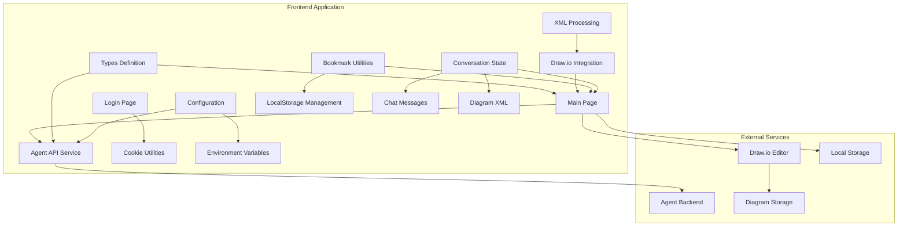
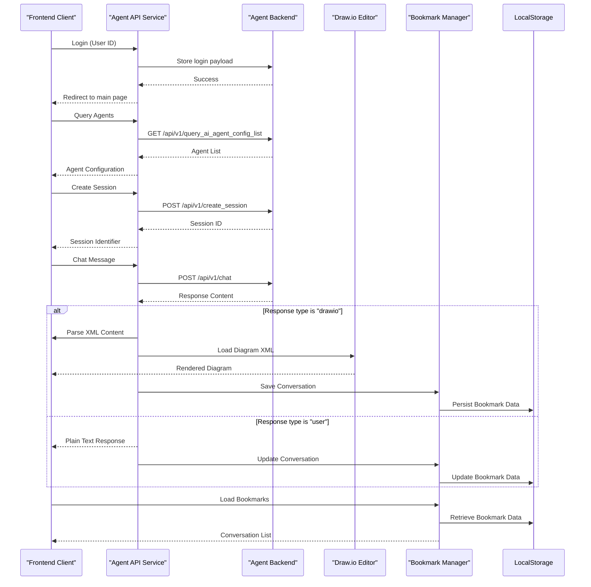
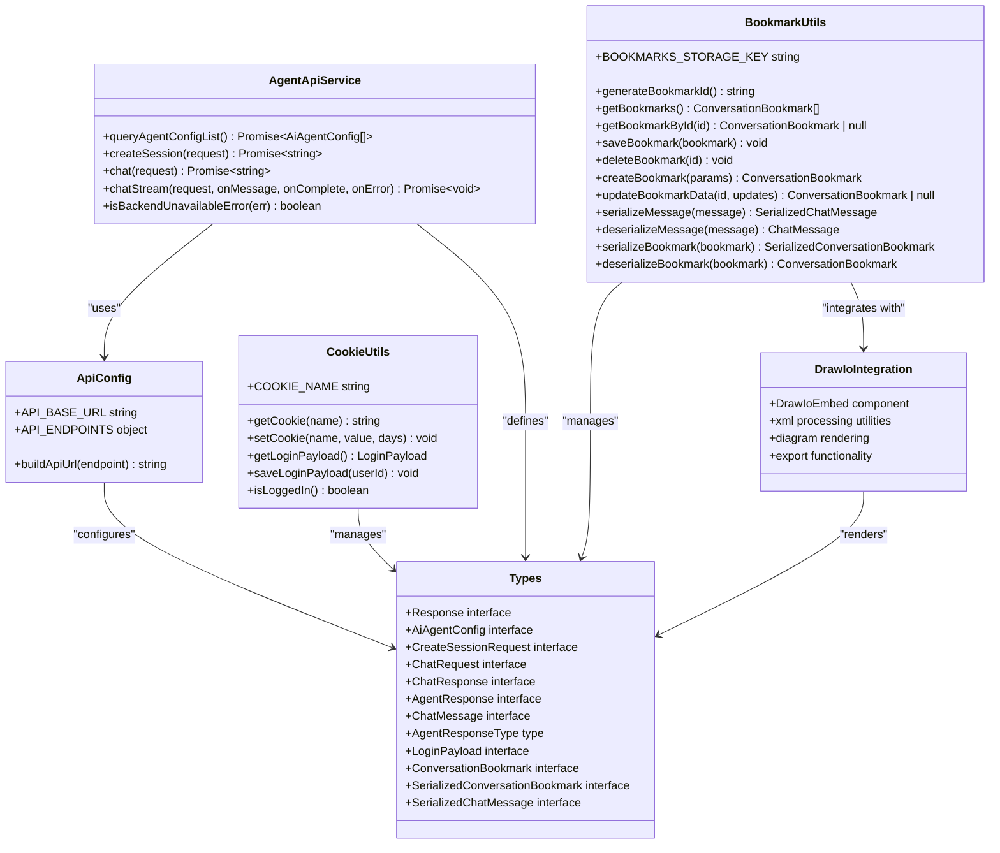

# API Reference

<cite>
**Referenced Files in This Document**
- [agent.ts](file://src/api/agent.ts)
- [api-config.ts](file://src/config/api-config.ts)
- [api.ts](file://src/types/api.ts)
- [page.tsx](file://src/app/page.tsx)
- [cookie.ts](file://src/utils/cookie.ts)
- [bookmark.ts](file://src/utils/bookmark.ts)
- [page.tsx](file://src/app/login/page.tsx)
- [react-drawio.md](file://docs/react-drawio.md)
- [package.json](file://package.json)
- [tsconfig.json](file://tsconfig.json)
</cite>

## Update Summary
**Changes Made**

- Added comprehensive documentation for ConversationBookmark and SerializedConversationBookmark interfaces
- Documented bookmark-related API endpoints and data structures for conversation persistence
- Added bookmark storage utilities and localStorage management functionality
- Updated architecture diagrams to include bookmark management workflow
- Enhanced session management API with bookmark integration
- Added bookmark sidebar UI components and conversation switching functionality

## Table of Contents
1. [Introduction](#introduction)
2. [Project Structure](#project-structure)
3. [Core Components](#core-components)
4. [Architecture Overview](#architecture-overview)
5. [Detailed Component Analysis](#detailed-component-analysis)
6. [XML Processing and Diagram Rendering](#xml-processing-and-diagram-rendering)
7. [Conversation Bookmark Management](#conversation-bookmark-management)
8. [Dependency Analysis](#dependency-analysis)
9. [Performance Considerations](#performance-considerations)
10. [Troubleshooting Guide](#troubleshooting-guide)
11. [Conclusion](#conclusion)

## Introduction

This document provides comprehensive API documentation for the AI Agent Scaffold Frontend. It covers the RESTful API
structure, authentication requirements, request/response schemas, and TypeScript interfaces used by the frontend
application. The API enables agent discovery, session management, and both non-streaming and streaming chat interactions
with advanced diagram generation capabilities through integrated Draw.io support. The system now includes robust
conversation bookmarking functionality for persistent conversation management and local storage-based bookmark storage.

## Project Structure

The frontend application follows a modular structure with clear separation of concerns and enhanced diagram processing
capabilities, now including comprehensive bookmark management:



**Diagram sources**

- [page.tsx:1-893](file://src/app/page.tsx#L1-L893)
- [agent.ts:1-191](file://src/api/agent.ts#L1-L191)
- [api-config.ts:1-28](file://src/config/api-config.ts#L1-L28)
- [bookmark.ts:1-202](file://src/utils/bookmark.ts#L1-L202)

**Section sources**

- [page.tsx:1-893](file://src/app/page.tsx#L1-L893)
- [agent.ts:1-191](file://src/api/agent.ts#L1-L191)
- [api-config.ts:1-28](file://src/config/api-config.ts#L1-L28)
- [bookmark.ts:1-202](file://src/utils/bookmark.ts#L1-L202)

## Core Components

### API Service Layer

The frontend implements a centralized API service layer that handles all backend communication with enhanced response
processing and bookmark integration:

- **Base URL Configuration**: Configurable via environment variable `NEXT_PUBLIC_API_BASE_URL`
- **Endpoint Management**: Centralized endpoint definitions for all API routes
- **Request Abstraction**: Unified request handling with JSON parsing and error management
- **Streaming Support**: Built-in support for Server-Sent Events (SSE) streaming
- **Response Type Discrimination**: Intelligent parsing of agent responses based on type field
- **Bookmark Integration**: Seamless integration with conversation bookmarking system

### Authentication System
The application uses a lightweight cookie-based authentication mechanism:

- **Login Flow**: Users provide a user ID on the login page
- **Cookie Storage**: Login payload stored as JSON in a dedicated cookie
- **Session Persistence**: Automatic login state detection on page load
- **Security**: Lax SameSite policy for cross-site compatibility

### Type System

Comprehensive TypeScript interfaces define all API contracts with enhanced type safety and bookmark management
capabilities:

- **Response Wrapper**: Standardized response format with code, info, and data fields
- **Agent Configuration**: Agent metadata including ID, name, and description
- **Session Management**: Session creation with agent and user identification
- **Chat Communication**: Message exchange with support for both text and diagram responses
- **Type Discrimination**: Explicit type field for differentiating response types
- **XML Processing**: Specialized handling for diagram XML content
- **Conversation Bookmarking**: Persistent conversation storage with serialization support
- **Local Storage Management**: Robust bookmark persistence with date serialization

**Section sources**
- [agent.ts:1-191](file://src/api/agent.ts#L1-L191)
- [api-config.ts:1-28](file://src/config/api-config.ts#L1-L28)
- [api.ts:1-112](file://src/types/api.ts#L1-L112)
- [cookie.ts:1-111](file://src/utils/cookie.ts#L1-L111)
- [bookmark.ts:1-202](file://src/utils/bookmark.ts#L1-L202)

## Architecture Overview



**Diagram sources**
- [agent.ts:75-113](file://src/api/agent.ts#L75-L113)
- [page.tsx:118-233](file://src/app/page.tsx#L118-L233)
- [bookmark.ts:57-135](file://src/utils/bookmark.ts#L57-L135)

## Detailed Component Analysis

### Agent Configuration API

#### Endpoint: Query AI Agent Config List
- **Method**: GET
- **URL**: `/api/v1/query_ai_agent_config_list`
- **Authentication**: Not required
- **Response**: Array of agent configuration objects

**Request Schema**
```typescript
interface AiAgentConfig {
  agentId: string;
  agentName: string;
  agentDesc: string;
}
```

**Response Schema**
```typescript
interface Response<AiAgentConfig[]> {
  code: string;
  info: string;
  data: AiAgentConfig[];
}
```

**Example Usage**
```typescript
const agents = await queryAgentConfigList();
// Returns: [{agentId: "agent-1", agentName: "Assistant", agentDesc: "Helpful AI"}]
```

**Section sources**
- [agent.ts:75-81](file://src/api/agent.ts#L75-L81)
- [api.ts:13-18](file://src/types/api.ts#L13-L18)

### Session Management API

#### Endpoint: Create Session
- **Method**: POST
- **URL**: `/api/v1/create_session`
- **Authentication**: Required (via cookie)
- **Request Body**: Session creation parameters
- **Response**: Session identifier

**Request Schema**
```typescript
interface CreateSessionRequest {
  agentId: string;
  userId: string;
}

interface CreateSessionResponse {
  sessionId: string;
}
```

**Response Schema**
```typescript
interface Response<CreateSessionResponse> {
  code: string;
  info: string;
  data: CreateSessionResponse;
}
```

**Example Usage**
```typescript
const sessionId = await createSession({
  agentId: "agent-1",
  userId: "user-123"
});
// Returns: "session-456"
```

**Section sources**
- [agent.ts:87-100](file://src/api/agent.ts#L87-L100)
- [api.ts:20-29](file://src/types/api.ts#L20-L29)

### Chat APIs

#### Non-Streaming Chat Endpoint
- **Method**: POST
- **URL**: `/api/v1/chat`
- **Authentication**: Required
- **Request Body**: Complete chat context
- **Response**: Plain text or JSON-encoded response with type discrimination

**Request Schema**
```typescript
interface ChatRequest {
  agentId: string;
  userId: string;
  sessionId: string;
  message: string;
}

interface ChatResponse {
  content: string;
}
```

**Response Schema**
```typescript
interface Response<ChatResponse> {
  code: string;
  info: string;
  data: ChatResponse;
}
```

**Enhanced Response Processing**
The chat endpoint now supports intelligent response type discrimination and automatic bookmark management:

- **JSON Responses**: `{ type: "user" | "drawio", content: string }`
- **Plain Text**: Direct text response
- **Raw XML**: Diagram XML content (auto-detected)
- **Automatic Bookmark Creation**: New conversations automatically saved to bookmarks
- **Bookmark Updates**: Existing conversations updated with new messages and diagram XML

**Section sources**
- [agent.ts:106-113](file://src/api/agent.ts#L106-L113)
- [api.ts:31-42](file://src/types/api.ts#L31-L42)

#### Streaming Chat Endpoint
- **Method**: POST
- **URL**: `/api/v1/chat_stream`
- **Authentication**: Required
- **Request Body**: Same as non-streaming chat
- **Response**: Server-Sent Events stream

**Streaming Implementation Details**
- Uses `text/event-stream` content type
- Processes incoming chunks incrementally
- Supports real-time message streaming
- Handles connection errors gracefully

**Section sources**
- [agent.ts:120-176](file://src/api/agent.ts#L120-L176)

### Response Handling and Validation

#### Response Wrapper
All API responses follow a standardized format:

```typescript
interface Response<T> {
  code: string;
  info: string;
  data?: T;
}

const ResponseCode = {
  SUCCESS: "0000"
} as const;
```

#### Enhanced Response Processing
The API service implements comprehensive response handling with type discrimination:

- **Network connectivity checks**
- **Backend availability detection**
- **JSON parsing validation**
- **HTTP status code evaluation**
- **Type-based response routing**
- **XML content extraction and processing**
- **Automatic bookmark synchronization**

**Section sources**
- [agent.ts:20-58](file://src/api/agent.ts#L20-L58)
- [api.ts:6-11](file://src/types/api.ts#L6-L11)
- [api.ts:70-74](file://src/types/api.ts#L70-L74)

## XML Processing and Diagram Rendering

### Agent Response Type Discrimination

The system now supports explicit type discrimination in agent responses:

```typescript
type AgentResponseType = "user" | "drawio";

interface AgentResponse {
  type: AgentResponseType;
  content: string;
}
```

**Type Field Values:**
- `"user"`: Plain text response requiring user interaction
- `"drawio"`: XML diagram content requiring rendering

### Chat Message Enhancement

The ChatMessage interface now includes optional type field for UI rendering:

```typescript
interface ChatMessage {
  id: string;
  role: "user" | "agent";
  content: string;
  timestamp: Date;
  agentId?: string;
  sessionId?: string;
  /** Mirrors AgentResponse.type; "drawio" messages rendered diagram in DrawIo panel */
  type?: AgentResponseType;
}
```

### XML Processing Capabilities

The frontend implements sophisticated XML processing for diagram rendering:

**Automatic XML Detection:**
- Raw XML responses starting with `<mxfile` or `<mxGraphModel`
- JSON-parsed responses with `type: "drawio"`
- Automatic extraction of `mxGraphModel` from `mxfile` wrapper

**Draw.io Integration:**
- Real-time diagram rendering in embedded Draw.io editor
- XML content loading with automatic model extraction
- Pending XML handling for out-of-order responses
- Export functionality for diagram images

**Section sources**
- [api.ts:44-68](file://src/types/api.ts#L44-L68)
- [page.tsx:165-236](file://src/app/page.tsx#L165-L236)

## Conversation Bookmark Management

### Bookmark Data Structures

The system implements a comprehensive bookmark management system for persistent conversation storage:

```typescript
// Main bookmark interface for runtime usage
interface ConversationBookmark {
  id: string;
  title: string;
  agentId: string;
  agentName: string;
  sessionId: string;
  userId: string;
  messages: ChatMessage[];
  diagramXml: string;
  createdAt: number;
  updatedAt: number;
}

// Serialized version for localStorage storage
interface SerializedConversationBookmark {
  id: string;
  title: string;
  agentId: string;
  agentName: string;
  sessionId: string;
  userId: string;
  messages: SerializedChatMessage[];
  diagramXml: string;
  createdAt: number;
  updatedAt: number;
}
```

### Bookmark Utility Functions

The bookmark system provides comprehensive localStorage management:

**Storage Key**: `"ai_agent_conversation_bookmarks"`

**Core Functions:**

- `generateBookmarkId()`: Creates unique bookmark identifiers
- `getBookmarks()`: Retrieves all bookmarks sorted by recency
- `getBookmarkById(id)`: Fetches specific bookmark by ID
- `saveBookmark(bookmark)`: Creates or updates bookmark
- `deleteBookmark(id)`: Removes bookmark from storage
- `createBookmark(params)`: Generates new bookmark from conversation state
- `updateBookmarkData(id, updates)`: Updates existing bookmark data

**Serialization Features:**

- Automatic conversion of Date objects to ISO strings for storage
- Bidirectional conversion between runtime and serialized formats
- Maintains conversation state integrity across browser sessions

### Bookmark UI Integration

The main application integrates bookmark functionality through:

**Bookmark Sidebar:**

- Collapsible conversation history panel
- Visual bookmark list with titles and dates
- Quick conversation switching capability
- Delete functionality with confirmation

**Conversation Management:**

- Automatic bookmark creation for new conversations
- Real-time bookmark updates during chat interactions
- Persistent conversation restoration on page reload
- User-specific bookmark filtering

**Section sources**

- [api.ts:75-112](file://src/types/api.ts#L75-L112)
- [bookmark.ts:1-202](file://src/utils/bookmark.ts#L1-L202)
- [page.tsx:40-75](file://src/app/page.tsx#L40-L75)
- [page.tsx:509-610](file://src/app/page.tsx#L509-L610)

## Dependency Analysis



**Diagram sources**
- [agent.ts:1-191](file://src/api/agent.ts#L1-L191)
- [api-config.ts:1-28](file://src/config/api-config.ts#L1-L28)
- [api.ts:1-112](file://src/types/api.ts#L1-L112)
- [cookie.ts:1-111](file://src/utils/cookie.ts#L1-L111)
- [bookmark.ts:1-202](file://src/utils/bookmark.ts#L1-L202)
- [page.tsx:382-400](file://src/app/page.tsx#L382-L400)

**Section sources**
- [agent.ts:1-191](file://src/api/agent.ts#L1-L191)
- [api-config.ts:1-28](file://src/config/api-config.ts#L1-L28)
- [api.ts:1-112](file://src/types/api.ts#L1-L112)
- [cookie.ts:1-111](file://src/utils/cookie.ts#L1-L111)
- [bookmark.ts:1-202](file://src/utils/bookmark.ts#L1-L202)

## Performance Considerations

### API Endpoint Performance
- **Agent Discovery**: Single request caching recommended
- **Session Creation**: Minimal overhead, cache successful sessions
- **Chat Operations**: Consider request debouncing for rapid inputs
- **Streaming**: Efficient chunk processing prevents memory buildup
- **XML Processing**: Optimize XML parsing and diagram rendering performance

### Frontend Optimization
- **Connection Reuse**: Maintain persistent connections for streaming
- **State Management**: Local state updates before network completion
- **Error Recovery**: Graceful fallback for network failures
- **Resource Cleanup**: Proper cleanup of event listeners and streams
- **XML Caching**: Cache frequently used diagram templates
- **Draw.io Lazy Loading**: Load Draw.io only when needed
- **Bookmark Serialization**: Efficient localStorage operations with batch updates

### Bookmark Performance

- **LocalStorage Optimization**: Batch bookmark operations to minimize storage writes
- **Memory Management**: Efficient message serialization reduces memory footprint
- **UI Responsiveness**: Debounced bookmark updates prevent UI blocking
- **Date Handling**: String-based timestamps reduce serialization overhead
- **Filtering Efficiency**: User-specific bookmark filtering reduces DOM manipulation

### Environment Configuration
- **Base URL**: Configure for production deployment
- **Timeout Settings**: Implement appropriate request timeouts
- **Retry Logic**: Consider exponential backoff for transient failures
- **XML Size Limits**: Implement reasonable limits for diagram content
- **Storage Limits**: Monitor localStorage usage to prevent quota exceeded errors

## Troubleshooting Guide

### Common Issues and Solutions

#### Backend Unavailable
**Symptoms**: Network errors, CORS failures, connection timeouts
**Detection**: `isBackendUnavailableError()` function
**Solutions**:
- Verify API base URL configuration
- Check network connectivity
- Review CORS policy settings
- Monitor backend service health

#### Authentication Failures
**Symptoms**: 401/403 errors, login state inconsistencies
**Solutions**:
- Ensure cookie is properly set during login
- Verify SameSite policy compatibility
- Check user ID format requirements
- Confirm session persistence

#### Response Parsing Errors
**Symptoms**: JSON parse failures, unexpected response formats
**Solutions**:
- Validate response content-type headers
- Implement fallback parsing strategies
- Check backend response consistency
- Log raw response for debugging

#### XML Processing Issues
**Symptoms**: Diagram rendering failures, XML parsing errors
**Solutions**:
- Verify XML format validity
- Check for proper `mxGraphModel` wrapping
- Validate Draw.io compatibility
- Implement XML sanitization
- Handle malformed XML gracefully

#### Draw.io Integration Problems
**Symptoms**: Diagram not rendering, blank canvas, export failures
**Solutions**:
- Ensure Draw.io component is mounted
- Check for pending XML handling
- Verify XML content integrity
- Monitor Draw.io load events
- Implement retry logic for delayed loading

#### Bookmark Management Issues

**Symptoms**: Bookmark not saving, conversations lost, storage errors
**Solutions**:

- Verify localStorage availability and permissions
- Check bookmark serialization/deserialization
- Monitor storage quota limits
- Implement error handling for storage failures
- Validate bookmark data integrity
- Debug bookmark ID generation conflicts

#### Conversation State Synchronization

**Symptoms**: Out-of-sync conversation state, bookmark not updating
**Solutions**:

- Ensure proper bookmark update triggers after chat responses
- Verify message serialization before storage
- Check for concurrent bookmark modifications
- Implement optimistic updates with rollback on failure
- Validate bookmark ID consistency across UI and storage

**Section sources**
- [agent.ts:181-190](file://src/api/agent.ts#L181-L190)
- [page.tsx:73-75](file://src/app/page.tsx#L73-L75)
- [cookie.ts:63-67](file://src/utils/cookie.ts#L63-L67)
- [page.tsx:186-202](file://src/app/page.tsx#L186-L202)
- [bookmark.ts:71-75](file://src/utils/bookmark.ts#L71-L75)

## Conclusion

The AI Agent Scaffold Frontend provides a robust API layer for interacting with AI agents and managing conversational
sessions with advanced diagram generation capabilities and comprehensive conversation bookmarking functionality. The
implementation follows modern React patterns with comprehensive TypeScript typing, efficient error handling, support for
real-time streaming, sophisticated XML processing for diagram rendering, and persistent conversation management through
localStorage-based bookmark storage.

Key strengths of the API implementation include:
- Consistent response formatting across all endpoints
- Comprehensive TypeScript interfaces for type safety
- Built-in error handling and recovery mechanisms
- Support for real-time streaming communication
- Lightweight authentication system suitable for development environments
- Advanced type discrimination for intelligent response routing
- Seamless Draw.io integration for diagram visualization
- Sophisticated XML processing and content extraction
- Robust bookmark management with localStorage persistence
- User-specific conversation filtering and organization
- Automatic conversation state synchronization
- Efficient serialization and deserialization for optimal performance

The API structure provides a solid foundation for building sophisticated AI-powered applications with diagram generation
capabilities, real-time collaboration features, seamless user experiences, and persistent conversation management. The
enhanced bookmark system enables users to maintain and revisit important conversations across browser sessions, while
the comprehensive type system and XML processing capabilities enable developers to build complex applications with
confidence in type safety and performance.

The integration of bookmark management with the existing chat and diagram functionality creates a cohesive user
experience where conversations naturally evolve into persistent bookmarks that can be easily accessed, organized, and
shared. This combination of real-time interaction and long-term persistence represents a significant enhancement to the
original API design, providing users with both immediate conversational capabilities and lasting value through
conversation preservation.