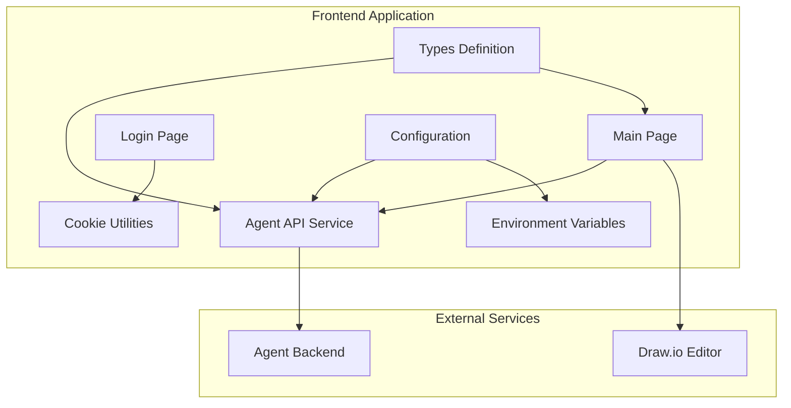
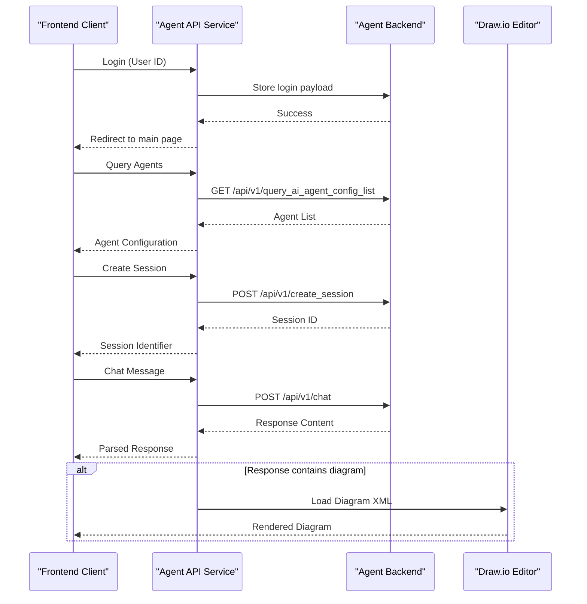
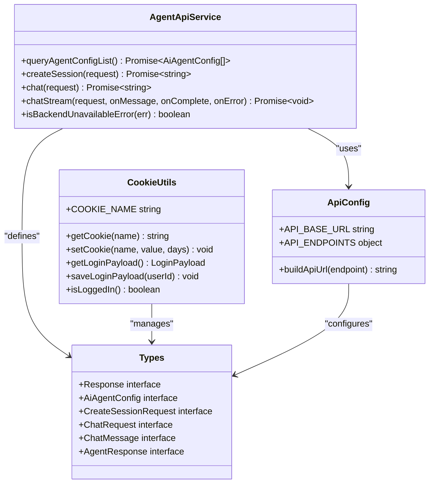

# API Reference

<cite>
**Referenced Files in This Document**
- [agent.ts](file://src/api/agent.ts)
- [api-config.ts](file://src/config/api-config.ts)
- [api.ts](file://src/types/api.ts)
- [page.tsx](file://src/app/page.tsx)
- [cookie.ts](file://src/utils/cookie.ts)
- [page.tsx](file://src/app/login/page.tsx)
- [package.json](file://package.json)
- [tsconfig.json](file://tsconfig.json)
</cite>

## Table of Contents

1. [Introduction](#introduction)
2. [Project Structure](#project-structure)
3. [Core Components](#core-components)
4. [Architecture Overview](#architecture-overview)
5. [Detailed Component Analysis](#detailed-component-analysis)
6. [Dependency Analysis](#dependency-analysis)
7. [Performance Considerations](#performance-considerations)
8. [Troubleshooting Guide](#troubleshooting-guide)
9. [Conclusion](#conclusion)

## Introduction

This document provides comprehensive API documentation for the AI Agent Scaffold Frontend. It covers the RESTful API
structure, authentication requirements, request/response schemas, and TypeScript interfaces used by the frontend
application. The API enables agent discovery, session management, and both non-streaming and streaming chat
interactions.

## Project Structure

The frontend application follows a modular structure with clear separation of concerns:



**Diagram sources**

- [page.tsx:1-600](file://src/app/page.tsx#L1-L600)
- [agent.ts:1-191](file://src/api/agent.ts#L1-L191)
- [api-config.ts:1-28](file://src/config/api-config.ts#L1-L28)

**Section sources**

- [page.tsx:1-600](file://src/app/page.tsx#L1-L600)
- [agent.ts:1-191](file://src/api/agent.ts#L1-L191)
- [api-config.ts:1-28](file://src/config/api-config.ts#L1-L28)

## Core Components

### API Service Layer

The frontend implements a centralized API service layer that handles all backend communication:

- **Base URL Configuration**: Configurable via environment variable `NEXT_PUBLIC_API_BASE_URL`
- **Endpoint Management**: Centralized endpoint definitions for all API routes
- **Request Abstraction**: Unified request handling with JSON parsing and error management
- **Streaming Support**: Built-in support for Server-Sent Events (SSE) streaming

### Authentication System

The application uses a lightweight cookie-based authentication mechanism:

- **Login Flow**: Users provide a user ID on the login page
- **Cookie Storage**: Login payload stored as JSON in a dedicated cookie
- **Session Persistence**: Automatic login state detection on page load
- **Security**: Lax SameSite policy for cross-site compatibility

### Type System

Comprehensive TypeScript interfaces define all API contracts:

- **Response Wrapper**: Standardized response format with code, info, and data fields
- **Agent Configuration**: Agent metadata including ID, name, and description
- **Session Management**: Session creation with agent and user identification
- **Chat Communication**: Message exchange with support for both text and diagram responses

**Section sources**

- [agent.ts:1-191](file://src/api/agent.ts#L1-L191)
- [api-config.ts:1-28](file://src/config/api-config.ts#L1-L28)
- [api.ts:1-74](file://src/types/api.ts#L1-L74)
- [cookie.ts:1-111](file://src/utils/cookie.ts#L1-L111)

## Architecture Overview



**Diagram sources**

- [agent.ts:75-113](file://src/api/agent.ts#L75-L113)
- [page.tsx:118-233](file://src/app/page.tsx#L118-L233)

## Detailed Component Analysis

### Agent Configuration API

#### Endpoint: Query AI Agent Config List

- **Method**: GET
- **URL**: `/api/v1/query_ai_agent_config_list`
- **Authentication**: Not required
- **Response**: Array of agent configuration objects

**Request Schema**

```typescript
interface AiAgentConfig {
    agentId: string;
    agentName: string;
    agentDesc: string;
}
```

**Response Schema**

```typescript
interface Response<AiAgentConfig

[] > {
    code: string;
    info: string;
    data: AiAgentConfig[];
}
```

**Example Usage**

```typescript
const agents = await queryAgentConfigList();
// Returns: [{agentId: "agent-1", agentName: "Assistant", agentDesc: "Helpful AI"}]
```

**Section sources**

- [agent.ts:75-81](file://src/api/agent.ts#L75-L81)
- [api.ts:13-18](file://src/types/api.ts#L13-L18)

### Session Management API

#### Endpoint: Create Session

- **Method**: POST
- **URL**: `/api/v1/create_session`
- **Authentication**: Required (via cookie)
- **Request Body**: Session creation parameters
- **Response**: Session identifier

**Request Schema**

```typescript
interface CreateSessionRequest {
    agentId: string;
    userId: string;
}

interface CreateSessionResponse {
    sessionId: string;
}
```

**Response Schema**

```typescript
interface Response<CreateSessionResponse> {
    code: string;
    info: string;
    data: CreateSessionResponse;
}
```

**Example Usage**

```typescript
const sessionId = await createSession({
  agentId: "agent-1",
  userId: "user-123"
});
// Returns: "session-456"
```

**Section sources**

- [agent.ts:87-100](file://src/api/agent.ts#L87-L100)
- [api.ts:20-29](file://src/types/api.ts#L20-L29)

### Chat APIs

#### Non-Streaming Chat Endpoint

- **Method**: POST
- **URL**: `/api/v1/chat`
- **Authentication**: Required
- **Request Body**: Complete chat context
- **Response**: Plain text or JSON-encoded response

**Request Schema**

```typescript
interface ChatRequest {
    agentId: string;
    userId: string;
    sessionId: string;
    message: string;
}

interface ChatResponse {
    content: string;
}
```

**Response Schema**

```typescript
interface Response<ChatResponse> {
    code: string;
    info: string;
    data: ChatResponse;
}
```

**Section sources**

- [agent.ts:106-113](file://src/api/agent.ts#L106-L113)
- [api.ts:31-42](file://src/types/api.ts#L31-L42)

#### Streaming Chat Endpoint

- **Method**: POST
- **URL**: `/api/v1/chat_stream`
- **Authentication**: Required
- **Request Body**: Same as non-streaming chat
- **Response**: Server-Sent Events stream

**Streaming Implementation Details**

- Uses `text/event-stream` content type
- Processes incoming chunks incrementally
- Supports real-time message streaming
- Handles connection errors gracefully

**Section sources**

- [agent.ts:120-176](file://src/api/agent.ts#L120-L176)

### Response Handling and Validation

#### Response Wrapper

All API responses follow a standardized format:

```typescript
interface Response<T> {
    code: string;
    info: string;
    data?: T;
}

const ResponseCode = {
    SUCCESS: "0000"
} as const;
```

#### Error Handling

The API service implements comprehensive error handling:

- Network connectivity checks
- Backend availability detection
- JSON parsing validation
- HTTP status code evaluation

**Section sources**

- [agent.ts:20-58](file://src/api/agent.ts#L20-L58)
- [api.ts:6-11](file://src/types/api.ts#L6-L11)
- [api.ts:70-74](file://src/types/api.ts#L70-L74)

## Dependency Analysis



**Diagram sources**

- [agent.ts:1-191](file://src/api/agent.ts#L1-L191)
- [api-config.ts:1-28](file://src/config/api-config.ts#L1-L28)
- [api.ts:1-74](file://src/types/api.ts#L1-L74)
- [cookie.ts:1-111](file://src/utils/cookie.ts#L1-L111)

**Section sources**

- [agent.ts:1-191](file://src/api/agent.ts#L1-L191)
- [api-config.ts:1-28](file://src/config/api-config.ts#L1-L28)
- [api.ts:1-74](file://src/types/api.ts#L1-L74)
- [cookie.ts:1-111](file://src/utils/cookie.ts#L1-L111)

## Performance Considerations

### API Endpoint Performance

- **Agent Discovery**: Single request caching recommended
- **Session Creation**: Minimal overhead, cache successful sessions
- **Chat Operations**: Consider request debouncing for rapid inputs
- **Streaming**: Efficient chunk processing prevents memory buildup

### Frontend Optimization

- **Connection Reuse**: Maintain persistent connections for streaming
- **State Management**: Local state updates before network completion
- **Error Recovery**: Graceful fallback for network failures
- **Resource Cleanup**: Proper cleanup of event listeners and streams

### Environment Configuration

- **Base URL**: Configure for production deployment
- **Timeout Settings**: Implement appropriate request timeouts
- **Retry Logic**: Consider exponential backoff for transient failures

## Troubleshooting Guide

### Common Issues and Solutions

#### Backend Unavailable

**Symptoms**: Network errors, CORS failures, connection timeouts
**Detection**: `isBackendUnavailableError()` function
**Solutions**:

- Verify API base URL configuration
- Check network connectivity
- Review CORS policy settings
- Monitor backend service health

#### Authentication Failures

**Symptoms**: 401/403 errors, login state inconsistencies
**Solutions**:

- Ensure cookie is properly set during login
- Verify SameSite policy compatibility
- Check user ID format requirements
- Confirm session persistence

#### Response Parsing Errors

**Symptoms**: JSON parse failures, unexpected response formats
**Solutions**:

- Validate response content-type headers
- Implement fallback parsing strategies
- Check backend response consistency
- Log raw response for debugging

**Section sources**

- [agent.ts:181-190](file://src/api/agent.ts#L181-L190)
- [page.tsx:73-75](file://src/app/page.tsx#L73-L75)
- [cookie.ts:63-67](file://src/utils/cookie.ts#L63-L67)

## Conclusion

The AI Agent Scaffold Frontend provides a robust API layer for interacting with AI agents and managing conversational
sessions. The implementation follows modern React patterns with comprehensive TypeScript typing, efficient error
handling, and support for both traditional HTTP requests and real-time streaming. The modular architecture ensures
maintainability and extensibility for future enhancements.

Key strengths of the API implementation include:

- Consistent response formatting across all endpoints
- Comprehensive TypeScript interfaces for type safety
- Built-in error handling and recovery mechanisms
- Support for real-time streaming communication
- Lightweight authentication system suitable for development environments

The API structure provides a solid foundation for building sophisticated AI-powered applications with diagram generation
capabilities and seamless user experiences.