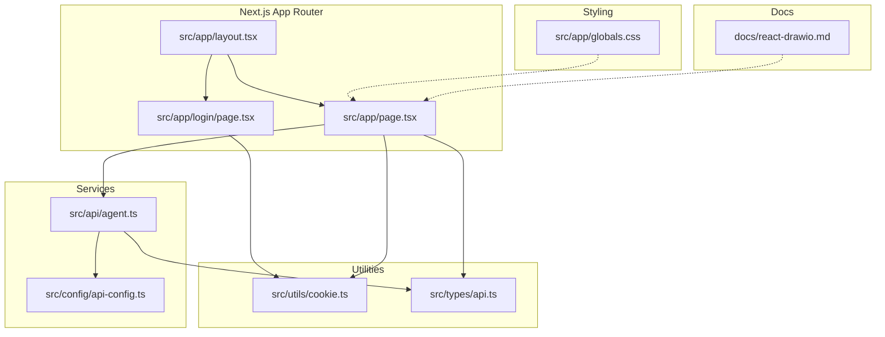
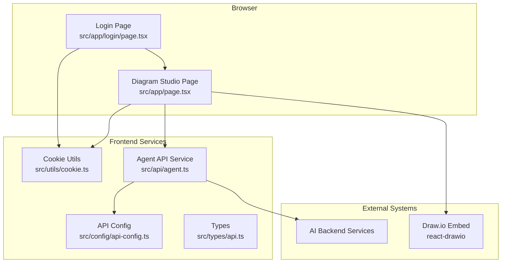
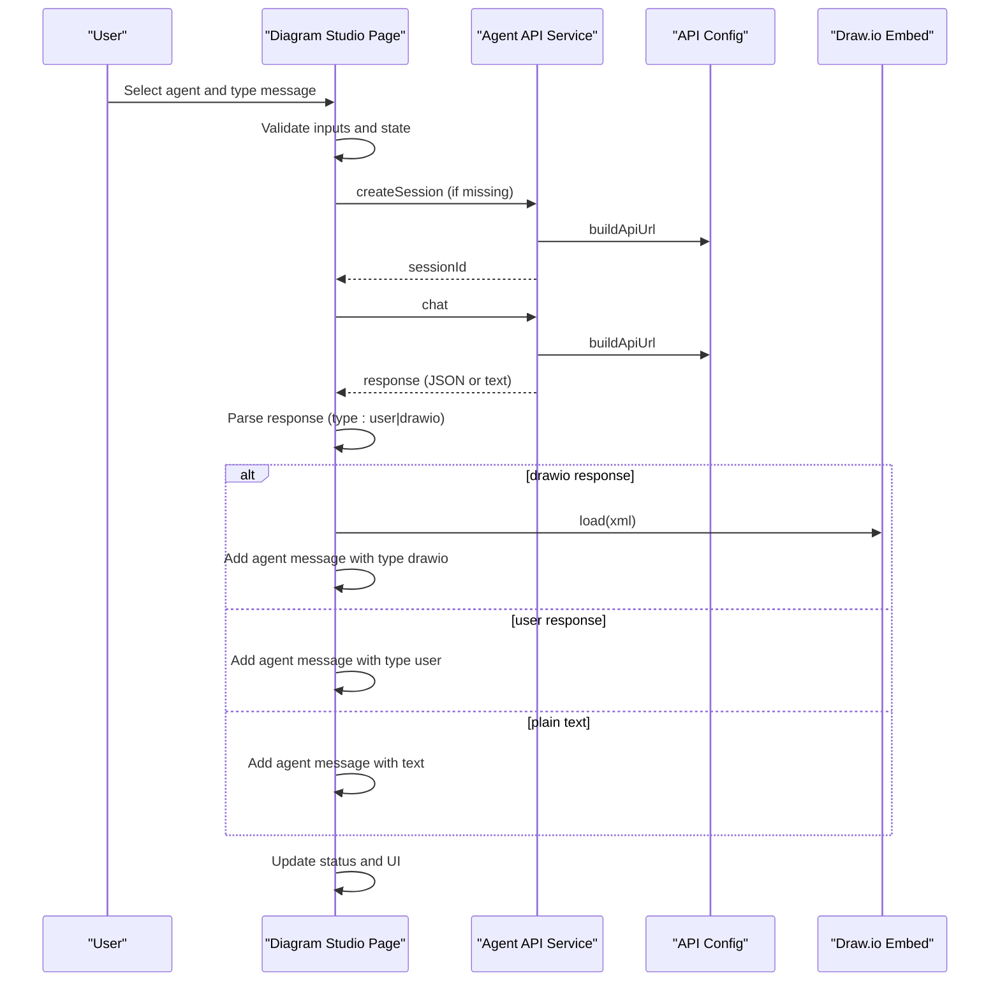
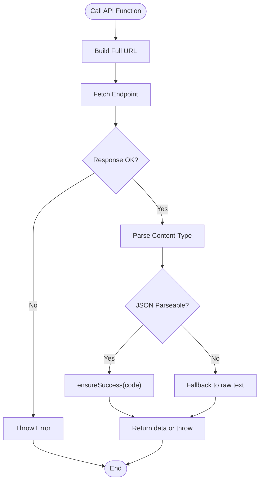
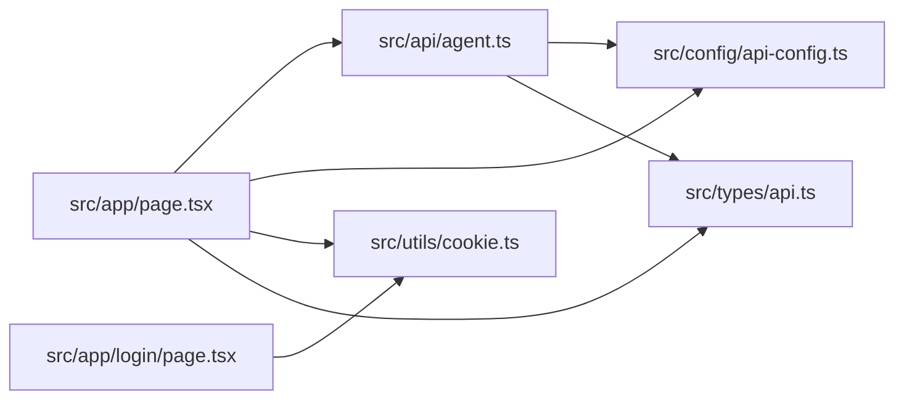

# Architecture Overview

<cite>
**Referenced Files in This Document**
- [README.md](file://README.md)
- [package.json](file://package.json)
- [next.config.ts](file://next.config.ts)
- [tsconfig.json](file://tsconfig.json)
- [src/app/layout.tsx](file://src/app/layout.tsx)
- [src/app/page.tsx](file://src/app/page.tsx)
- [src/app/login/page.tsx](file://src/app/login/page.tsx)
- [src/app/globals.css](file://src/app/globals.css)
- [src/api/agent.ts](file://src/api/agent.ts)
- [src/config/api-config.ts](file://src/config/api-config.ts)
- [src/types/api.ts](file://src/types/api.ts)
- [src/utils/cookie.ts](file://src/utils/cookie.ts)
- [docs/react-drawio.md](file://docs/react-drawio.md)
</cite>

## Table of Contents

1. [Introduction](#introduction)
2. [Project Structure](#project-structure)
3. [Core Components](#core-components)
4. [Architecture Overview](#architecture-overview)
5. [Detailed Component Analysis](#detailed-component-analysis)
6. [Dependency Analysis](#dependency-analysis)
7. [Performance Considerations](#performance-considerations)
8. [Troubleshooting Guide](#troubleshooting-guide)
9. [Conclusion](#conclusion)

## Introduction

This document describes the architecture of the AI Agent Scaffold Frontend built with Next.js App Router. The
application is a diagramming and AI-assisted chat platform that integrates a Draw.io editor with backend AI services. It
follows a component-based structure with a clear separation of concerns:

- UI components handle presentation and user interactions
- Services encapsulate API communication
- Utilities provide helper functions for cookies and formatting
- Configuration centralizes API endpoints and base URLs

External dependencies include react-drawio for the embedded diagram editor and TailwindCSS for styling. The system
boundary is defined by the frontend application and its integration points with backend AI services.

## Project Structure

The project follows Next.js App Router conventions with a strict file-based routing model. Key areas:

- src/app: Page components and shared layout
- src/api: Service layer for backend communication
- src/config: Centralized API configuration
- src/types: Shared TypeScript interfaces
- src/utils: Utility modules for cookies and formatting
- docs: Third-party integration documentation

**Diagram sources**

- [src/app/layout.tsx:1-34](file://src/app/layout.tsx#L1-L34)
- [src/app/page.tsx:1-600](file://src/app/page.tsx#L1-L600)
- [src/app/login/page.tsx:1-173](file://src/app/login/page.tsx#L1-L173)
- [src/api/agent.ts:1-191](file://src/api/agent.ts#L1-L191)
- [src/config/api-config.ts:1-28](file://src/config/api-config.ts#L1-L28)
- [src/utils/cookie.ts:1-111](file://src/utils/cookie.ts#L1-L111)
- [src/types/api.ts:1-74](file://src/types/api.ts#L1-L74)
- [src/app/globals.css:1-27](file://src/app/globals.css#L1-L27)
- [docs/react-drawio.md:1-168](file://docs/react-drawio.md#L1-L168)

**Section sources**

- [README.md:1-37](file://README.md#L1-L37)
- [package.json:1-28](file://package.json#L1-L28)
- [next.config.ts:1-8](file://next.config.ts#L1-L8)
- [tsconfig.json:1-35](file://tsconfig.json#L1-L35)

## Core Components

- Diagram Studio Page (Main UI): Orchestrates agent selection, chat interactions, Draw.io integration, and session
  management.
- API Service Layer: Encapsulates HTTP requests, response parsing, and error handling for backend endpoints.
- Configuration Management: Centralizes API base URL and endpoint constants with a builder function.
- Cookie Utilities: Provides cookie CRUD operations and login payload helpers.
- Type System: Defines shared interfaces for requests, responses, and UI messages.
- Login Page: Minimal authentication flow that sets a login cookie and redirects to the main page.

Design patterns used:

- Service Layer Pattern: API calls are isolated in dedicated modules.
- MVC-like Separation: Components manage UI state, services handle data communication, utilities provide helper
  functions.
- Configuration Driven: API endpoints and base URL are centralized for easy maintenance.
- Reactive UI with Hooks: React hooks manage local state, effects, and side effects.

**Section sources**

- [src/app/page.tsx:1-600](file://src/app/page.tsx#L1-L600)
- [src/api/agent.ts:1-191](file://src/api/agent.ts#L1-L191)
- [src/config/api-config.ts:1-28](file://src/config/api-config.ts#L1-L28)
- [src/utils/cookie.ts:1-111](file://src/utils/cookie.ts#L1-L111)
- [src/types/api.ts:1-74](file://src/types/api.ts#L1-L74)
- [src/app/login/page.tsx:1-173](file://src/app/login/page.tsx#L1-L173)

## Architecture Overview

The system is structured around a single-page application with two primary routes:

- /login: Authentication page that writes a login cookie and navigates to the main page.
- /: The Diagram Studio page that integrates the Draw.io editor, agent selection, and chat UI.

**Diagram sources**

- [src/app/page.tsx:1-600](file://src/app/page.tsx#L1-L600)
- [src/app/login/page.tsx:1-173](file://src/app/login/page.tsx#L1-L173)
- [src/api/agent.ts:1-191](file://src/api/agent.ts#L1-L191)
- [src/config/api-config.ts:1-28](file://src/config/api-config.ts#L1-L28)
- [src/utils/cookie.ts:1-111](file://src/utils/cookie.ts#L1-L111)
- [src/types/api.ts:1-74](file://src/types/api.ts#L1-L74)
- [docs/react-drawio.md:1-168](file://docs/react-drawio.md#L1-L168)

## Detailed Component Analysis

### Diagram Studio Page (Main UI)

Responsibilities:

- Authentication guard: Redirects unauthenticated users to /login.
- Agent discovery: Loads agent configurations from the backend and persists last selection.
- Session lifecycle: Creates sessions when needed and maintains session IDs.
- Chat orchestration: Sends messages, parses agent responses, and updates UI state.
- Draw.io integration: Renders diagrams from agent responses and handles exports.
- Status reporting: Displays informational and error messages.

State management patterns:

- Local React state for UI state (agents, selected agent, messages, session, UI toggles).
- Persistent selections via localStorage.
- Cookies for login state.

Data flow:

- On mount, checks cookie for user identity; otherwise redirects to login.
- Loads agent list and restores previous selection.
- On message send, conditionally creates a session, posts to chat endpoint, parses response, and updates messages and
  Draw.io XML.

**Diagram sources**

- [src/app/page.tsx:118-233](file://src/app/page.tsx#L118-L233)
- [src/api/agent.ts:87-113](file://src/api/agent.ts#L87-L113)
- [src/config/api-config.ts:24-27](file://src/config/api-config.ts#L24-L27)

**Section sources**

- [src/app/page.tsx:1-600](file://src/app/page.tsx#L1-L600)

### API Service Layer

Responsibilities:

- Centralized HTTP requests with JSON parsing and error handling.
- Non-streaming chat and streaming chat support.
- Response code validation and error propagation.
- Backend availability detection.

Key functions:

- requestJson: Builds URL, performs fetch, parses JSON, and throws on non-OK responses.
- ensureSuccess: Validates response code and extracts data.
- queryAgentConfigList: Fetches agent configurations.
- createSession: Creates a session and returns sessionId.
- chat: Posts chat message and returns content string.
- chatStream: Streams server-sent events and invokes callbacks.
- isBackendUnavailableError: Detects network-related failures.

**Diagram sources**

- [src/api/agent.ts:20-58](file://src/api/agent.ts#L20-L58)
- [src/api/agent.ts:63-69](file://src/api/agent.ts#L63-L69)
- [src/api/agent.ts:75-113](file://src/api/agent.ts#L75-L113)

**Section sources**

- [src/api/agent.ts:1-191](file://src/api/agent.ts#L1-L191)

### Configuration Management

Responsibilities:

- Define API base URL from environment.
- Define endpoint constants.
- Provide a URL builder function.

Patterns:

- Environment-driven configuration for base URL.
- Immutable endpoint constants.
- Single source of truth for API endpoints.

**Section sources**

- [src/config/api-config.ts:1-28](file://src/config/api-config.ts#L1-L28)

### Cookie Utilities

Responsibilities:

- Cookie CRUD operations.
- Safe JSON parsing.
- Login payload serialization and deserialization.
- User identification helpers.
- Timestamp formatting.

Integration:

- Used by the Diagram Studio page to enforce authentication.
- Used by the Login page to persist user identity.

**Section sources**

- [src/utils/cookie.ts:1-111](file://src/utils/cookie.ts#L1-L111)

### Type System

Responsibilities:

- Define response wrapper, agent config, session, chat request/response, agent response variants, login payload, and
  chat message.
- Define response code constants.

Benefits:

- Strong typing across services and UI.
- Consistent contract with backend.

**Section sources**

- [src/types/api.ts:1-74](file://src/types/api.ts#L1-L74)

### Login Page

Responsibilities:

- Minimal form to capture user ID.
- Persist login payload to cookie.
- Navigate to main page.

Flow:

- On submit, validates input, saves payload, and redirects.

**Section sources**

- [src/app/login/page.tsx:1-173](file://src/app/login/page.tsx#L1-L173)

### Draw.io Integration

Responsibilities:

- Embed diagrams.net editor.
- Load XML diagrams from agent responses.
- Export diagrams and preview images.
- Configure editor UI (dark mode, libraries, etc.).

Integration points:

- React ref for programmatic actions (load, exportDiagram).
- onExport callback to capture exported image data.

**Section sources**

- [src/app/page.tsx:344-356](file://src/app/page.tsx#L344-L356)
- [docs/react-drawio.md:1-168](file://docs/react-drawio.md#L1-L168)

## Dependency Analysis

External dependencies:

- next: Framework runtime and App Router.
- react, react-dom: UI framework.
- react-drawio: Embedded diagrams.net editor.
- tailwindcss: Utility-first CSS framework.
- @types/*: TypeScript definitions.

Internal dependencies:

- Diagram Studio Page depends on API service, cookie utilities, types, and configuration.
- API service depends on configuration and types.
- Login page depends on cookie utilities.

**Diagram sources**

- [src/app/page.tsx:1-600](file://src/app/page.tsx#L1-L600)
- [src/app/login/page.tsx:1-173](file://src/app/login/page.tsx#L1-L173)
- [src/api/agent.ts:1-191](file://src/api/agent.ts#L1-L191)
- [src/config/api-config.ts:1-28](file://src/config/api-config.ts#L1-L28)
- [src/utils/cookie.ts:1-111](file://src/utils/cookie.ts#L1-L111)
- [src/types/api.ts:1-74](file://src/types/api.ts#L1-L74)

**Section sources**

- [package.json:11-26](file://package.json#L11-L26)

## Performance Considerations

- Minimize re-renders: Use React state grouping and memoization where appropriate.
- Debounce or throttle input handlers to reduce unnecessary updates.
- Lazy-load heavy assets and defer non-critical operations.
- Optimize API calls: Batch requests where feasible and cache agent lists locally.
- Use streaming for long-running operations when available to improve perceived performance.

## Troubleshooting Guide

Common issues and resolutions:

- Backend Unavailable: The API service detects network errors and marks status accordingly. Verify API base URL and CORS
  settings.
- Session Creation Failure: Ensure agentId and userId are present before creating a session.
- Parsing Errors: Agent responses may be plain text; the UI gracefully falls back to displaying raw content.
- Authentication Redirect Loop: Confirm cookie presence and validity; clear stale cookies if needed.
- Draw.io Export Issues: Ensure the editor is initialized and the ref is available before exporting.

**Section sources**

- [src/api/agent.ts:181-190](file://src/api/agent.ts#L181-L190)
- [src/app/page.tsx:144-233](file://src/app/page.tsx#L144-L233)
- [src/utils/cookie.ts:63-85](file://src/utils/cookie.ts#L63-L85)

## Conclusion

The AI Agent Scaffold Frontend employs a clean separation of concerns with a strong service layer, centralized
configuration, and robust utilities. The Diagram Studio page orchestrates UI, API communication, and Draw.io
integration, while the Login page provides a minimal authentication flow. The architecture is extensible, maintainable,
and aligned with modern React and Next.js best practices.