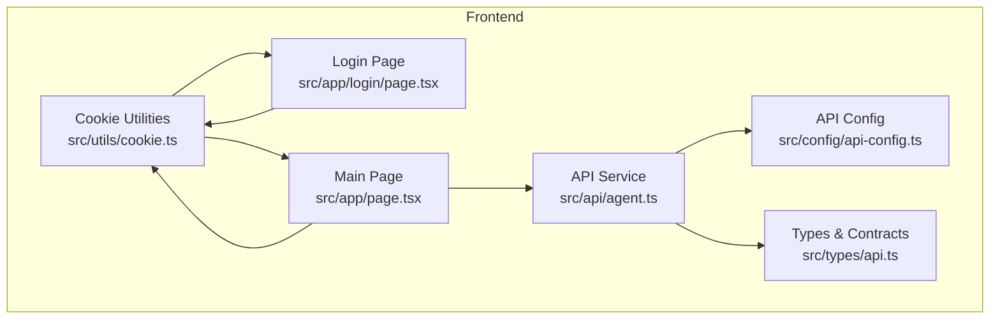
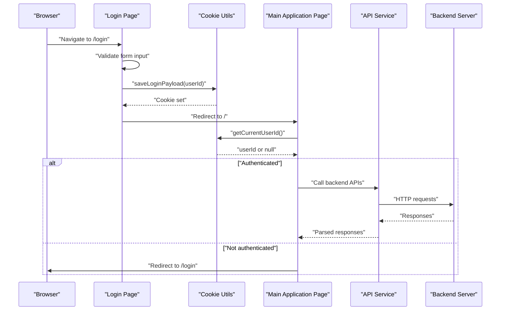
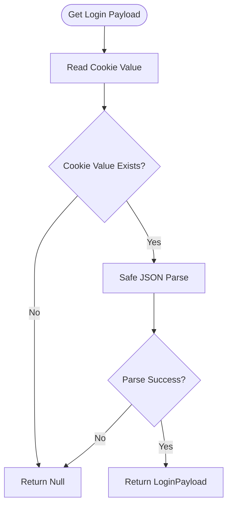
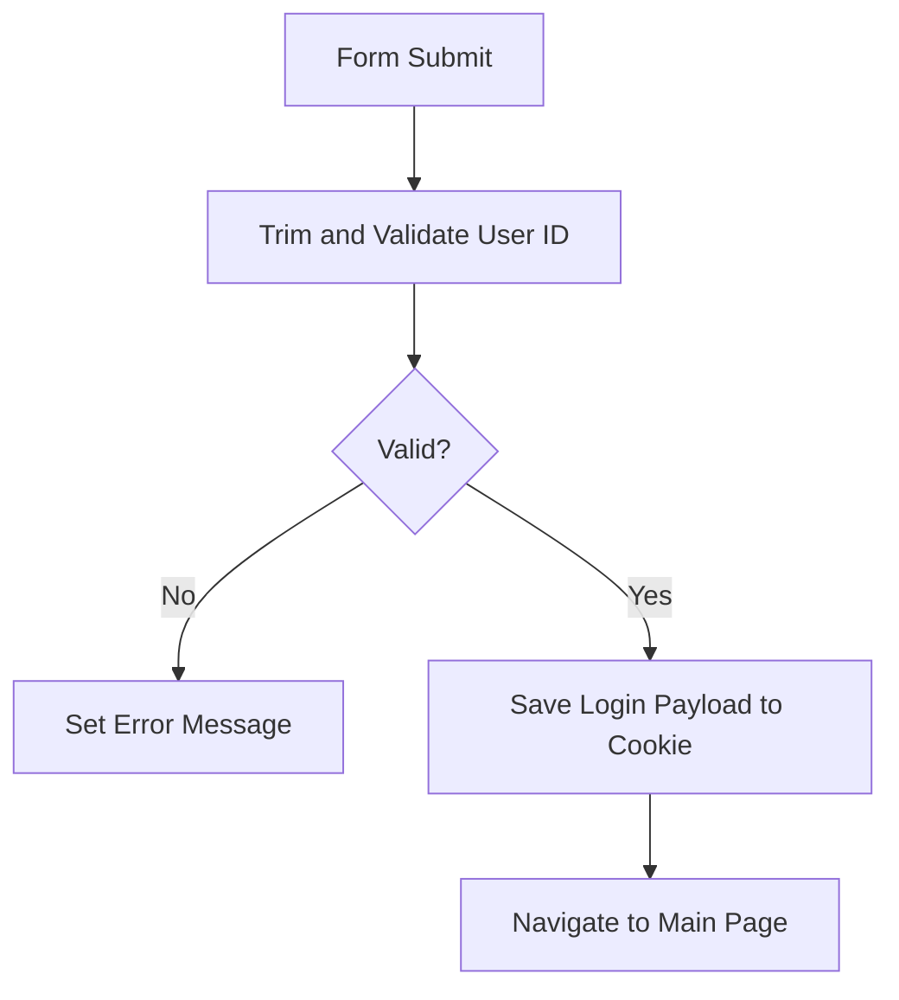
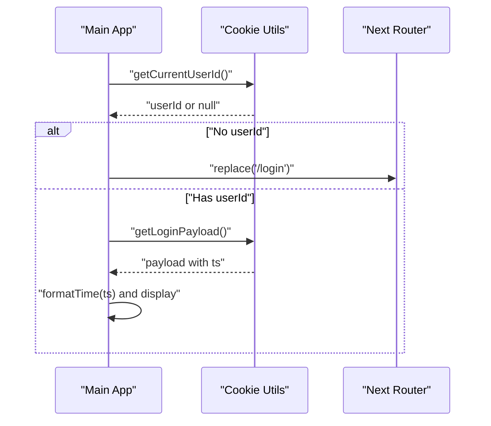
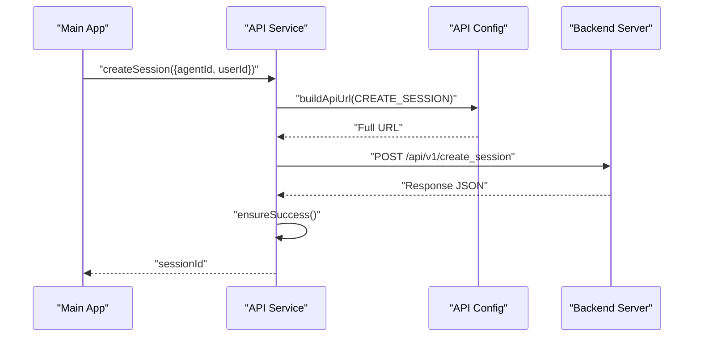
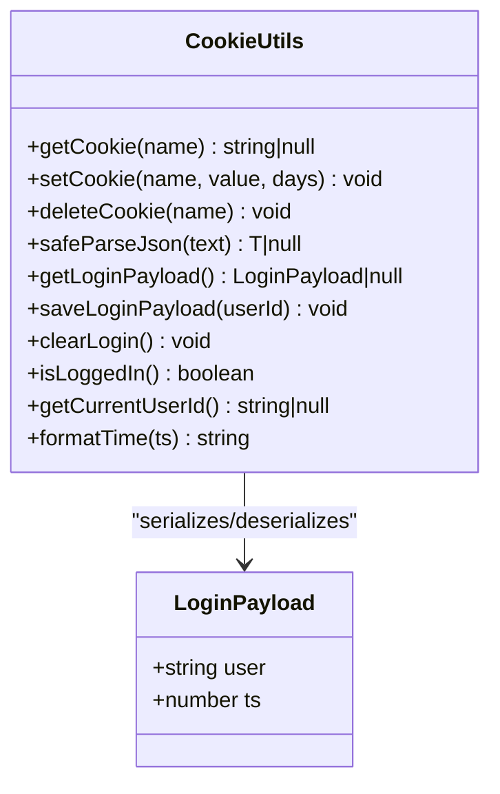
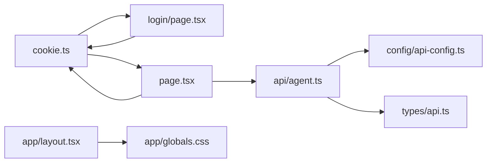

# Authentication System

<cite>
**Referenced Files in This Document**
- [cookie.ts](file://src/utils/cookie.ts)
- [page.tsx](file://src/app/login/page.tsx)
- [page.tsx](file://src/app/page.tsx)
- [agent.ts](file://src/api/agent.ts)
- [api-config.ts](file://src/config/api-config.ts)
- [api.ts](file://src/types/api.ts)
- [layout.tsx](file://src/app/layout.tsx)
- [globals.css](file://src/app/globals.css)
- [package.json](file://package.json)
</cite>

## Table of Contents
1. [Introduction](#introduction)
2. [Project Structure](#project-structure)
3. [Core Components](#core-components)
4. [Architecture Overview](#architecture-overview)
5. [Detailed Component Analysis](#detailed-component-analysis)
6. [Dependency Analysis](#dependency-analysis)
7. [Performance Considerations](#performance-considerations)
8. [Troubleshooting Guide](#troubleshooting-guide)
9. [Conclusion](#conclusion)

## Introduction

This document explains the authentication system implemented in the frontend application. It focuses on cookie-based
authentication, user session management, and the login workflow. It documents cookie utility functions for JSON parsing,
expiration handling, and session persistence across browser sessions. It also covers the login page implementation, form
validation, authentication state management, and how user sessions are maintained. Security considerations for cookie
storage and session lifecycle management are addressed, along with practical examples of authentication flows, error
handling for failed logins, and session timeout scenarios. Finally, it describes integration with backend authentication
services and how the frontend handles authentication tokens and user state.

## Project Structure
The authentication system spans several key areas:
- Cookie utilities for storing and retrieving login state
- Login page with form validation and submission handling
- Main application page that enforces authentication checks
- API service layer for backend integration
- Type definitions for authentication payloads and API contracts
- Global configuration for API endpoints and base URLs

**Diagram sources**
- [cookie.ts:1-111](file://src/utils/cookie.ts#L1-L111)
- [page.tsx:1-173](file://src/app/login/page.tsx#L1-L173)
- [page.tsx:1-600](file://src/app/page.tsx#L1-L600)
- [agent.ts:1-191](file://src/api/agent.ts#L1-L191)
- [api-config.ts:1-28](file://src/config/api-config.ts#L1-L28)
- [api.ts:1-74](file://src/types/api.ts#L1-L74)

**Section sources**
- [cookie.ts:1-111](file://src/utils/cookie.ts#L1-L111)
- [page.tsx:1-173](file://src/app/login/page.tsx#L1-L173)
- [page.tsx:1-600](file://src/app/page.tsx#L1-L600)
- [agent.ts:1-191](file://src/api/agent.ts#L1-L191)
- [api-config.ts:1-28](file://src/config/api-config.ts#L1-L28)
- [api.ts:1-74](file://src/types/api.ts#L1-L74)

## Core Components

- Cookie utilities module: Provides functions to get, set, delete, and safely parse JSON stored in cookies. It defines a
  constant cookie name for the login payload and exposes helpers to check login status and extract the current user ID.
- Login page: Implements a client-side form that validates user input, saves the login payload to a cookie, and
  navigates to the main page.
- Main application page: Enforces authentication by checking the cookie on mount and redirecting unauthenticated users
  to the login page. It displays user information and provides logout functionality.
- API service: Encapsulates backend communication, including request building, JSON handling, and error propagation. It
  integrates with the API configuration module.
- Types: Defines the LoginPayload interface and other API-related types used across the application.
- API configuration: Centralizes API base URL and endpoint constants, and provides a URL builder.

**Section sources**
- [cookie.ts:1-111](file://src/utils/cookie.ts#L1-L111)
- [page.tsx:1-173](file://src/app/login/page.tsx#L1-L173)
- [page.tsx:1-600](file://src/app/page.tsx#L1-L600)
- [agent.ts:1-191](file://src/api/agent.ts#L1-L191)
- [api.ts:52-56](file://src/types/api.ts#L52-L56)
- [api-config.ts:1-28](file://src/config/api-config.ts#L1-L28)

## Architecture Overview
The authentication architecture follows a cookie-based approach:
- On successful login, the frontend stores a LoginPayload in a cookie.
- The main application page checks for the presence of this cookie on initial load and redirects to the login page if
  missing.
- The API service communicates with the backend using configured endpoints and manages errors consistently.

**Diagram sources**
- [page.tsx:13-36](file://src/app/login/page.tsx#L13-L36)
- [cookie.ts:63-85](file://src/utils/cookie.ts#L63-L85)
- [page.tsx:38-51](file://src/app/page.tsx#L38-L51)
- [agent.ts:20-58](file://src/api/agent.ts#L20-L58)
- [api-config.ts:25-27](file://src/config/api-config.ts#L25-L27)

## Detailed Component Analysis

### Cookie Utilities
The cookie utilities module centralizes cookie management for authentication:
- Constants: Defines the cookie name used to store the login payload.
- Accessors: Functions to get, set, and delete cookies with proper encoding and decoding.
- JSON handling: A safe parser that returns null on invalid JSON, preventing crashes during cookie reads.
- Login payload: Functions to serialize/deserialize the LoginPayload and persist it in the cookie.
- Authentication helpers: isLoggedIn and getCurrentUserId extract user identity from the cookie payload.
- Timestamp formatting: Utility to convert numeric timestamps to human-readable strings.

**Diagram sources**
- [cookie.ts:63-67](file://src/utils/cookie.ts#L63-L67)
- [cookie.ts:52-58](file://src/utils/cookie.ts#L52-L58)

**Section sources**
- [cookie.ts:8-111](file://src/utils/cookie.ts#L8-L111)
- [api.ts:52-56](file://src/types/api.ts#L52-L56)

### Login Page Implementation
The login page implements a client-side form with validation and submission handling:
- State management: Tracks user ID input, loading state, and error messages.
- Validation: Ensures the user ID is non-empty after trimming.
- Submission: Saves the login payload to a cookie and navigates to the main page.
- UI feedback: Displays loading indicators and error messages.

**Diagram sources**
- [page.tsx:13-36](file://src/app/login/page.tsx#L13-L36)
- [cookie.ts:72-78](file://src/utils/cookie.ts#L72-L78)

**Section sources**
- [page.tsx:1-173](file://src/app/login/page.tsx#L1-L173)
- [cookie.ts:63-85](file://src/utils/cookie.ts#L63-L85)

### Main Application Page Authentication
The main application page enforces authentication:
- Mount effect: Checks for a valid user ID from the cookie and redirects to the login page if absent.
- User info display: Reads the login payload and formats the login timestamp for display.
- Logout: Clears the login cookie and redirects to the login page.

**Diagram sources**
- [page.tsx:38-51](file://src/app/page.tsx#L38-L51)
- [cookie.ts:98-110](file://src/utils/cookie.ts#L98-L110)

**Section sources**
- [page.tsx:1-600](file://src/app/page.tsx#L1-L600)
- [cookie.ts:88-110](file://src/utils/cookie.ts#L88-L110)

### API Integration and Session Management
The API service layer handles backend communication:
- Request building: Uses the API configuration to construct full URLs.
- JSON handling: Parses responses and handles non-JSON responses gracefully.
- Error handling: Throws descriptive errors for HTTP failures and non-success responses.
- Session creation: Exposes a function to create sessions using agent and user identifiers.

**Diagram sources**
- [agent.ts:87-100](file://src/api/agent.ts#L87-L100)
- [api-config.ts:25-27](file://src/config/api-config.ts#L25-L27)

**Section sources**
- [agent.ts:1-191](file://src/api/agent.ts#L1-L191)
- [api-config.ts:1-28](file://src/config/api-config.ts#L1-L28)
- [api.ts:20-37](file://src/types/api.ts#L20-L37)

### Authentication State Management
Authentication state is managed client-side via cookies:
- Login payload: Stored as a JSON string in a dedicated cookie with a default expiration of seven days.
- User ID extraction: The main page reads the cookie to determine if the user is authenticated.
- Logout: Clears the cookie and redirects to the login page.

**Diagram sources**
- [cookie.ts:13-110](file://src/utils/cookie.ts#L13-L110)
- [api.ts:52-56](file://src/types/api.ts#L52-L56)

**Section sources**
- [cookie.ts:1-111](file://src/utils/cookie.ts#L1-L111)
- [api.ts:52-56](file://src/types/api.ts#L52-L56)

## Dependency Analysis
The authentication system exhibits clear separation of concerns:
- Cookie utilities depend on DOM APIs and the LoginPayload type.
- Login page depends on cookie utilities and Next.js routing.
- Main application page depends on cookie utilities and Next.js navigation.
- API service depends on API configuration and types.
- Global styles and layout provide the visual foundation.

**Diagram sources**
- [cookie.ts:1-111](file://src/utils/cookie.ts#L1-L111)
- [page.tsx:1-173](file://src/app/login/page.tsx#L1-L173)
- [page.tsx:1-600](file://src/app/page.tsx#L1-L600)
- [agent.ts:1-191](file://src/api/agent.ts#L1-L191)
- [api-config.ts:1-28](file://src/config/api-config.ts#L1-L28)
- [api.ts:1-74](file://src/types/api.ts#L1-L74)
- [layout.tsx:1-34](file://src/app/layout.tsx#L1-L34)
- [globals.css:1-27](file://src/app/globals.css#L1-L27)

**Section sources**
- [cookie.ts:1-111](file://src/utils/cookie.ts#L1-L111)
- [page.tsx:1-173](file://src/app/login/page.tsx#L1-L173)
- [page.tsx:1-600](file://src/app/page.tsx#L1-L600)
- [agent.ts:1-191](file://src/api/agent.ts#L1-L191)
- [api-config.ts:1-28](file://src/config/api-config.ts#L1-L28)
- [api.ts:1-74](file://src/types/api.ts#L1-L74)
- [layout.tsx:1-34](file://src/app/layout.tsx#L1-L34)
- [globals.css:1-27](file://src/app/globals.css#L1-L27)

## Performance Considerations
- Cookie size: The login payload is small (user ID and timestamp), minimizing overhead.
- Parsing cost: Safe JSON parsing prevents exceptions and avoids repeated parsing failures.
- Navigation: Client-side navigation via Next.js reduces server round-trips for route changes.
- API caching: Consider caching agent lists and session IDs to reduce network requests.

## Troubleshooting Guide
Common issues and resolutions:

- Login fails silently: Verify cookie setting and redirection logic in the login page. Ensure the cookie utility
  functions are invoked and the router navigation occurs after saving the payload.
- Redirect loop to login: Confirm that the cookie contains a valid LoginPayload and that the main page’s authentication
  check passes.
- Backend errors: Use the API service error handling to capture HTTP and response code errors. The service throws
  descriptive errors for non-OK responses and non-success codes.
- Network availability: The API service includes a helper to detect backend unavailability errors, enabling
  user-friendly messaging.

Practical examples:

- Successful login flow: User enters a non-empty user ID, the login page saves the payload to a cookie, and the main
  page reads the cookie to confirm authentication.
- Failed login handling: If an error occurs during submission, the login page displays an error message and remains on
  the login route.
- Session timeout scenario: If the cookie is cleared or expired, the main page redirects to the login route upon mount.

**Section sources**
- [page.tsx:13-36](file://src/app/login/page.tsx#L13-L36)
- [page.tsx:38-51](file://src/app/page.tsx#L38-L51)
- [agent.ts:52-58](file://src/api/agent.ts#L52-L58)
- [agent.ts:181-190](file://src/api/agent.ts#L181-L190)

## Conclusion

The authentication system employs a straightforward cookie-based approach to manage user sessions client-side. It
provides robust cookie utilities for safe JSON handling, login state persistence, and user identification. The login
page offers basic validation and seamless navigation to the main application, which enforces authentication and displays
user information. Integration with backend services is handled through a centralized API service with consistent error
handling. While the current implementation relies on client-side cookies, it establishes a solid foundation for session
management and can be extended to support secure tokens and server-side session validation as requirements evolve.