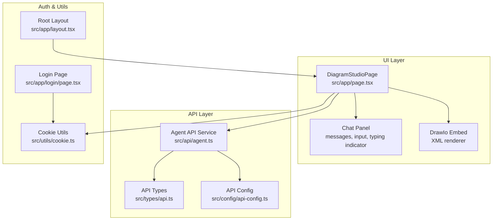
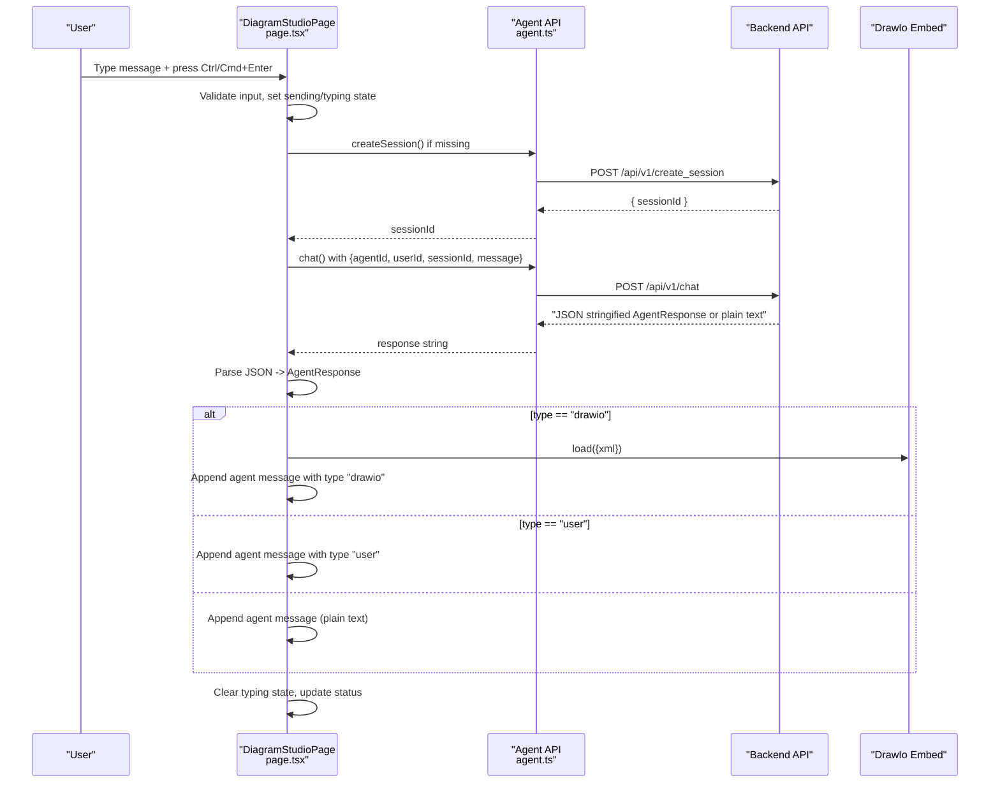
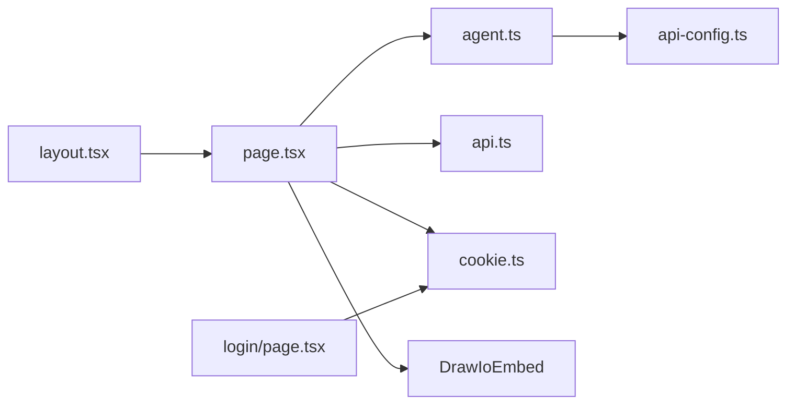

# Chat Interface

<cite>
**Referenced Files in This Document**
- [page.tsx](file://src/app/page.tsx)
- [agent.ts](file://src/api/agent.ts)
- [api.ts](file://src/types/api.ts)
- [api-config.ts](file://src/config/api-config.ts)
- [cookie.ts](file://src/utils/cookie.ts)
- [layout.tsx](file://src/app/layout.tsx)
- [login/page.tsx](file://src/app/login/page.tsx)
</cite>

## Table of Contents

1. [Introduction](#introduction)
2. [Project Structure](#project-structure)
3. [Core Components](#core-components)
4. [Architecture Overview](#architecture-overview)
5. [Detailed Component Analysis](#detailed-component-analysis)
6. [Dependency Analysis](#dependency-analysis)
7. [Performance Considerations](#performance-considerations)
8. [Troubleshooting Guide](#troubleshooting-guide)
9. [Conclusion](#conclusion)

## Introduction

This document describes the Chat Interface component responsible for real-time-like messaging, message history
management, AI agent integration, and diagram rendering. It covers UI components, input handling, keyboard shortcuts,
preset prompts, message classification, typing indicators, error handling, and how chat context influences diagram
creation. Accessibility and responsive design considerations are included, along with performance guidance for long
conversations.

## Project Structure

The Chat Interface is implemented in a single page that orchestrates agent selection, session lifecycle, message
exchange, and diagram rendering via an embedded editor.

**Diagram sources**

- [page.tsx:11-600](file://src/app/page.tsx#L11-L600)
- [agent.ts:1-191](file://src/api/agent.ts#L1-L191)
- [api.ts:1-74](file://src/types/api.ts#L1-L74)
- [api-config.ts:1-28](file://src/config/api-config.ts#L1-L28)
- [cookie.ts:1-111](file://src/utils/cookie.ts#L1-L111)
- [login/page.tsx:1-173](file://src/app/login/page.tsx#L1-L173)
- [layout.tsx:1-34](file://src/app/layout.tsx#L1-L34)

**Section sources**

- [page.tsx:11-600](file://src/app/page.tsx#L11-L600)
- [layout.tsx:20-33](file://src/app/layout.tsx#L20-L33)

## Core Components

- Chat state management: messages, input, sending state, typing state, status, and session ID.
- Agent selection and session lifecycle: agents list, last selected agent persistence, session creation.
- Real-time-like message processing: non-streaming chat with JSON-parsed agent responses supporting diagram rendering.
- UI elements: message bubbles, typing indicators, status bar, preset prompts, input area with dynamic height, and
  keyboard shortcuts.
- Integration with Draw.io editor: loading XML into the embedded editor and exporting rendered diagrams.

Key implementation references:

- State initialization and effects: [page.tsx:23-90](file://src/app/page.tsx#L23-L90)
- Agent selection and session reset: [page.tsx:92-100](file://src/app/page.tsx#L92-L100)
- Message sending and response parsing: [page.tsx:118-233](file://src/app/page.tsx#L118-L233)
- Typing indicator and
  auto-scroll: [page.tsx:88-90](file://src/app/page.tsx#L88-L90), [page.tsx:464-481](file://src/app/page.tsx#L464-L481)
- Preset prompts and input
  handling: [page.tsx:242-248](file://src/app/page.tsx#L242-L248), [page.tsx:487-541](file://src/app/page.tsx#L487-L541)
- Draw.io
  integration: [page.tsx:344-356](file://src/app/page.tsx#L344-L356), [page.tsx:171-177](file://src/app/page.tsx#L171-L177)

**Section sources**

- [page.tsx:23-233](file://src/app/page.tsx#L23-L233)
- [page.tsx:403-541](file://src/app/page.tsx#L403-L541)

## Architecture Overview

The Chat Interface follows a unidirectional data flow:

- UI collects user input and triggers actions.
- Actions call the Agent API service to create sessions and send messages.
- Responses are parsed; if the agent returns a diagram, the XML is loaded into the Draw.io editor.
- Messages are appended to the local state, updating the UI and optionally triggering auto-scroll.

**Diagram sources**

- [page.tsx:118-233](file://src/app/page.tsx#L118-L233)
- [agent.ts:87-113](file://src/api/agent.ts#L87-L113)
- [api-config.ts:10-22](file://src/config/api-config.ts#L10-L22)

**Section sources**

- [page.tsx:118-233](file://src/app/page.tsx#L118-L233)
- [agent.ts:87-113](file://src/api/agent.ts#L87-L113)
- [api-config.ts:10-22](file://src/config/api-config.ts#L10-L22)

## Detailed Component Analysis

### Message Classification and Rendering

- Classification: messages carry a role field ("user" or "agent") and optional type field mirroring AgentResponse.type.
- Rendering: user messages appear on the right with distinct styling; agent messages appear on the left with a subtle
  border and dark background. Special rendering for diagram messages displays an icon and label.
- Timestamps and session IDs: timestamps are formatted per message; session IDs are shown when present.

References:

- Role and type fields: [api.ts:59-68](file://src/types/api.ts#L59-L68)
- Rendering logic: [page.tsx:412-462](file://src/app/page.tsx#L412-L462)
- Timestamp/session ID display: [page.tsx:448-459](file://src/app/page.tsx#L448-L459)

**Diagram sources**

- [page.tsx:412-462](file://src/app/page.tsx#L412-L462)
- [api.ts:47-50](file://src/types/api.ts#L47-L50)

**Section sources**

- [api.ts:47-68](file://src/types/api.ts#L47-L68)
- [page.tsx:412-462](file://src/app/page.tsx#L412-L462)

### Message History Management

- Storage: messages array holds ChatMessage entries with id, role, content, timestamp, and optional
  agentId/sessionId/type.
- Auto-scroll: effect scrolls to bottom when messages or typing state changes.
- Empty state: shows guidance when no messages exist.

References:

- State and effect: [page.tsx:27-90](file://src/app/page.tsx#L27-L90)
- Message list rendering: [page.tsx:403-462](file://src/app/page.tsx#L403-L462)

**Section sources**

- [page.tsx:27-90](file://src/app/page.tsx#L27-L90)
- [page.tsx:403-462](file://src/app/page.tsx#L403-L462)

### Status Indicators and Error Handling

- Status bar: displays info/error messages with appropriate styling.
- Error propagation: caught errors are converted to ChatMessage entries and status updates; backend-unavailable
  detection augments status messages.
- Finalization: sending and typing states are cleared in finally blocks.

References:

- Status display: [page.tsx:394-400](file://src/app/page.tsx#L394-L400)
- Error handling block: [page.tsx:213-233](file://src/app/page.tsx#L213-L233)
- Backend availability detection: [agent.ts:181-190](file://src/api/agent.ts#L181-L190)

**Section sources**

- [page.tsx:213-233](file://src/app/page.tsx#L213-L233)
- [agent.ts:181-190](file://src/api/agent.ts#L181-L190)

### Input Handling and Keyboard Shortcuts

- Multi-line textarea with dynamic height adjustment.
- Shortcut: Ctrl/Cmd+Enter sends the message; Enter alone creates a new line.
- Disable states: input disabled when no agent selected or during send; send button disabled when input is empty or
  agent is missing.

References:

- Input element and handler: [page.tsx:503-522](file://src/app/page.tsx#L503-L522)
- Dynamic height: [page.tsx:512-517](file://src/app/page.tsx#L512-L517)
- Shortcut handler: [page.tsx:235-240](file://src/app/page.tsx#L235-L240)

**Section sources**

- [page.tsx:503-522](file://src/app/page.tsx#L503-L522)
- [page.tsx:512-517](file://src/app/page.tsx#L512-L517)
- [page.tsx:235-240](file://src/app/page.tsx#L235-L240)

### Preset Prompt Functionality

- Preset chips: shown only when the chat is empty and an agent is selected.
- Behavior: clicking a chip populates the input with the associated prompt.

References:

- Preset prompts definition: [page.tsx:242-248](file://src/app/page.tsx#L242-L248)
- Chip rendering and click handler: [page.tsx:487-500](file://src/app/page.tsx#L487-L500)

**Section sources**

- [page.tsx:242-248](file://src/app/page.tsx#L242-L248)
- [page.tsx:487-500](file://src/app/page.tsx#L487-L500)

### Typing Indicators

- Visual indicator: three bouncing dots inside an agent-styled bubble.
- Lifecycle: set when sending starts; cleared in finally after response processing.

References:

- Typing indicator rendering: [page.tsx:464-481](file://src/app/page.tsx#L464-L481)
- State
  transitions: [page.tsx:138-142](file://src/app/page.tsx#L138-L142), [page.tsx:229-232](file://src/app/page.tsx#L229-L232)

**Section sources**

- [page.tsx:464-481](file://src/app/page.tsx#L464-L481)
- [page.tsx:138-142](file://src/app/page.tsx#L138-L142)
- [page.tsx:229-232](file://src/app/page.tsx#L229-L232)

### Integration with AI Agent System

- Agent selection: dropdown loads agent configs and persists last selection.
- Session lifecycle: session created on first message if absent; session ID stored and reused.
- Non-streaming chat: response content is either parsed JSON (AgentResponse) or plain text fallback.

References:

- Agent loading and
  selection: [page.tsx:53-85](file://src/app/page.tsx#L53-L85), [page.tsx:92-100](file://src/app/page.tsx#L92-L100)
- Session creation: [page.tsx:144-153](file://src/app/page.tsx#L144-L153)
- Chat
  request/response: [agent.ts:106-113](file://src/api/agent.ts#L106-L113), [api.ts:31-42](file://src/types/api.ts#L31-L42)

**Section sources**

- [page.tsx:53-153](file://src/app/page.tsx#L53-L153)
- [agent.ts:106-113](file://src/api/agent.ts#L106-L113)
- [api.ts:31-42](file://src/types/api.ts#L31-L42)

### Message Queuing and Response Processing

- Queue model: messages are appended to the existing list; no explicit queue abstraction is used. The UI renders the
  latest message immediately upon arrival.
- Response processing: JSON parsing determines whether the agent requested a diagram or additional information;
  otherwise, a plain text message is appended.

References:

- Message append and status: [page.tsx:171-211](file://src/app/page.tsx#L171-L211)
- JSON parsing and branching: [page.tsx:163-169](file://src/app/page.tsx#L163-L169)

**Section sources**

- [page.tsx:163-211](file://src/app/page.tsx#L163-L211)

### Conversation Flow Management and Context Influence

- Session-scoped context: each conversation has a sessionId; agent responses include agentId and sessionId for
  traceability.
- Context preservation: messages carry agentId and sessionId to maintain continuity across exchanges.
- Diagram context: when a diagram is rendered, subsequent agent messages can reference the same session to keep the
  editor synchronized.

References:

- Session fields on messages: [api.ts:64-67](file://src/types/api.ts#L64-L67)
- Session usage in
  chat: [page.tsx:146-153](file://src/app/page.tsx#L146-L153), [page.tsx:178-187](file://src/app/page.tsx#L178-L187)

**Section sources**

- [api.ts:64-67](file://src/types/api.ts#L64-L67)
- [page.tsx:146-187](file://src/app/page.tsx#L146-L187)

### Accessibility and Responsive Design

- Accessibility:
    - Semantic labels and roles: buttons, selects, and inputs use appropriate attributes.
    - Focus styles: inputs and buttons apply focus outlines and ring styles.
    - Disabled states: controls reflect disabled state to screen readers.
- Responsive design:
    - Flexible layout: main area uses flexbox; chat panel width animates smoothly.
    - Scrollbars: custom scrollbar styles applied to message area.
    - Typography: fonts configured via root layout.

References:

- Layout and fonts: [layout.tsx:20-33](file://src/app/layout.tsx#L20-L33)
- Chat panel width animation: [page.tsx:358-362](file://src/app/page.tsx#L358-L362)
- Scrollbar customization: [page.tsx](file://src/app/page.tsx#L404)

**Section sources**

- [layout.tsx:20-33](file://src/app/layout.tsx#L20-L33)
- [page.tsx:358-362](file://src/app/page.tsx#L358-L362)
- [page.tsx](file://src/app/page.tsx#L404)

## Dependency Analysis

The Chat Interface depends on:

- Agent API service for network operations.
- API configuration for endpoint URLs and base URL.
- Types for request/response contracts.
- Cookie utilities for authentication state.
- Draw.io embed for diagram rendering.

**Diagram sources**

- [page.tsx:1-10](file://src/app/page.tsx#L1-L10)
- [agent.ts:1-16](file://src/api/agent.ts#L1-L16)
- [api-config.ts:1-28](file://src/config/api-config.ts#L1-L28)
- [api.ts:1-11](file://src/types/api.ts#L1-L11)
- [cookie.ts:1-11](file://src/utils/cookie.ts#L1-L11)
- [login/page.tsx:1-6](file://src/app/login/page.tsx#L1-L6)
- [layout.tsx:1-4](file://src/app/layout.tsx#L1-L4)

**Section sources**

- [page.tsx:1-10](file://src/app/page.tsx#L1-L10)
- [agent.ts:1-16](file://src/api/agent.ts#L1-L16)
- [api-config.ts:1-28](file://src/config/api-config.ts#L1-L28)
- [api.ts:1-11](file://src/types/api.ts#L1-L11)
- [cookie.ts:1-11](file://src/utils/cookie.ts#L1-L11)
- [login/page.tsx:1-6](file://src/app/login/page.tsx#L1-L6)
- [layout.tsx:1-4](file://src/app/layout.tsx#L1-L4)

## Performance Considerations

- Long conversation histories:
    - Current implementation appends all messages without pagination or virtualization. For very long histories,
      consider:
        - Virtualized lists for messages.
        - Pagination or message truncation with "show more" controls.
        - Immutable updates with stable keys to minimize re-renders.
- Rendering costs:
    - Diagram rendering occurs on demand when receiving a "drawio" message; avoid unnecessary reloads by checking XML
      equality before calling load.
- Network efficiency:
    - Non-streaming chat is simpler but slower for long responses. Consider adding streaming support to improve
      perceived latency.
- UI responsiveness:
    - Keep heavy computations off the render thread; memoize derived values like selected agent name.
- Accessibility and UX:
    - Ensure smooth scrolling and fast input handling; avoid layout thrashing by batching DOM writes.

[No sources needed since this section provides general guidance]

## Troubleshooting Guide

Common issues and resolutions:

- Backend unavailable:
    - Symptom: error status indicating backend unavailability.
    - Cause: network errors or CORS failures.
    - Resolution: verify API base URL and network connectivity; check console for fetch-related errors.
    -
    References: [agent.ts:181-190](file://src/api/agent.ts#L181-L190), [page.tsx:226-228](file://src/app/page.tsx#L226-L228)
- No agent selected:
    - Symptom: send button disabled; status indicates selecting an agent.
    - Resolution: choose an agent from the dropdown.
    -
    References: [page.tsx:121-124](file://src/app/page.tsx#L121-L124), [page.tsx:520-522](file://src/app/page.tsx#L520-L522)
- Login required:
    - Symptom: redirect to login page or status indicating login required.
    - Resolution: authenticate via login page; ensure cookie is set.
    -
    References: [page.tsx:38-51](file://src/app/page.tsx#L38-L51), [login/page.tsx:13-36](file://src/app/login/page.tsx#L13-L36), [cookie.ts:63-101](file://src/utils/cookie.ts#L63-L101)
- Diagram not rendering:
    - Symptom: agent responds with diagram but editor remains blank.
    - Resolution: confirm JSON parsing yields type "drawio"; ensure XML is valid; verify Draw.io embed is mounted.
    - References: [page.tsx:171-177](file://src/app/page.tsx#L171-L177), [api.ts:47-50](file://src/types/api.ts#L47-L50)

**Section sources**

- [agent.ts:181-190](file://src/api/agent.ts#L181-L190)
- [page.tsx:121-124](file://src/app/page.tsx#L121-L124)
- [page.tsx:226-228](file://src/app/page.tsx#L226-L228)
- [page.tsx:38-51](file://src/app/page.tsx#L38-L51)
- [login/page.tsx:13-36](file://src/app/login/page.tsx#L13-L36)
- [cookie.ts:63-101](file://src/utils/cookie.ts#L63-L101)
- [page.tsx:171-177](file://src/app/page.tsx#L171-L177)
- [api.ts:47-50](file://src/types/api.ts#L47-L50)

## Conclusion

The Chat Interface integrates agent selection, session management, non-streaming chat, and diagram rendering into a
cohesive UI. It uses clear message classification, status indicators, and typing cues to guide users. For
production-scale usage, consider implementing message virtualization, streaming responses, and robust error recovery to
enhance performance and user experience.