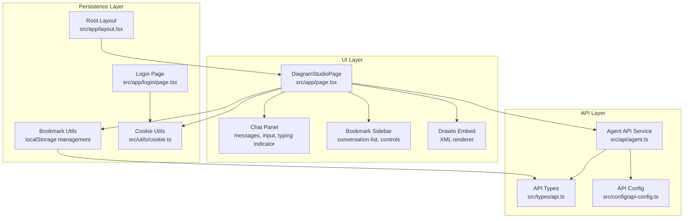
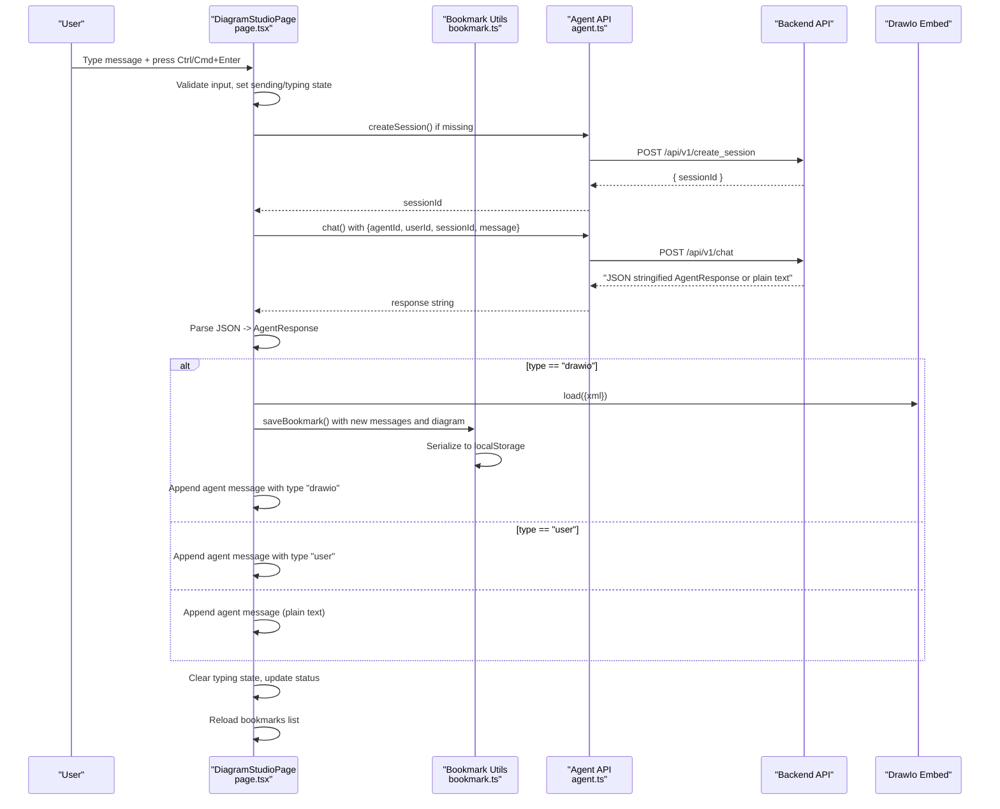
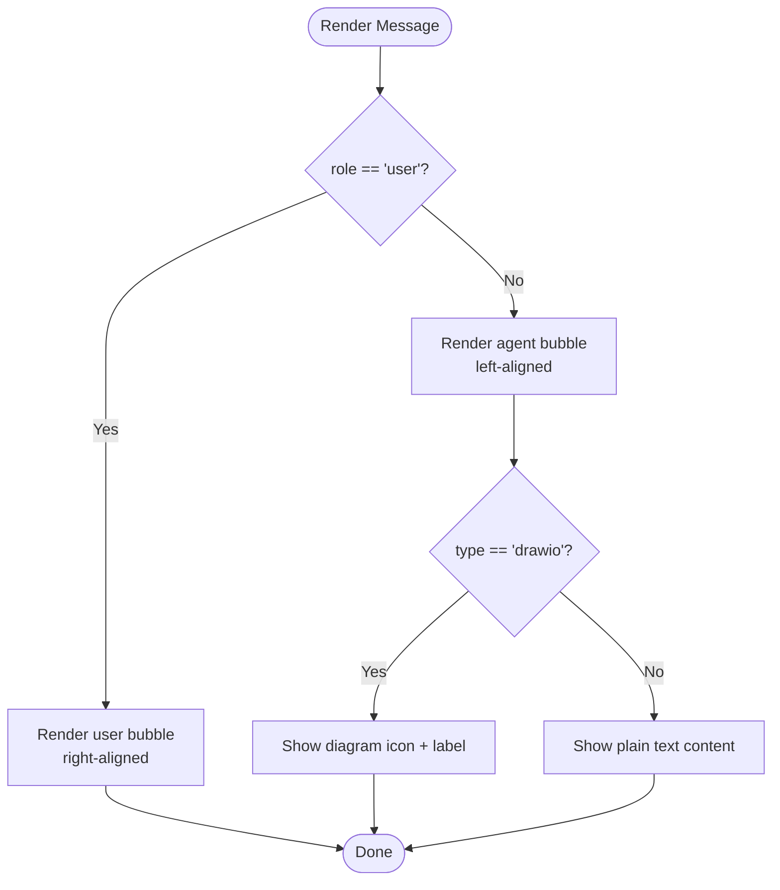
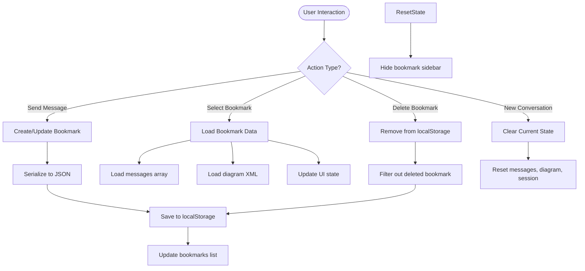
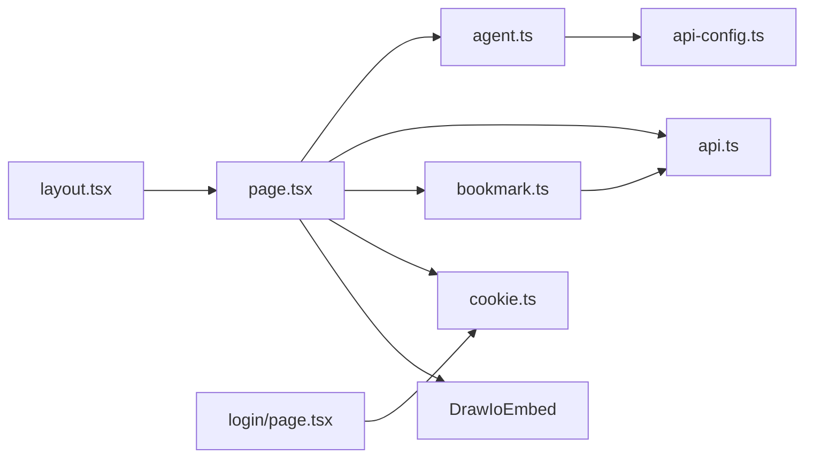

# Chat Interface

<cite>
**Referenced Files in This Document**
- [page.tsx](file://src/app/page.tsx)
- [agent.ts](file://src/api/agent.ts)
- [api.ts](file://src/types/api.ts)
- [api-config.ts](file://src/config/api-config.ts)
- [cookie.ts](file://src/utils/cookie.ts)
- [layout.tsx](file://src/app/layout.tsx)
- [login/page.tsx](file://src/app/login/page.tsx)
- [bookmark.ts](file://src/utils/bookmark.ts)
</cite>

## Update Summary
**Changes Made**

- Added comprehensive conversation bookmarking system with bookmark sidebar and persistent storage
- Enhanced bookmark management with automatic synchronization and conversation persistence
- Integrated bookmark sidebar with conversation switching, deletion, and new conversation creation
- Added bookmark state management including current bookmark tracking and automatic bookmark creation/update
- Updated architecture to support persistent conversation management with localStorage integration

## Table of Contents
1. [Introduction](#introduction)
2. [Project Structure](#project-structure)
3. [Core Components](#core-components)
4. [Architecture Overview](#architecture-overview)
5. [Detailed Component Analysis](#detailed-component-analysis)
6. [Dependency Analysis](#dependency-analysis)
7. [Performance Considerations](#performance-considerations)
8. [Troubleshooting Guide](#troubleshooting-guide)
9. [Conclusion](#conclusion)

## Introduction

This document describes the Chat Interface component responsible for real-time-like messaging, message history
management, AI agent integration, diagram rendering, and comprehensive conversation bookmarking. It covers UI
components, input handling, keyboard shortcuts, preset prompts, message classification, typing indicators, error
handling, persistent conversation management, and how chat context influences diagram creation. Accessibility and
responsive design considerations are included, along with performance guidance for long conversations and bookmark
synchronization.

## Project Structure

The Chat Interface is implemented in a single page that orchestrates agent selection, session lifecycle, message
exchange, diagram rendering, and comprehensive conversation bookmarking via an embedded editor and localStorage
persistence.

**Diagram sources**

- [page.tsx:10-10](file://src/app/page.tsx#L10-L10)
- [agent.ts:1-191](file://src/api/agent.ts#L1-L191)
- [api.ts:75-87](file://src/types/api.ts#L75-L87)
- [api-config.ts:1-28](file://src/config/api-config.ts#L1-L28)
- [cookie.ts:1-111](file://src/utils/cookie.ts#L1-L111)
- [login/page.tsx:1-173](file://src/app/login/page.tsx#L1-L173)
- [layout.tsx:1-34](file://src/app/layout.tsx#L1-L34)
- [bookmark.ts:1-202](file://src/utils/bookmark.ts#L1-L202)

**Section sources**

- [page.tsx:10-10](file://src/app/page.tsx#L10-L10)
- [layout.tsx:20-33](file://src/app/layout.tsx#L20-L33)

## Core Components
- Chat state management: messages, input, sending state, typing state, status, and session ID.
- Agent selection and session lifecycle: agents list, last selected agent persistence, session creation.
- Real-time-like message processing: non-streaming chat with JSON-parsed agent responses supporting diagram rendering.
- **Enhanced** Conversation bookmarking system: bookmark sidebar, automatic bookmark synchronization, persistent
  conversation management with localStorage.
- UI elements: message bubbles, typing indicators, status bar, preset prompts, input area with dynamic height, keyboard
  shortcuts, and bookmark controls.
- Integration with Draw.io editor: loading XML into the embedded editor and exporting rendered diagrams.
- **New** Bookmark state management: bookmarks array, current bookmark tracking, bookmark sidebar visibility control.

Key implementation references:

- State initialization and effects: [page.tsx:24-67](file://src/app/page.tsx#L24-L67)
- Bookmark state and
  sidebar: [page.tsx:40-43](file://src/app/page.tsx#L40-L43), [page.tsx:510-610](file://src/app/page.tsx#L510-L610)
- Agent selection and session reset: [page.tsx:116-124](file://src/app/page.tsx#L116-L124)
- Message sending and response parsing: [page.tsx:187-372](file://src/app/page.tsx#L187-L372)
- Typing indicator and
  auto-scroll: [page.tsx:111-114](file://src/app/page.tsx#L111-L114), [page.tsx:756-773](file://src/app/page.tsx#L756-L773)
- Preset prompts and input
  handling: [page.tsx:381-399](file://src/app/page.tsx#L381-L399), [page.tsx:777-834](file://src/app/page.tsx#L777-L834)
- Draw.io
  integration: [page.tsx:625-647](file://src/app/page.tsx#L625-L647), [page.tsx:263-270](file://src/app/page.tsx#L263-L270)
- Bookmark utilities: [bookmark.ts:57-201](file://src/utils/bookmark.ts#L57-L201)

**Section sources**

- [page.tsx:24-67](file://src/app/page.tsx#L24-L67)
- [page.tsx:187-372](file://src/app/page.tsx#L187-L372)
- [page.tsx:510-610](file://src/app/page.tsx#L510-L610)
- [bookmark.ts:57-201](file://src/utils/bookmark.ts#L57-L201)

## Architecture Overview

The Chat Interface follows a unidirectional data flow with enhanced bookmark persistence:
- UI collects user input and triggers actions.
- Actions call the Agent API service to create sessions and send messages.
- Responses are parsed; if the agent returns a diagram, the XML is loaded into the Draw.io editor.
- Messages are appended to the local state, updating the UI and optionally triggering auto-scroll.
- **Enhanced** Bookmark system automatically saves conversations to localStorage with automatic synchronization.
- **New** Bookmark sidebar provides persistent access to saved conversations with instant switching capabilities.

**Diagram sources**

- [page.tsx:187-372](file://src/app/page.tsx#L187-L372)
- [bookmark.ts:105-125](file://src/utils/bookmark.ts#L105-L125)
- [agent.ts:87-113](file://src/api/agent.ts#L87-L113)
- [api-config.ts:10-22](file://src/config/api-config.ts#L10-L22)

**Section sources**

- [page.tsx:187-372](file://src/app/page.tsx#L187-L372)
- [bookmark.ts:105-125](file://src/utils/bookmark.ts#L105-L125)
- [agent.ts:87-113](file://src/api/agent.ts#L87-L113)
- [api-config.ts:10-22](file://src/config/api-config.ts#L10-L22)

## Detailed Component Analysis

### Message Classification and Rendering
- Classification: messages carry a role field ("user" or "agent") and optional type field mirroring AgentResponse.type.
- Rendering: user messages appear on the right with distinct styling; agent messages appear on the left with a subtle
  border and dark background. Special rendering for diagram messages displays an icon and label.
- Timestamps and session IDs: timestamps are formatted per message; session IDs are shown when present.

References:
- Role and type fields: [api.ts:59-68](file://src/types/api.ts#L59-L68)
- Rendering logic: [page.tsx:703-754](file://src/app/page.tsx#L703-L754)
- Timestamp/session ID display: [page.tsx:740-751](file://src/app/page.tsx#L740-L751)

**Diagram sources**

- [page.tsx:703-754](file://src/app/page.tsx#L703-L754)
- [api.ts:47-50](file://src/types/api.ts#L47-L50)

**Section sources**

- [api.ts:59-68](file://src/types/api.ts#L59-L68)
- [page.tsx:703-754](file://src/app/page.tsx#L703-L754)

### Message History Management

- Storage: messages array holds ChatMessage entries with id, role, content, timestamp, and optional
  agentId/sessionId/type.
- Auto-scroll: effect scrolls to bottom when messages or typing state changes.
- Empty state: shows guidance when no messages exist.

References:

- State and effect: [page.tsx:24-67](file://src/app/page.tsx#L24-L67)
- Message list rendering: [page.tsx:693-774](file://src/app/page.tsx#L693-774)

**Section sources**

- [page.tsx:24-67](file://src/app/page.tsx#L24-L67)
- [page.tsx:693-774](file://src/app/page.tsx#L693-L774)

### Status Indicators and Error Handling
- Status bar: displays info/error messages with appropriate styling.
- Error propagation: caught errors are converted to ChatMessage entries and status updates; backend-unavailable
  detection augments status messages.
- Finalization: sending and typing states are cleared in finally blocks.

References:

- Status display: [page.tsx:685-691](file://src/app/page.tsx#L685-L691)
- Error handling block: [page.tsx:352-372](file://src/app/page.tsx#L352-L372)
- Backend availability detection: [agent.ts:181-190](file://src/api/agent.ts#L181-L190)

**Section sources**

- [page.tsx:352-372](file://src/app/page.tsx#L352-L372)
- [agent.ts:181-190](file://src/api/agent.ts#L181-L190)

### Input Handling and Keyboard Shortcuts
- Multi-line textarea with dynamic height adjustment that automatically resizes based on content.
- Dual-mode keyboard interaction: Ctrl/Cmd+Enter sends the message immediately; Enter alone creates a new line.
- Disable states: input disabled when no agent selected or during send; send button disabled when input is empty or
  agent is missing.

References:

- Input element and handler: [page.tsx:794-809](file://src/app/page.tsx#L794-L809)
- Dynamic height calculation: [page.tsx:804-809](file://src/app/page.tsx#L804-L809)
- Dual-mode keyboard handler: [page.tsx:374-379](file://src/app/page.tsx#L374-L379)

**Section sources**

- [page.tsx:794-809](file://src/app/page.tsx#L794-L809)
- [page.tsx:804-809](file://src/app/page.tsx#L804-L809)
- [page.tsx:374-379](file://src/app/page.tsx#L374-L379)

### Preset Prompt Functionality
- Enhanced preset chips: shown only when the chat is empty and an agent is selected.
- Four comprehensive examples: H5 Login Flow, E-commerce Shopping, Microservices Architecture, and CI/CD Pipeline.
- Behavior: clicking a chip populates the input with the associated prompt.

References:

- Enhanced preset prompts definition: [page.tsx:381-399](file://src/app/page.tsx#L381-L399)
- Chip rendering and click handler: [page.tsx:780-792](file://src/app/page.tsx#L780-L792)

**Section sources**

- [page.tsx:381-399](file://src/app/page.tsx#L381-L399)
- [page.tsx:780-792](file://src/app/page.tsx#L780-L792)

### Typing Indicators
- Visual indicator: three bouncing dots inside an agent-styled bubble.
- Lifecycle: set when sending starts; cleared in finally after response processing.

References:

- Typing indicator rendering: [page.tsx:756-773](file://src/app/page.tsx#L756-L773)
- State
  transitions: [page.tsx:210-212](file://src/app/page.tsx#L210-L212), [page.tsx:368-371](file://src/app/page.tsx#L368-L371)

**Section sources**

- [page.tsx:756-773](file://src/app/page.tsx#L756-L773)
- [page.tsx:210-212](file://src/app/page.tsx#L210-L212)
- [page.tsx:368-371](file://src/app/page.tsx#L368-L371)

### Conversation Bookmarking System

- **New** Comprehensive bookmark management: automatic creation, update, and deletion of conversation bookmarks.
- **New** Persistent storage: conversations saved to localStorage with serialization/deserialization.
- **New** Bookmark sidebar: collapsible sidebar showing conversation list with metadata and controls.
- **New** Automatic synchronization: bookmarks reload from localStorage on state changes and user interactions.
- **New** Conversation switching: click any bookmark to instantly load that conversation state.
- **New** Bookmark utilities: createBookmark, saveBookmark, deleteBookmark, getBookmarks, and getBookmarkById functions.

References:

- Bookmark state initialization: [page.tsx:40-43](file://src/app/page.tsx#L40-L43)
- Bookmark sidebar implementation: [page.tsx:510-610](file://src/app/page.tsx#L510-L610)
- Bookmark loading and filtering: [page.tsx:61-75](file://src/app/page.tsx#L61-L75)
- Bookmark creation/update logic: [page.tsx:287-323](file://src/app/page.tsx#L287-L323)
- Bookmark utilities: [bookmark.ts:57-201](file://src/utils/bookmark.ts#L57-L201)

**Diagram sources**

- [page.tsx:287-323](file://src/app/page.tsx#L287-L323)
- [page.tsx:140-156](file://src/app/page.tsx#L140-L156)
- [page.tsx:158-170](file://src/app/page.tsx#L158-L170)
- [bookmark.ts:105-135](file://src/utils/bookmark.ts#L105-L135)

**Section sources**

- [page.tsx:40-43](file://src/app/page.tsx#L40-L43)
- [page.tsx:510-610](file://src/app/page.tsx#L510-L610)
- [page.tsx:61-75](file://src/app/page.tsx#L61-L75)
- [page.tsx:287-323](file://src/app/page.tsx#L287-L323)
- [bookmark.ts:57-201](file://src/utils/bookmark.ts#L57-L201)

### Integration with AI Agent System
- Agent selection: dropdown loads agent configs and persists last selection.
- Session lifecycle: session created on first message if absent; session ID stored and reused.
- Non-streaming chat: response content is either parsed JSON (AgentResponse) or plain text fallback.

References:

- Agent loading and
  selection: [page.tsx:77-103](file://src/app/page.tsx#L77-L103), [page.tsx:116-124](file://src/app/page.tsx#L116-L124)
- Session creation: [page.tsx:215-223](file://src/app/page.tsx#L215-L223)
- Chat
  request/response: [agent.ts:106-113](file://src/api/agent.ts#L106-L113), [api.ts:39-50](file://src/types/api.ts#L39-L50)

**Section sources**

- [page.tsx:77-103](file://src/app/page.tsx#L77-L103)
- [page.tsx:116-124](file://src/app/page.tsx#L116-L124)
- [page.tsx:215-223](file://src/app/page.tsx#L215-L223)
- [agent.ts:106-113](file://src/api/agent.ts#L106-L113)
- [api.ts:39-50](file://src/types/api.ts#L39-L50)

### Message Queuing and Response Processing

- Queue model: messages are appended to the existing list; no explicit queue abstraction is used. The UI renders the
  latest message immediately upon arrival.
- Response processing: JSON parsing determines whether the agent requested a diagram or additional information;
  otherwise, a plain text message is appended.
- **Enhanced** Bookmark integration: messages are automatically saved to bookmarks after successful diagram rendering.

References:

- Message append and status: [page.tsx:339-351](file://src/app/page.tsx#L339-L351)
- JSON parsing and branching: [page.tsx:234-252](file://src/app/page.tsx#L234-L252)
- Bookmark saving logic: [page.tsx:287-323](file://src/app/page.tsx#L287-L323)

**Section sources**

- [page.tsx:339-351](file://src/app/page.tsx#L339-L351)
- [page.tsx:234-252](file://src/app/page.tsx#L234-L252)
- [page.tsx:287-323](file://src/app/page.tsx#L287-L323)

### Conversation Flow Management and Context Influence

- Session-scoped context: each conversation has a sessionId; agent responses include agentId and sessionId for
  traceability.
- Context preservation: messages carry agentId and sessionId to maintain continuity across exchanges.
- Diagram context: when a diagram is rendered, subsequent agent messages can reference the same session to keep the
  editor synchronized.
- **Enhanced** Bookmark context: conversations maintain complete context including messages, diagram XML, and metadata
  for seamless restoration.

References:
- Session fields on messages: [api.ts:64-67](file://src/types/api.ts#L64-L67)
- Session usage in
  chat: [page.tsx:215-223](file://src/app/page.tsx#L215-L223), [page.tsx:263-270](file://src/app/page.tsx#L263-L270)
- Bookmark context
  preservation: [api.ts:75-87](file://src/types/api.ts#L75-L87), [bookmark.ts:140-168](file://src/utils/bookmark.ts#L140-L168)

**Section sources**
- [api.ts:64-67](file://src/types/api.ts#L64-L67)
- [page.tsx:215-223](file://src/app/page.tsx#L215-L223)
- [page.tsx:263-270](file://src/app/page.tsx#L263-L270)
- [api.ts:75-87](file://src/types/api.ts#L75-L87)
- [bookmark.ts:140-168](file://src/utils/bookmark.ts#L140-L168)

### Accessibility and Responsive Design
- Accessibility:
  - Semantic labels and roles: buttons, selects, inputs, and interactive elements use appropriate attributes.
  - Focus styles: inputs, buttons, and interactive elements apply focus outlines and ring styles.
  - Disabled states: controls reflect disabled state to screen readers.
  - **Enhanced** Bookmark accessibility: hover states, focus management, and keyboard navigation for bookmark list.
- Responsive design:
  - Flexible layout: main area uses flexbox; chat panel width animates smoothly; bookmark sidebar collapses to icon-only
    mode.
  - Scrollbars: custom scrollbar styles applied to message area and bookmark list.
  - Typography: fonts configured via root layout.
  - **Enhanced** Mobile responsiveness: bookmark sidebar transforms to slide-out panel, chat panel adapts to smaller
    screens.

References:
- Layout and fonts: [layout.tsx:20-33](file://src/app/layout.tsx#L20-L33)
- Chat panel width animation: [page.tsx:650-653](file://src/app/page.tsx#L650-L653)
- Scrollbar customization: [page.tsx:694](file://src/app/page.tsx#L694)
- Bookmark sidebar responsive behavior: [page.tsx:510-514](file://src/app/page.tsx#L510-L514)

**Section sources**
- [layout.tsx:20-33](file://src/app/layout.tsx#L20-L33)
- [page.tsx:650-653](file://src/app/page.tsx#L650-L653)
- [page.tsx:694](file://src/app/page.tsx#L694)
- [page.tsx:510-514](file://src/app/page.tsx#L510-L514)

## Dependency Analysis
The Chat Interface depends on:
- Agent API service for network operations.
- API configuration for endpoint URLs and base URL.
- Types for request/response contracts.
- Cookie utilities for authentication state.
- Draw.io embed for diagram rendering.
- **New** Bookmark utilities for localStorage persistence and conversation management.

**Diagram sources**

- [page.tsx:6-10](file://src/app/page.tsx#L6-L10)
- [agent.ts:1-16](file://src/api/agent.ts#L1-L16)
- [api-config.ts:1-28](file://src/config/api-config.ts#L1-L28)
- [api.ts:1-11](file://src/types/api.ts#L1-L11)
- [cookie.ts:1-11](file://src/utils/cookie.ts#L1-L11)
- [login/page.tsx:1-6](file://src/app/login/page.tsx#L1-L6)
- [layout.tsx:1-4](file://src/app/layout.tsx#L1-L4)
- [bookmark.ts:6-6](file://src/utils/bookmark.ts#L6-L6)

**Section sources**

- [page.tsx:6-10](file://src/app/page.tsx#L6-L10)
- [agent.ts:1-16](file://src/api/agent.ts#L1-L16)
- [api-config.ts:1-28](file://src/config/api-config.ts#L1-L28)
- [api.ts:1-11](file://src/types/api.ts#L1-L11)
- [cookie.ts:1-11](file://src/utils/cookie.ts#L1-L11)
- [login/page.tsx:1-6](file://src/app/login/page.tsx#L1-L6)
- [layout.tsx:1-4](file://src/app/layout.tsx#L1-L4)
- [bookmark.ts:6-6](file://src/utils/bookmark.ts#L6-L6)

## Performance Considerations
- Long conversation histories:
  - Current implementation appends all messages without pagination or virtualization. For very long histories, consider:
    - Virtualized lists for messages.
    - Pagination or message truncation with "show more" controls.
    - Immutable updates with stable keys to minimize re-renders.
- **Enhanced** Bookmark performance:
  - **New** LocalStorage caching: bookmarks loaded once and cached in memory.
  - **New** Efficient serialization: only necessary fields serialized to reduce storage overhead.
  - **New** Debounced updates: bookmark updates batched to prevent excessive localStorage writes.
- Rendering costs:
  - Diagram rendering occurs on demand when receiving a "drawio" message; avoid unnecessary reloads by checking XML
    equality before calling load.
- Network efficiency:
  - Non-streaming chat is simpler but slower for long responses. Consider adding streaming support to improve perceived
    latency.
- UI responsiveness:
  - Keep heavy computations off the render thread; memoize derived values like selected agent name.
  - Dynamic height calculation is optimized to prevent layout thrashing by using automatic height adjustment.
  - **New** Bookmark sidebar animations: smooth transitions with CSS transitions for better perceived performance.
- Accessibility and UX:
  - Ensure smooth scrolling and fast input handling; avoid layout thrashing by batching DOM writes.
  - **New** Bookmark hover states: optimized opacity transitions for better visual feedback.

## Troubleshooting Guide
Common issues and resolutions:
- Backend unavailable:
  - Symptom: error status indicating backend unavailability.
  - Cause: network errors or CORS failures.
  - Resolution: verify API base URL and network connectivity; check console for fetch-related errors.
  -
  References: [agent.ts:181-190](file://src/api/agent.ts#L181-L190), [page.tsx:365-367](file://src/app/page.tsx#L365-L367)
- No agent selected:
  - Symptom: send button disabled; status indicates selecting an agent.
  - Resolution: choose an agent from the dropdown.
  - References: [page.tsx:191-194](file://src/app/page.tsx#L191-L194), [page.tsx:813](file://src/app/page.tsx#L813)
- Login required:
  - Symptom: redirect to login page or status indicating login required.
  - Resolution: authenticate via login page; ensure cookie is set.
  -
  References: [page.tsx:45-52](file://src/app/page.tsx#L45-L52), [login/page.tsx:13-36](file://src/app/login/page.tsx#L13-L36), [cookie.ts:63-101](file://src/utils/cookie.ts#L63-L101)
- Diagram not rendering:
  - Symptom: agent responds with diagram but editor remains blank.
  - Resolution: confirm JSON parsing yields type "drawio"; ensure XML is valid; verify Draw.io embed is mounted.
  - References: [page.tsx:263-270](file://src/app/page.tsx#L263-L270), [api.ts:47-50](file://src/types/api.ts#L47-L50)
- Keyboard shortcut not working:
  - Symptom: Ctrl+Enter does not submit messages.
  - Resolution: ensure browser supports keyboard event modifiers; check that input field has focus.
  - References: [page.tsx:374-379](file://src/app/page.tsx#L374-L379)
- **New** Bookmark not saving:
  - Symptom: conversations not persisting between sessions.
  - Cause: localStorage access blocked or quota exceeded.
  - Resolution: check browser localStorage capacity; clear old bookmarks; verify browser privacy settings.
  -
  References: [bookmark.ts:88-97](file://src/utils/bookmark.ts#L88-L97), [page.tsx:316-323](file://src/app/page.tsx#L316-L323)
- **New** Bookmark sidebar not showing:
  - Symptom: bookmark toggle button appears but sidebar doesn't open.
  - Cause: CSS transitions or JavaScript state issues.
  - Resolution: check bookmarkSidebarOpen state; verify CSS transition classes; ensure proper event handlers.
  -
  References: [page.tsx:467-481](file://src/app/page.tsx#L467-L481), [page.tsx:510-514](file://src/app/page.tsx#L510-L514)
- **New** Bookmark deletion not working:
  - Symptom: delete button clicks but conversation still appears.
  - Cause: event propagation or state not updating.
  - Resolution: ensure event.stopPropagation() is called; verify reloadBookmarks() is invoked; check currentBookmarkId
    comparison.
  - References: [page.tsx:158-170](file://src/app/page.tsx#L158-L170), [page.tsx:160](file://src/app/page.tsx#L160)

**Section sources**
- [agent.ts:181-190](file://src/api/agent.ts#L181-L190)
- [page.tsx:191-194](file://src/app/page.tsx#L191-L194)
- [page.tsx:365-367](file://src/app/page.tsx#L365-L367)
- [page.tsx:45-52](file://src/app/page.tsx#L45-L52)
- [login/page.tsx:13-36](file://src/app/login/page.tsx#L13-L36)
- [cookie.ts:63-101](file://src/utils/cookie.ts#L63-L101)
- [page.tsx:263-270](file://src/app/page.tsx#L263-L270)
- [api.ts:47-50](file://src/types/api.ts#L47-L50)
- [page.tsx:374-379](file://src/app/page.tsx#L374-L379)
- [bookmark.ts:88-97](file://src/utils/bookmark.ts#L88-L97)
- [page.tsx:316-323](file://src/app/page.tsx#L316-L323)
- [page.tsx:467-481](file://src/app/page.tsx#L467-L481)
- [page.tsx:510-514](file://src/app/page.tsx#L510-L514)
- [page.tsx:158-170](file://src/app/page.tsx#L158-L170)
- [page.tsx:160](file://src/app/page.tsx#L160)

## Conclusion

The Chat Interface integrates agent selection, session management, non-streaming chat, diagram rendering, and
comprehensive conversation bookmarking into a cohesive UI. It uses clear message classification, status indicators,
typing cues, and persistent conversation management to guide users. Recent enhancements include a dual-mode keyboard
interaction system with Ctrl+Enter submission, expanded preset prompt examples, dynamic input height handling, and a
sophisticated bookmarking system with automatic synchronization and persistent storage. The new bookmarking system
provides seamless conversation persistence with automatic creation, update, and deletion capabilities, enabling users to
manage multiple conversations efficiently. For production-scale usage, consider implementing message virtualization,
streaming responses, robust error recovery, and advanced bookmark management features to enhance performance and user
experience.