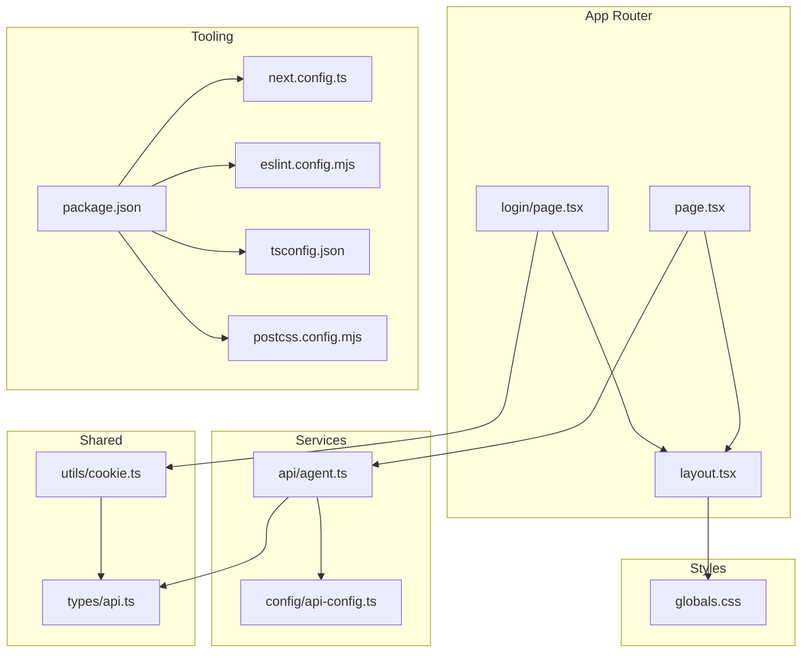
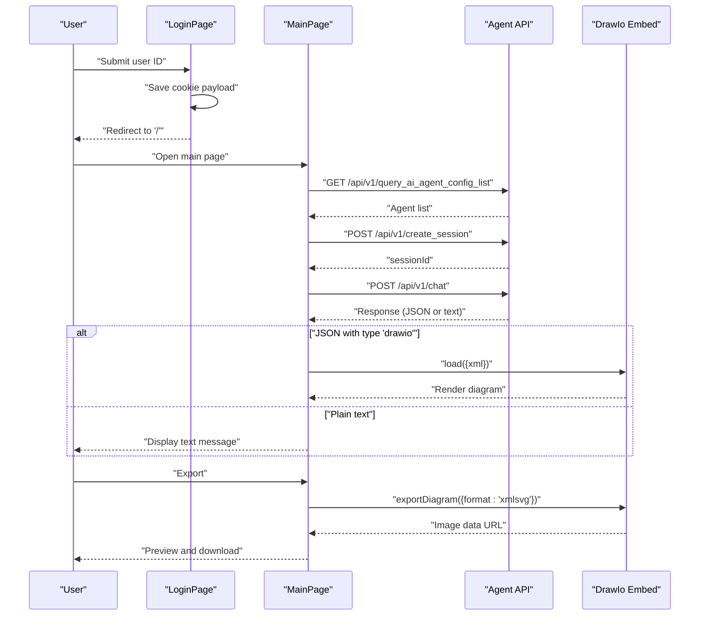
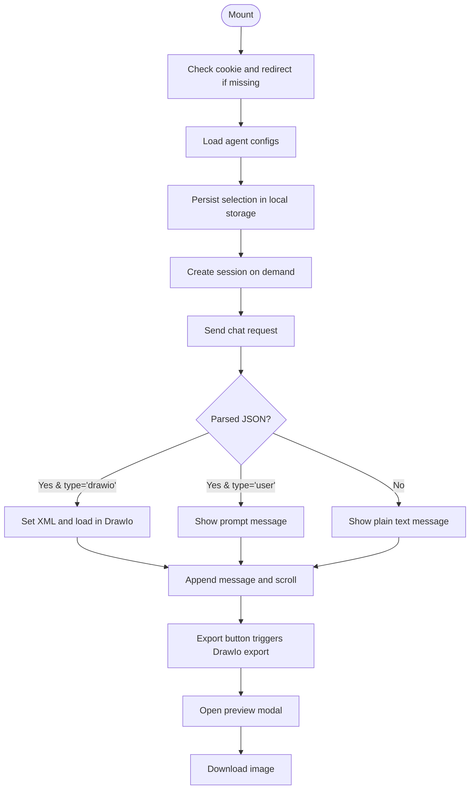
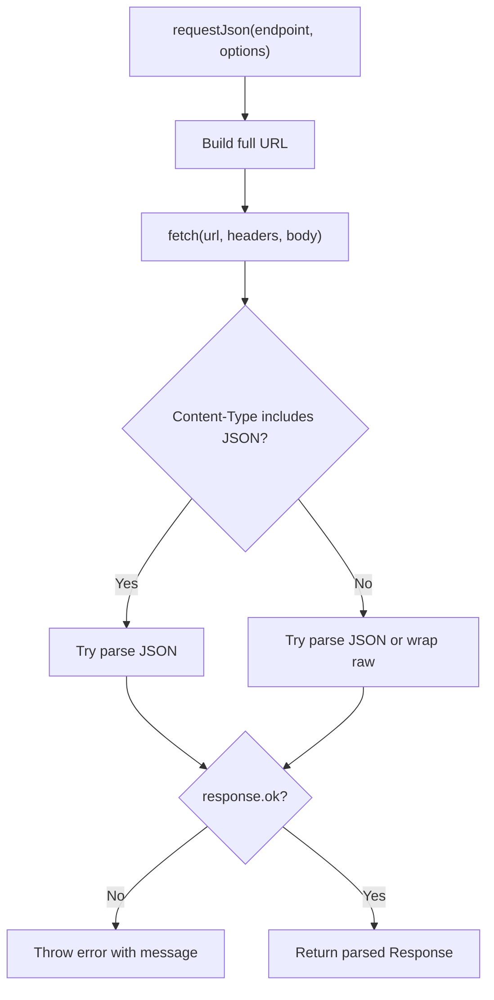
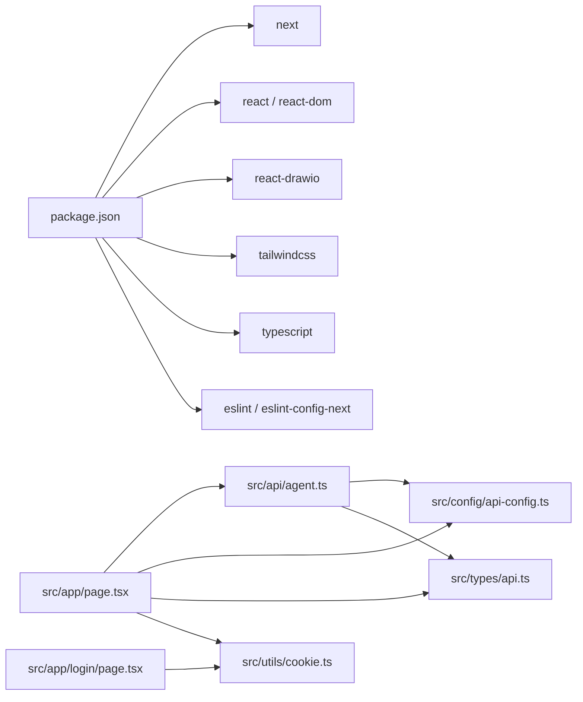

# Development Guide

<cite>
**Referenced Files in This Document**
- [package.json](file://package.json)
- [tsconfig.json](file://tsconfig.json)
- [next.config.ts](file://next.config.ts)
- [eslint.config.mjs](file://eslint.config.mjs)
- [postcss.config.mjs](file://postcss.config.mjs)
- [README.md](file://README.md)
- [src/app/layout.tsx](file://src/app/layout.tsx)
- [src/app/page.tsx](file://src/app/page.tsx)
- [src/app/globals.css](file://src/app/globals.css)
- [src/app/login/page.tsx](file://src/app/login/page.tsx)
- [src/api/agent.ts](file://src/api/agent.ts)
- [src/config/api-config.ts](file://src/config/api-config.ts)
- [src/types/api.ts](file://src/types/api.ts)
- [src/utils/cookie.ts](file://src/utils/cookie.ts)
- [AGENTS.md](file://AGENTS.md)
- [CLAUDE.md](file://CLAUDE.md)
</cite>

## Table of Contents
1. [Introduction](#introduction)
2. [Project Structure](#project-structure)
3. [Core Components](#core-components)
4. [Architecture Overview](#architecture-overview)
5. [Detailed Component Analysis](#detailed-component-analysis)
6. [Dependency Analysis](#dependency-analysis)
7. [Performance Considerations](#performance-considerations)
8. [Troubleshooting Guide](#troubleshooting-guide)
9. [Conclusion](#conclusion)
10. [Appendices](#appendices)

## Introduction

This development guide explains how to build, extend, and maintain the AI Agent Scaffold Frontend. It covers code
organization, TypeScript configuration, component development patterns, testing strategies, build and deployment,
quality practices (ESLint, formatting), performance, debugging, and contribution workflows. The application integrates a
Next.js App Router frontend with a Draw.io editor, an AI agent chat, and a lightweight cookie-based login flow.

## Project Structure
The project follows Next.js App Router conventions with a clear separation of concerns:
- Application shell and routing live under src/app
- API service layer under src/api
- Configuration constants under src/config
- Shared types under src/types
- Utilities under src/utils
- Global styles under src/app/globals.css
- Tailwind and PostCSS configured via postcss.config.mjs
- Linting via ESLint with Next.js recommended configs

**Diagram sources**
- [src/app/layout.tsx:1-34](file://src/app/layout.tsx#L1-L34)
- [src/app/page.tsx:1-600](file://src/app/page.tsx#L1-L600)
- [src/app/login/page.tsx:1-173](file://src/app/login/page.tsx#L1-L173)
- [src/api/agent.ts:1-191](file://src/api/agent.ts#L1-L191)
- [src/config/api-config.ts:1-28](file://src/config/api-config.ts#L1-L28)
- [src/types/api.ts:1-74](file://src/types/api.ts#L1-L74)
- [src/utils/cookie.ts:1-111](file://src/utils/cookie.ts#L1-L111)
- [src/app/globals.css:1-27](file://src/app/globals.css#L1-L27)
- [package.json:1-28](file://package.json#L1-L28)
- [tsconfig.json:1-35](file://tsconfig.json#L1-L35)
- [eslint.config.mjs:1-19](file://eslint.config.mjs#L1-L19)
- [postcss.config.mjs:1-8](file://postcss.config.mjs#L1-L8)
- [next.config.ts:1-8](file://next.config.ts#L1-L8)

**Section sources**
- [README.md:1-37](file://README.md#L1-L37)
- [package.json:1-28](file://package.json#L1-L28)
- [tsconfig.json:1-35](file://tsconfig.json#L1-L35)
- [next.config.ts:1-8](file://next.config.ts#L1-L8)
- [postcss.config.mjs:1-8](file://postcss.config.mjs#L1-L8)
- [eslint.config.mjs:1-19](file://eslint.config.mjs#L1-L19)

## Core Components
- Application shell and theme:
  - Root layout sets fonts, metadata, and global container classes.
  - Global CSS defines dark mode variables and Tailwind base styles.
- Main page:
  - Integrates Draw.io editor, agent chat, session management, and export flow.
  - Implements login guard, agent selection, and message rendering.
- API service:
  - Centralized request builder, JSON parsing, error handling, and streaming support.
- Configuration:
  - API base URL and endpoints are centralized for easy overrides.
- Types:
  - Strongly typed request/response contracts and UI message model.
- Utilities:
  - Cookie helpers for login persistence and time formatting.

Key responsibilities and patterns:
- Strict typing with TypeScript strict mode and incremental builds.
- Centralized API configuration and consistent error handling.
- Minimal re-renders via React state hooks and memoization-friendly callbacks.
- Dark theme-first UI with Tailwind utilities and CSS variables.

**Section sources**
- [src/app/layout.tsx:1-34](file://src/app/layout.tsx#L1-L34)
- [src/app/globals.css:1-27](file://src/app/globals.css#L1-L27)
- [src/app/page.tsx:1-600](file://src/app/page.tsx#L1-L600)
- [src/api/agent.ts:1-191](file://src/api/agent.ts#L1-L191)
- [src/config/api-config.ts:1-28](file://src/config/api-config.ts#L1-L28)
- [src/types/api.ts:1-74](file://src/types/api.ts#L1-L74)
- [src/utils/cookie.ts:1-111](file://src/utils/cookie.ts#L1-L111)

## Architecture Overview
High-level flow:
- User logs in via login page and cookie persistence.
- Main page loads agents, manages sessions, and sends chat requests.
- Backend responds with either plain text or structured JSON indicating a Draw.io diagram.
- Draw.io editor renders XML content; exported images are previewed and downloadable.

**Diagram sources**
- [src/app/login/page.tsx:1-173](file://src/app/login/page.tsx#L1-L173)
- [src/app/page.tsx:1-600](file://src/app/page.tsx#L1-L600)
- [src/api/agent.ts:1-191](file://src/api/agent.ts#L1-L191)
- [src/config/api-config.ts:1-28](file://src/config/api-config.ts#L1-L28)

## Detailed Component Analysis

### Main Page Component (Diagram Studio)
Responsibilities:
- Client-side routing guard and login verification
- Agent list loading and selection with persistence
- Session lifecycle management
- Chat UX: input handling, sending, typing indicators, and status messaging
- Parsing agent responses and rendering Draw.io diagrams
- Export flow and image preview modal

Patterns:
- Effect-driven initialization and cleanup
- Controlled state updates for messages, session, and UI flags
- Safe JSON parsing with fallback to plain text
- Local storage for agent preference restoration

**Diagram sources**
- [src/app/page.tsx:1-600](file://src/app/page.tsx#L1-L600)

**Section sources**
- [src/app/page.tsx:1-600](file://src/app/page.tsx#L1-L600)

### API Service Layer
Responsibilities:
- Unified request builder with URL composition
- Robust JSON parsing and error propagation
- Non-streaming and streaming chat handlers
- Backend availability detection

Patterns:
- Generic requestJson<T>() centralizes headers, content-type checks, and error handling
- ensureSuccess<T>() enforces response contract and throws on failure
- Streaming uses ReadableStream reader loop with TextDecoder and chunk processing
- isBackendUnavailableError() detects network/CORS/fetch failures

**Diagram sources**
- [src/api/agent.ts:1-191](file://src/api/agent.ts#L1-L191)

**Section sources**
- [src/api/agent.ts:1-191](file://src/api/agent.ts#L1-L191)

### Configuration and Types
- API configuration centralizes base URL and endpoints; supports runtime override via environment variable.
- Types define the response wrapper, agent config, session creation, chat request/response, and UI message model.

Best practices:
- Keep endpoints and base URL in one place for easy migration.
- Use discriminated unions for agent response types to drive UI rendering decisions.

**Section sources**
- [src/config/api-config.ts:1-28](file://src/config/api-config.ts#L1-L28)
- [src/types/api.ts:1-74](file://src/types/api.ts#L1-L74)

### Utilities (Cookie Management)
- Cookie helpers for reading, writing, deleting, and safe JSON parsing
- Login payload serialization and time formatting
- Guarded access for SSR/SSG contexts

**Section sources**
- [src/utils/cookie.ts:1-111](file://src/utils/cookie.ts#L1-L111)

### Login Page
- Minimal form with validation and submission flow
- Persists login payload to cookie and navigates to main page

**Section sources**
- [src/app/login/page.tsx:1-173](file://src/app/login/page.tsx#L1-L173)

### Layout and Styles
- Root layout injects fonts and global container classes
- Global CSS defines dark mode variables and Tailwind base styles
- Tailwind plugin configured via PostCSS

**Section sources**
- [src/app/layout.tsx:1-34](file://src/app/layout.tsx#L1-L34)
- [src/app/globals.css:1-27](file://src/app/globals.css#L1-L27)
- [postcss.config.mjs:1-8](file://postcss.config.mjs#L1-L8)

## Dependency Analysis
External dependencies and toolchain:
- Next.js 16 App Router for routing and SSR/SSG
- React 19 for components and hooks
- react-drawio for embedded diagram editor
- Tailwind CSS v4 for styling
- TypeScript 5 for type safety
- ESLint with Next.js recommended configs for linting

Internal module relationships:
- Main page depends on API service, configuration, types, and cookie utilities
- API service depends on configuration and types
- Login page depends on cookie utilities

**Diagram sources**
- [package.json:1-28](file://package.json#L1-L28)
- [src/app/page.tsx:1-600](file://src/app/page.tsx#L1-L600)
- [src/app/login/page.tsx:1-173](file://src/app/login/page.tsx#L1-L173)
- [src/api/agent.ts:1-191](file://src/api/agent.ts#L1-L191)
- [src/config/api-config.ts:1-28](file://src/config/api-config.ts#L1-L28)
- [src/types/api.ts:1-74](file://src/types/api.ts#L1-L74)
- [src/utils/cookie.ts:1-111](file://src/utils/cookie.ts#L1-L111)

**Section sources**
- [package.json:1-28](file://package.json#L1-L28)

## Performance Considerations
- Prefer client-side rendering only where necessary; leverage Next.js static generation and caching.
- Minimize heavy DOM updates; the main page batches state updates and uses refs for smooth scrolling.
- Use controlled components for textarea to avoid unnecessary reflows.
- Lazy-load optional assets; the Draw.io embed is mounted conditionally.
- Keep API payloads small; the agent response parser handles both JSON and plain text gracefully.
- Avoid blocking operations in render; move heavy computations to effects or workers.

## Troubleshooting Guide
Common issues and resolutions:
- Backend connectivity errors:
  - The API service detects backend unavailability and surfaces actionable messages. Verify NEXT_PUBLIC_API_BASE_URL and
    CORS configuration.
- Agent list fails to load:
  - Check endpoint permissions and response shape; ensure ResponseCode.SUCCESS matches backend.
- Chat does not render diagrams:
  - Confirm agent response includes JSON with type 'drawio' and valid XML content; verify Draw.io embed props.
- Export produces blank or corrupted images:
  - Ensure Draw.io export is triggered after XML is loaded; confirm onExport handler updates state.
- Login redirect loops:
  - Validate cookie presence and payload; ensure cookie domain/path alignment with app origin.
- Fonts and styles not applied:
  - Confirm Tailwind plugin is enabled and global CSS is imported in layout.

Quality gates:
- Run linting with the project script to enforce style and correctness.
- Use TypeScript strict mode to catch potential runtime issues early.

**Section sources**
- [src/api/agent.ts:178-191](file://src/api/agent.ts#L178-L191)
- [src/app/page.tsx:108-115](file://src/app/page.tsx#L108-L115)
- [src/app/page.tsx:164-177](file://src/app/page.tsx#L164-L177)
- [src/utils/cookie.ts:63-85](file://src/utils/cookie.ts#L63-L85)
- [eslint.config.mjs:1-19](file://eslint.config.mjs#L1-L19)

## Conclusion

This guide outlined the architecture, development patterns, and operational practices for the AI Agent Scaffold
Frontend. By following the established conventions—centralized configuration, strong typing, robust API handling, and
quality tooling—you can confidently extend the application, integrate new AI agents, implement additional export
formats, and customize the UI theme.

## Appendices

### A. TypeScript Configuration Best Practices
- Enable strict mode and incremental builds for fast feedback.
- Use path aliases (@/*) to keep imports concise and refactor-safe.
- Keep generated types out of tracked sources; rely on Next.js type generation.

**Section sources**
- [tsconfig.json:1-35](file://tsconfig.json#L1-L35)

### B. ESLint and Formatting Standards
- Use the Next.js ESLint configs for React and web vitals.
- Override defaults only when necessary; keep global ignores minimal.
- Run linting via the project script to ensure consistency across contributors.

**Section sources**
- [eslint.config.mjs:1-19](file://eslint.config.mjs#L1-L19)
- [package.json:9-9](file://package.json#L9-L9)

### C. Build and Deployment
- Development: use the dev script to start the Next.js dev server.
- Production build: use the build script to compile the application.
- Start production: use the start script to serve compiled assets.
- Deployment: follow Next.js deployment documentation; platform-specific guidance is available in the project’s README.

**Section sources**
- [package.json:5-9](file://package.json#L5-L9)
- [README.md:32-36](file://README.md#L32-L36)

### D. Extending the Application

- Add a new AI agent:
  - Register the agent in the backend so it appears in the agent list.
  - On the frontend, the agent selector will automatically reflect new entries.
  - If the agent returns structured responses, extend the UI message type and rendering logic accordingly.

- Implement additional export formats:
  - Extend the export handler to support other formats supported by the Draw.io embed.
  - Update the export modal to present appropriate options and filenames.

- Customize the UI theme:
  - Adjust CSS variables in global styles for colors and fonts.
  - Use Tailwind utilities consistently; avoid ad-hoc inline styles.
  - Keep dark mode in mind when introducing new components.

- Integrate a new feature area:
  - Place new pages under src/app following the App Router convention.
  - Reuse shared types, configuration, and utilities to minimize duplication.

**Section sources**
- [src/app/page.tsx:1-600](file://src/app/page.tsx#L1-L600)
- [src/app/globals.css:1-27](file://src/app/globals.css#L1-L27)
- [src/config/api-config.ts:1-28](file://src/config/api-config.ts#L1-L28)
- [src/types/api.ts:1-74](file://src/types/api.ts#L1-L74)

### E. Testing Strategies
- Unit tests for utilities:
  - Test cookie helpers with mocked document.cookie and edge cases (missing keys, malformed JSON).
- Integration tests for API service:
  - Mock fetch responses to cover success, JSON parsing, and error scenarios.
  - Simulate streaming responses with ReadableStream and verify chunk handling.
- Component tests for UI:
  - Render the main page with mocked API and simulate user interactions (agent selection, sending messages, exporting).
  - Verify state transitions and DOM updates.

Note: The repository currently lacks test files. Adding a testing framework (e.g., Jest/React Testing Library) and test
suites will improve confidence during refactors and feature additions.

**Section sources**
- [src/utils/cookie.ts:1-111](file://src/utils/cookie.ts#L1-L111)
- [src/api/agent.ts:1-191](file://src/api/agent.ts#L1-L191)
- [src/app/page.tsx:1-600](file://src/app/page.tsx#L1-L600)

### F. Refactoring Patterns
- Extract API calls into dedicated hooks to promote reuse and testability.
- Normalize UI components (buttons, inputs, modals) into shared components.
- Encapsulate theme tokens in a single design system file for consistent usage.

### G. Contribution Workflow
- Branch from main and open a pull request with a clear description.
- Run linting and build locally before submitting.
- Keep commits focused and add tests where applicable.

### H. Agent-Specific Notes

- The repository includes agent-related guidance documents. Review them for version-specific conventions and breaking
  changes.

**Section sources**
- [AGENTS.md:1-6](file://AGENTS.md#L1-L6)
- [CLAUDE.md:1-2](file://CLAUDE.md#L1-L2)