# Diagram Editor

<cite>
**Referenced Files in This Document**
- [page.tsx](file://src/app/page.tsx)
- [agent.ts](file://src/api/agent.ts)
- [api-config.ts](file://src/config/api-config.ts)
- [api.ts](file://src/types/api.ts)
- [react-drawio.md](file://docs/react-drawio.md)
</cite>

## Update Summary

**Changes Made**

- Enhanced documentation to reflect the interactive drawing studio component implementation
- Added detailed coverage of intelligent XML processing for mxGraphModel extraction
- Documented the dual-mode interaction system with preset prompts
- Updated architecture diagrams to show the integrated workflow
- Expanded troubleshooting guide with XML processing specifics

## Table of Contents
1. [Introduction](#introduction)
2. [Project Structure](#project-structure)
3. [Core Components](#core-components)
4. [Architecture Overview](#architecture-overview)
5. [Detailed Component Analysis](#detailed-component-analysis)
6. [Dependency Analysis](#dependency-analysis)
7. [Performance Considerations](#performance-considerations)
8. [Troubleshooting Guide](#troubleshooting-guide)
9. [Conclusion](#conclusion)

## Introduction

This document describes the Diagram Editor component that integrates draw.io via the react-drawio embed component. The
implementation features an enhanced interactive drawing studio with intelligent XML processing, dual-mode interaction
system, and comprehensive preset prompt examples. It explains how diagram XML is managed, how edits are synchronized
with an AI agent system, and how users export diagrams in SVG, PNG, and XML formats. The system supports both direct
editor interaction and AI-assisted diagram generation through natural language prompts.

## Project Structure

The Diagram Editor is implemented as a sophisticated single-page application built with Next.js. The editor combines a
React component that hosts the draw.io editor embedded in an iframe with an integrated AI assistant system. The
architecture supports both direct diagram creation/editing and AI-driven diagram generation through natural language
prompts.

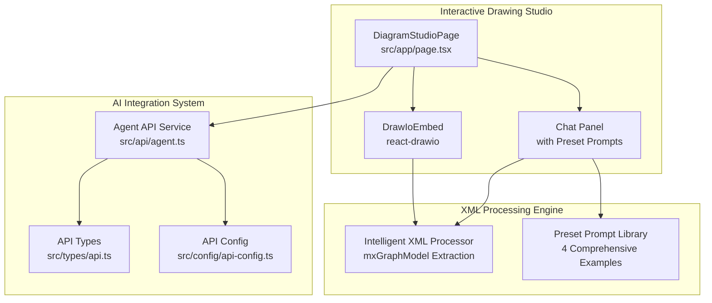

**Diagram sources**

- [page.tsx:11-648](file://src/app/page.tsx#L11-L648)
- [agent.ts:1-191](file://src/api/agent.ts#L1-L191)
- [api-config.ts:1-28](file://src/config/api-config.ts#L1-L28)
- [api.ts:1-74](file://src/types/api.ts#L1-L74)

**Section sources**

- [page.tsx:11-648](file://src/app/page.tsx#L11-L648)
- [agent.ts:1-191](file://src/api/agent.ts#L1-L191)
- [api-config.ts:1-28](file://src/config/api-config.ts#L1-L28)
- [api.ts:1-74](file://src/types/api.ts#L1-L74)

## Core Components

- **DiagramStudioPage**: The central interactive drawing studio orchestrating editor UI, AI agent interactions, XML
  processing, and export flows
- **DrawIoEmbed (react-drawio)**: Advanced embed component with dark UI, animated spinners, libraries, and save-and-exit
  toggles for programmatic control and export
- **Agent API Service**: Comprehensive service providing typed wrappers for agent configurations, session management,
  chat interactions, and streaming responses
- **Intelligent XML Processor**: Sophisticated XML parsing system extracting mxGraphModel from mxfile wrappers and
  handling raw XML responses
- **Dual-Mode Interaction System**: Integrated chat panel with preset prompts and direct editor interaction capabilities
- **Preset Prompt Library**: Four comprehensive examples covering common diagram types (login flows, e-commerce
  processes, microservices architecture, CI/CD pipelines)

Key responsibilities:

- State management for diagram XML with intelligent processing
- Real-time synchronization with AI agent system via chat endpoints
- Dual-mode interaction supporting both AI assistance and direct editing
- Export functionality supporting SVG, PNG, and XML formats
- Comprehensive preset prompt system for guided diagram creation

**Section sources**

- [page.tsx:11-648](file://src/app/page.tsx#L11-L648)
- [agent.ts:1-191](file://src/api/agent.ts#L1-L191)
- [api-config.ts:1-28](file://src/config/api-config.ts#L1-L28)
- [api.ts:1-74](file://src/types/api.ts#L1-L74)

## Architecture Overview

The Diagram Editor implements a sophisticated dual-mode interaction system:

- **Direct Mode**: Users edit diagrams directly in the draw.io editor with immediate visual feedback
- **AI-Assisted Mode**: Users provide natural language prompts that generate or refine diagrams through AI agents
- **Intelligent XML Processing**: Automatic extraction of mxGraphModel from mxfile wrappers for optimal diagram
  rendering
- **Real-time Synchronization**: Seamless updates between editor state and AI agent responses

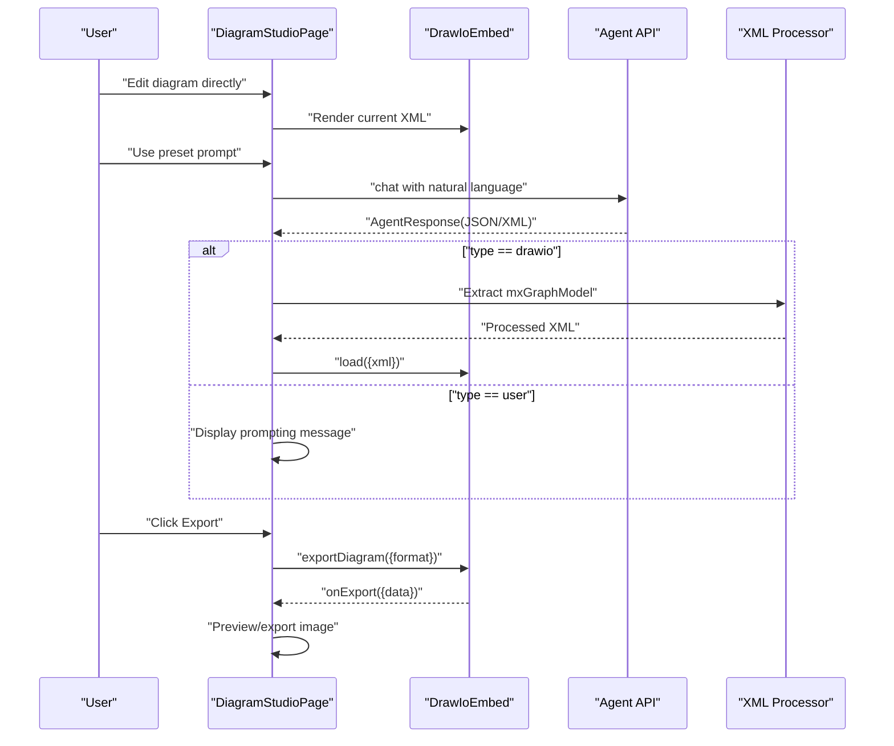

**Diagram sources**

- [page.tsx:118-233](file://src/app/page.tsx#L118-L233)
- [page.tsx:186-212](file://src/app/page.tsx#L186-L212)
- [agent.ts:75-113](file://src/api/agent.ts#L75-L113)
- [react-drawio.md:108-168](file://docs/react-drawio.md#L108-L168)

## Detailed Component Analysis

### Interactive Drawing Studio Component

The DiagramStudioPage serves as a comprehensive interactive drawing studio featuring:

- **Dual-Mode Interface**: Side-by-side editor and chat panel with collapsible sections
- **Advanced Editor Features**: Dark theme, animated spinners, library integration, and save-and-exit controls
- **Real-time Status Feedback**: Loading states, error handling, and success notifications
- **Session Management**: Persistent agent selection and session tracking across user interactions

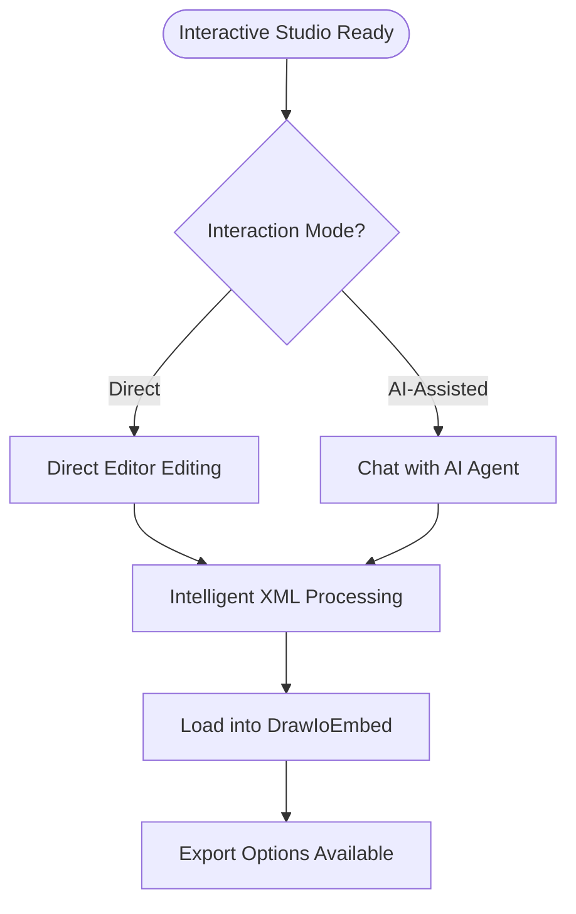

**Diagram sources**

- [page.tsx:382-401](file://src/app/page.tsx#L382-L401)
- [page.tsx:268-285](file://src/app/page.tsx#L268-L285)
- [page.tsx:118-233](file://src/app/page.tsx#L118-L233)

**Section sources**

- [page.tsx:382-401](file://src/app/page.tsx#L382-L401)
- [page.tsx:268-285](file://src/app/page.tsx#L268-L285)
- [page.tsx:118-233](file://src/app/page.tsx#L118-L233)

### Intelligent XML Processing for mxGraphModel Extraction

The system implements sophisticated XML processing capabilities:

- **Automatic Detection**: Recognition of raw XML responses starting with `<mxfile` or `<mxGraphModel`
- **Pattern Matching**: Regex-based extraction of mxGraphModel content from mxfile wrappers
- **Fallback Handling**: Graceful degradation when XML processing fails
- **Optimized Loading**: Direct loading of extracted mxGraphModel for improved performance

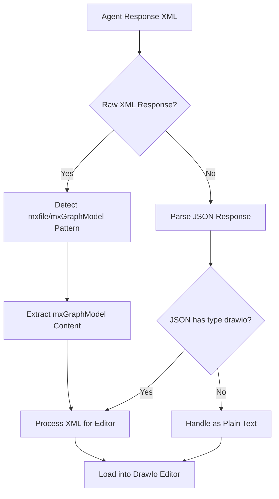

**Diagram sources**

- [page.tsx:165-212](file://src/app/page.tsx#L165-L212)
- [page.tsx:188-193](file://src/app/page.tsx#L188-L193)

**Section sources**

- [page.tsx:165-212](file://src/app/page.tsx#L165-L212)
- [page.tsx:188-193](file://src/app/page.tsx#L188-L193)

### Dual-Mode Interaction System

The system supports two distinct interaction modes:

- **Direct Mode**: Users manipulate diagrams directly in the editor with immediate visual feedback
- **AI-Assisted Mode**: Users provide natural language prompts that generate or refine diagrams through AI agents

**Direct Mode Features:**

- Real-time XML synchronization between editor and state
- Immediate visual feedback for all diagram modifications
- Direct export capabilities for SVG, PNG, and XML formats

**AI-Assisted Mode Features:**

- Natural language prompt processing with AI agents
- Structured JSON responses with type-based routing
- Preset prompt library for guided diagram creation
- Session persistence for coherent conversation flow

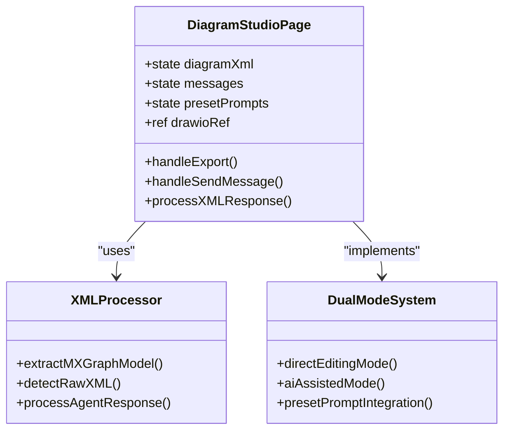

**Diagram sources**

- [page.tsx:118-233](file://src/app/page.tsx#L118-L233)
- [page.tsx:165-212](file://src/app/page.tsx#L165-L212)
- [page.tsx:268-285](file://src/app/page.tsx#L268-L285)

**Section sources**

- [page.tsx:118-233](file://src/app/page.tsx#L118-L233)
- [page.tsx:165-212](file://src/app/page.tsx#L165-L212)
- [page.tsx:268-285](file://src/app/page.tsx#L268-L285)

### Comprehensive Preset Prompt Examples

The system includes four comprehensive preset prompts covering common use cases:

- **H5 Login Flow**: User authentication process with validation and error handling
- **E-commerce Shopping**: Complete shopping cart and checkout workflow
- **Microservices Architecture**: Distributed system design with service interactions
- **CI/CD Pipeline**: Software delivery pipeline with testing and deployment stages

These presets provide immediate value by demonstrating the AI's ability to translate natural language into structured
diagrams.

**Section sources**

- [page.tsx:268-285](file://src/app/page.tsx#L268-L285)

### Diagram XML Management

The XML management system implements intelligent processing and state synchronization:

- **State Storage**: Local state management for diagram XML with automatic cleanup
- **Intelligent Loading**: Deferred loading when editor is not ready, with pending XML queue
- **Format Optimization**: Direct mxGraphModel extraction for improved performance
- **Export Integration**: Seamless integration with export functionality

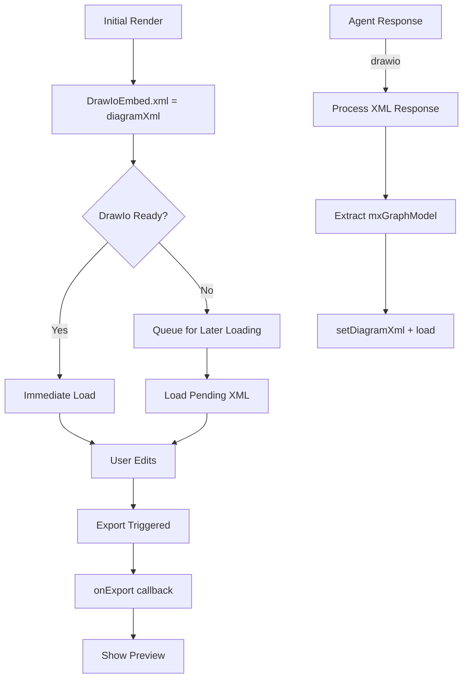

**Diagram sources**
- [page.tsx:31-36](file://src/app/page.tsx#L31-L36)
- [page.tsx:345-355](file://src/app/page.tsx#L345-L355)
- [page.tsx:171-202](file://src/app/page.tsx#L171-L202)

**Section sources**
- [page.tsx:31-36](file://src/app/page.tsx#L31-L36)
- [page.tsx:345-355](file://src/app/page.tsx#L345-L355)
- [page.tsx:171-202](file://src/app/page.tsx#L171-L202)

### Real-time Update Mechanisms

The system implements sophisticated real-time synchronization:

- **Agent-driven Updates**: Intelligent parsing of JSON/XML responses with type-based routing
- **Session Management**: Persistent sessions with automatic creation and cleanup
- **Status Reporting**: Comprehensive status messages for loading, errors, and success states
- **Deferred Loading**: XML loading deferred until editor is ready for optimal performance

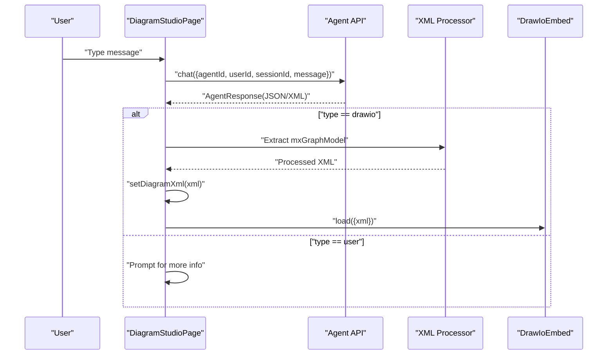

**Diagram sources**
- [page.tsx:118-233](file://src/app/page.tsx#L118-L233)
- [page.tsx:186-212](file://src/app/page.tsx#L186-L212)
- [agent.ts:106-113](file://src/api/agent.ts#L106-L113)
- [api.ts:44-50](file://src/types/api.ts#L44-L50)

**Section sources**
- [page.tsx:118-233](file://src/app/page.tsx#L118-L233)
- [page.tsx:186-212](file://src/app/page.tsx#L186-L212)
- [agent.ts:106-113](file://src/api/agent.ts#L106-L113)
- [api.ts:44-50](file://src/types/api.ts#L44-L50)

### Diagram Creation Workflow

The system supports flexible diagram creation through multiple pathways:

- **Direct Creation**: Users edit diagrams directly in the draw.io editor
- **AI Generation**: Users provide natural language prompts that generate diagrams
- **Hybrid Approach**: Combination of direct editing and AI assistance for iterative refinement

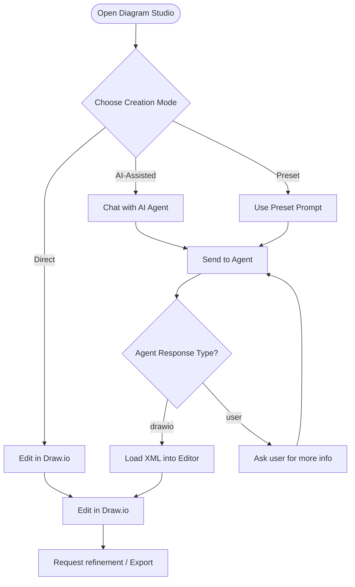

**Diagram sources**
- [page.tsx:243-248](file://src/app/page.tsx#L243-L248)
- [page.tsx:118-233](file://src/app/page.tsx#L118-L233)
- [page.tsx:268-285](file://src/app/page.tsx#L268-L285)
- [api.ts:44-50](file://src/types/api.ts#L44-L50)

**Section sources**
- [page.tsx:243-248](file://src/app/page.tsx#L243-L248)
- [page.tsx:118-233](file://src/app/page.tsx#L118-L233)
- [page.tsx:268-285](file://src/app/page.tsx#L268-L285)
- [api.ts:44-50](file://src/types/api.ts#L44-L50)

### Editing Capabilities

The editor provides comprehensive editing capabilities:

- **Advanced UI Configuration**: Dark theme, animated spinners, library integration, and save-and-exit controls
- **Programmatic Actions**: Full control over editor actions including load, configure, merge, template, layout, draft,
  status, spinner, and exportDiagram
- **Real-time Feedback**: Immediate visual feedback for all editing operations
- **Export Integration**: Seamless integration with export functionality supporting multiple formats

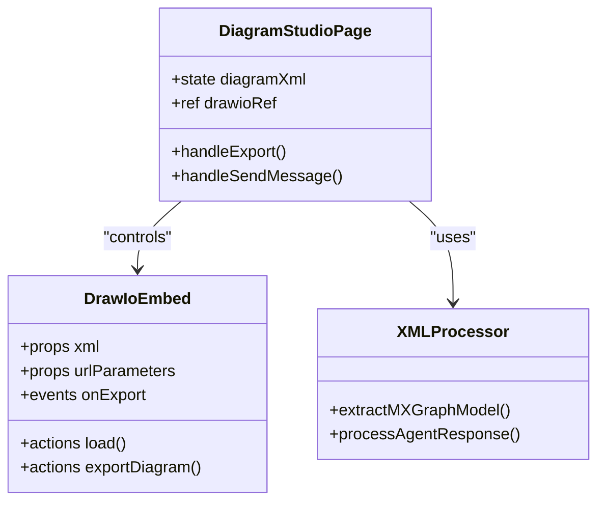

**Diagram sources**
- [page.tsx:345-355](file://src/app/page.tsx#L345-L355)
- [page.tsx:382-401](file://src/app/page.tsx#L382-L401)
- [page.tsx:188-193](file://src/app/page.tsx#L188-L193)

**Section sources**
- [page.tsx:345-355](file://src/app/page.tsx#L345-L355)
- [page.tsx:382-401](file://src/app/page.tsx#L382-L401)
- [page.tsx:188-193](file://src/app/page.tsx#L188-L193)

### Export Functionality

The export system provides comprehensive format support:

- **Supported Formats**: SVG, PNG, and XML export through the underlying react-drawio component
- **Preview Modal**: Enhanced modal interface with download functionality and image preview
- **Format Optimization**: Intelligent format selection based on use case (SVG for scalability, PNG for rasterized
  outputs)
- **Integration Points**: Seamless integration with both direct editing and AI-assisted workflows

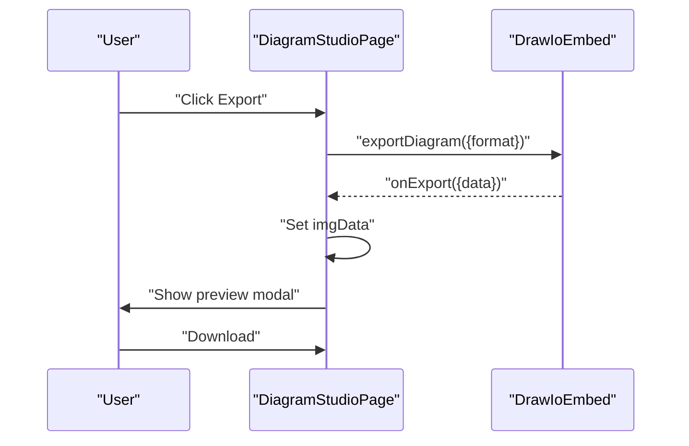

**Diagram sources**
- [page.tsx:108-115](file://src/app/page.tsx#L108-L115)
- [page.tsx:546-596](file://src/app/page.tsx#L546-L596)
- [react-drawio.md:126-129](file://docs/react-drawio.md#L126-L129)

**Section sources**
- [page.tsx:108-115](file://src/app/page.tsx#L108-L115)
- [page.tsx:546-596](file://src/app/page.tsx#L546-L596)
- [react-drawio.md:126-129](file://docs/react-drawio.md#L126-L129)

### State Management for Diagram XML

The state management system implements intelligent coordination:

- **Local State Management**: diagramXml state with automatic cleanup and optimization
- **Prop Forwarding**: Efficient XML prop passing to DrawIoEmbed for initialization and updates
- **Agent Integration**: Seamless integration with AI agent responses and XML processing
- **Performance Optimization**: Deferred loading and intelligent XML extraction for optimal performance

**Diagram sources**
- [page.tsx:31-36](file://src/app/page.tsx#L31-L36)
- [page.tsx:345-355](file://src/app/page.tsx#L345-L355)
- [page.tsx:171-177](file://src/app/page.tsx#L171-L177)

**Section sources**
- [page.tsx:31-36](file://src/app/page.tsx#L31-L36)
- [page.tsx:345-355](file://src/app/page.tsx#L345-L355)
- [page.tsx:171-177](file://src/app/page.tsx#L171-L177)

### Synchronization with AI Agent System

The AI agent synchronization system implements sophisticated coordination:

- **Agent Selection**: Persistent agent selection with local storage integration
- **Session Lifecycle**: Automatic session creation and management per agent-user pair
- **Response Parsing**: Intelligent JSON/XML parsing with type-based routing
- **Dual-Mode Support**: Seamless integration with both direct editing and AI-assisted workflows

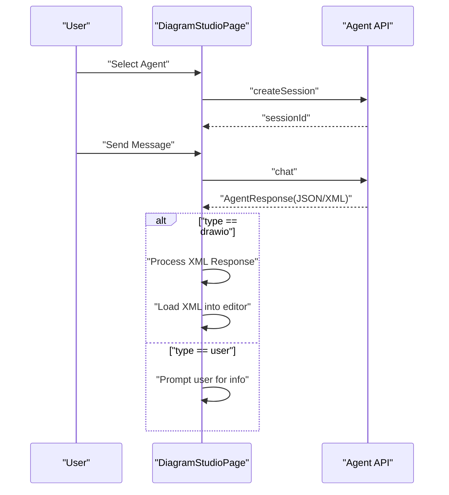

**Diagram sources**
- [page.tsx:93-100](file://src/app/page.tsx#L93-L100)
- [page.tsx:146-153](file://src/app/page.tsx#L146-L153)
- [page.tsx:164-211](file://src/app/page.tsx#L164-L211)
- [agent.ts:87-100](file://src/api/agent.ts#L87-L100)
- [agent.ts:106-113](file://src/api/agent.ts#L106-L113)
- [api.ts:44-50](file://src/types/api.ts#L44-L50)

**Section sources**
- [page.tsx:93-100](file://src/app/page.tsx#L93-L100)
- [page.tsx:146-153](file://src/app/page.tsx#L146-L153)
- [page.tsx:164-211](file://src/app/page.tsx#L164-L211)
- [agent.ts:87-100](file://src/api/agent.ts#L87-L100)
- [agent.ts:106-113](file://src/api/agent.ts#L106-L113)
- [api.ts:44-50](file://src/types/api.ts#L44-L50)

### User Interaction Patterns

The system supports diverse interaction patterns:

- **Agent Selector**: Persistent agent selection with session tracking
- **Chat Panel**: Collapsible panel with typing indicators, status messages, and preset prompts
- **Preset Prompts**: Four comprehensive examples for guided diagram creation
- **Export Preview**: Enhanced modal with download functionality and image preview
- **Dual-Mode Navigation**: Seamless switching between direct editing and AI assistance

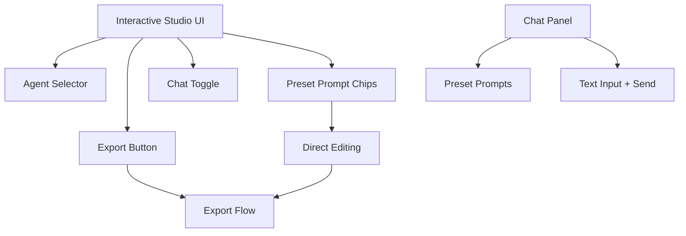

**Diagram sources**
- [page.tsx:282-306](file://src/app/page.tsx#L282-L306)
- [page.tsx:358-542](file://src/app/page.tsx#L358-L542)
- [page.tsx:243-248](file://src/app/page.tsx#L243-L248)
- [page.tsx:546-596](file://src/app/page.tsx#L546-L596)
- [page.tsx:268-285](file://src/app/page.tsx#L268-L285)

**Section sources**
- [page.tsx:282-306](file://src/app/page.tsx#L282-L306)
- [page.tsx:358-542](file://src/app/page.tsx#L358-L542)
- [page.tsx:243-248](file://src/app/page.tsx#L243-L248)
- [page.tsx:546-596](file://src/app/page.tsx#L546-L596)
- [page.tsx:268-285](file://src/app/page.tsx#L268-L285)

### Practical Examples

The system provides comprehensive examples for different use cases:

- **Loading Existing Diagrams**: Direct XML loading with intelligent processing
- **Exporting Diagrams**: Multi-format export with preview and download functionality
- **Template Usage**: Integration with draw.io templates through programmatic actions
- **Collaborative Editing**: Shared sessions with AI assistance for iterative refinement
- **Preset Prompt Usage**: Four comprehensive examples demonstrating AI capabilities

**Section sources**
- [react-drawio.md:63-73](file://docs/react-drawio.md#L63-L73)
- [react-drawio.md:75-106](file://docs/react-drawio.md#L75-L106)
- [react-drawio.md:148-168](file://docs/react-drawio.md#L148-L168)
- [react-drawio.md:126-129](file://docs/react-drawio.md#L126-L129)
- [page.tsx:268-285](file://src/app/page.tsx#L268-L285)

## Dependency Analysis

The Diagram Editor implements a sophisticated dependency structure:

- **react-drawio**: Core embedding and control system for draw.io integration
- **Agent API Service**: Comprehensive backend communication with AI agents
- **API Configuration**: Centralized endpoint management and URL building
- **TypeScript Types**: Strong typing for all API interactions and state management
- **XML Processing Engine**: Sophisticated XML parsing and extraction capabilities

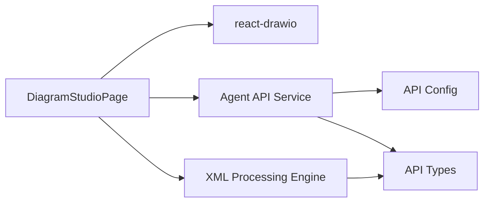

**Diagram sources**

- [page.tsx:11-648](file://src/app/page.tsx#L11-L648)
- [agent.ts:1-191](file://src/api/agent.ts#L1-L191)
- [api-config.ts:1-28](file://src/config/api-config.ts#L1-L28)
- [api.ts:1-74](file://src/types/api.ts#L1-L74)

**Section sources**

- [page.tsx:11-648](file://src/app/page.tsx#L11-L648)
- [agent.ts:1-191](file://src/api/agent.ts#L1-L191)
- [api-config.ts:1-28](file://src/config/api-config.ts#L1-L28)
- [api.ts:1-74](file://src/types/api.ts#L1-L74)

## Performance Considerations

The system implements several performance optimization strategies:

- **Intelligent XML Processing**: Direct mxGraphModel extraction reduces processing overhead
- **Deferred Loading**: XML loading deferred until editor readiness prevents race conditions
- **Memory Management**: Optimized state management with automatic cleanup of temporary data
- **Large Diagram Support**: SVG export preferred for scalability and crisp rendering at various sizes
- **Browser Compatibility**: Standard iframe-based embed ensures broad browser support
- **Rendering Optimization**: Minimal XML processing and efficient state updates
- **Network Efficiency**: Session reuse and batched requests reduce network overhead

## Troubleshooting Guide

The system includes comprehensive troubleshooting capabilities:

- **Backend Connectivity**: Agent API service includes detection of backend unavailability errors
- **XML Processing Failures**: Intelligent fallback handling for malformed or unsupported XML
- **Export Issues**: Verified export action calls with supported format validation
- **Agent Response Parsing**: Robust JSON/XML parsing with graceful degradation
- **Editor Readiness**: Deferred loading mechanism prevents premature XML loading
- **Session Management**: Automatic session creation and cleanup for optimal user experience

**Section sources**
- [agent.ts:181-190](file://src/api/agent.ts#L181-L190)
- [page.tsx:108-115](file://src/app/page.tsx#L108-L115)
- [page.tsx:164-211](file://src/app/page.tsx#L164-L211)
- [page.tsx:188-193](file://src/app/page.tsx#L188-L193)

## Conclusion

The Diagram Editor represents a sophisticated interactive drawing studio that seamlessly integrates draw.io via
react-drawio with an advanced AI-assisted diagram generation system. The implementation features intelligent XML
processing for mxGraphModel extraction, a dual-mode interaction system supporting both direct editing and AI assistance,
and comprehensive preset prompt examples. The system manages diagram XML state efficiently, synchronizes with AI agent
systems for natural-language-driven creation and refinement, and supports exporting in SVG, PNG, and XML formats. The UI
combines responsive editor capabilities with an integrated chat panel for seamless collaboration and iterative
improvement, making it a powerful tool for both individual diagram creation and team-based design workflows.