# Diagram Editor

<cite>
**Referenced Files in This Document**
- [page.tsx](file://src/app/page.tsx)
- [agent.ts](file://src/api/agent.ts)
- [api-config.ts](file://src/config/api-config.ts)
- [api.ts](file://src/types/api.ts)
- [react-drawio.md](file://docs/react-drawio.md)
</cite>

## Table of Contents

1. [Introduction](#introduction)
2. [Project Structure](#project-structure)
3. [Core Components](#core-components)
4. [Architecture Overview](#architecture-overview)
5. [Detailed Component Analysis](#detailed-component-analysis)
6. [Dependency Analysis](#dependency-analysis)
7. [Performance Considerations](#performance-considerations)
8. [Troubleshooting Guide](#troubleshooting-guide)
9. [Conclusion](#conclusion)

## Introduction

This document describes the Diagram Editor component that integrates draw.io via the react-drawio embed component. It
explains how diagram XML is managed, how edits are synchronized with an AI agent system, and how users export diagrams
in SVG, PNG, and XML formats. It also covers the diagram creation workflow, editing capabilities, collaboration
patterns, toolbar customization, and performance considerations for large diagrams.

## Project Structure

The Diagram Editor is implemented as a single-page application built with Next.js. The editor is centered around a React
component that hosts the draw.io editor embedded in an iframe and coordinates with an AI agent backend for
natural-language-driven diagram generation and refinement.

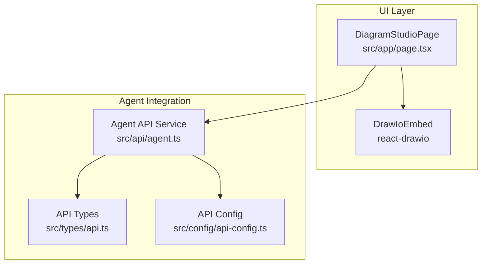

**Diagram sources**

- [page.tsx:11-600](file://src/app/page.tsx#L11-L600)
- [agent.ts:1-191](file://src/api/agent.ts#L1-L191)
- [api-config.ts:1-28](file://src/config/api-config.ts#L1-L28)
- [api.ts:1-74](file://src/types/api.ts#L1-L74)

**Section sources**

- [page.tsx:11-600](file://src/app/page.tsx#L11-L600)
- [agent.ts:1-191](file://src/api/agent.ts#L1-L191)
- [api-config.ts:1-28](file://src/config/api-config.ts#L1-L28)
- [api.ts:1-74](file://src/types/api.ts#L1-L74)

## Core Components

- DiagramStudioPage: Orchestrates the editor UI, manages diagram XML state, handles agent interactions, and controls
  export flows.
- DrawIoEmbed (react-drawio): Embeds the draw.io editor in an iframe and exposes actions and events for programmatic
  control and export.
- Agent API service: Provides typed wrappers for querying agent configurations, creating sessions, sending chat
  messages, and streaming responses.
- API configuration and types: Centralizes endpoint definitions and shared TypeScript interfaces for agent and chat
  interactions.

Key responsibilities:

- State management for diagram XML and export previews
- Real-time synchronization with AI agent system via chat endpoints
- Export functionality supporting SVG, PNG, and XML formats
- User interaction patterns for creation, editing, and collaboration

**Section sources**

- [page.tsx:11-600](file://src/app/page.tsx#L11-L600)
- [agent.ts:1-191](file://src/api/agent.ts#L1-L191)
- [api-config.ts:1-28](file://src/config/api-config.ts#L1-L28)
- [api.ts:1-74](file://src/types/api.ts#L1-L74)

## Architecture Overview

The Diagram Editor follows a unidirectional data flow:

- User edits in the draw.io editor
- The editor emits export events containing image data
- The user triggers export actions to retrieve SVG/PNG/XML
- The AI agent system is engaged via chat to generate or refine diagrams
- Agent responses may include structured JSON indicating diagram XML to load into the editor

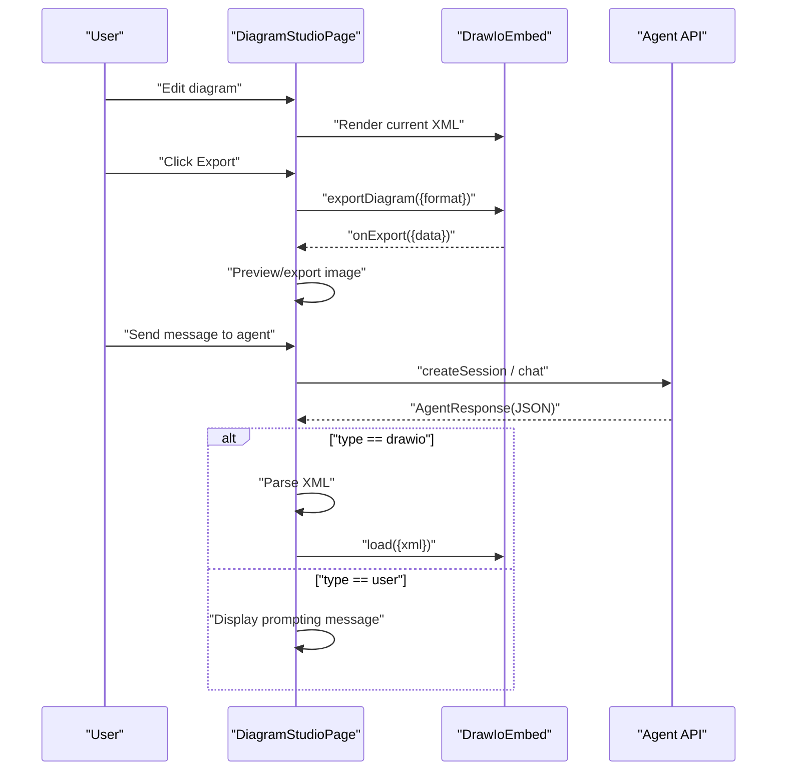

**Diagram sources**

- [page.tsx:108-233](file://src/app/page.tsx#L108-L233)
- [agent.ts:75-113](file://src/api/agent.ts#L75-L113)
- [react-drawio.md:108-168](file://docs/react-drawio.md#L108-L168)

## Detailed Component Analysis

### Diagram XML Management

- State storage: The component maintains diagram XML in local state and passes it to the editor via props.
- Initial load: The editor receives the XML prop to prefill the canvas.
- Updates: When the AI agent responds with a diagram, the component updates state and instructs the editor to load the
  new XML.

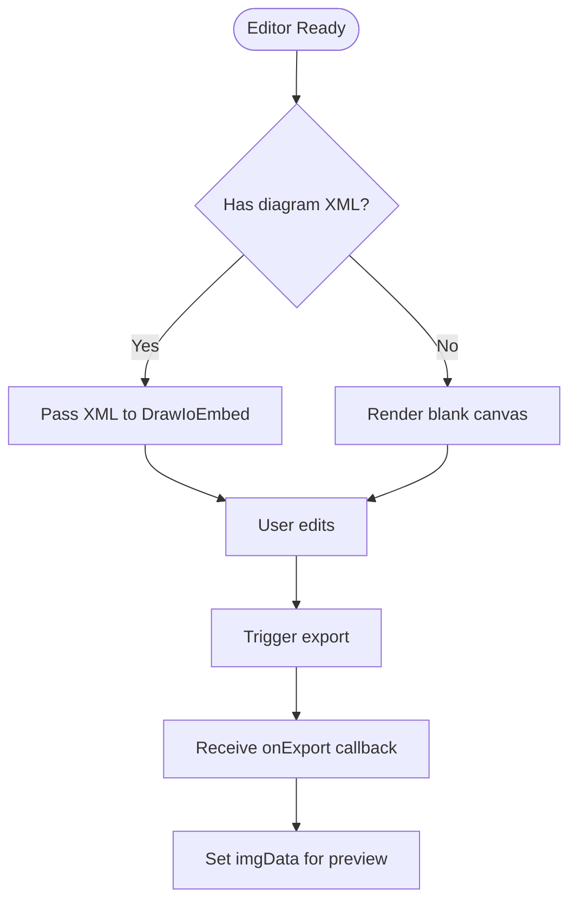

**Diagram sources**

- [page.tsx:31-36](file://src/app/page.tsx#L31-L36)
- [page.tsx:345-355](file://src/app/page.tsx#L345-L355)
- [page.tsx:108-115](file://src/app/page.tsx#L108-L115)

**Section sources**

- [page.tsx:31-36](file://src/app/page.tsx#L31-L36)
- [page.tsx:345-355](file://src/app/page.tsx#L345-L355)
- [page.tsx:108-115](file://src/app/page.tsx#L108-L115)

### Real-time Update Mechanisms

- Agent-driven updates: When the agent responds with a diagram, the component parses the response, updates state, and
  loads the XML into the editor.
- Session management: Sessions are created per agent and user to maintain coherent conversations.
- Status reporting: UI status messages inform users about loading, errors, and readiness.

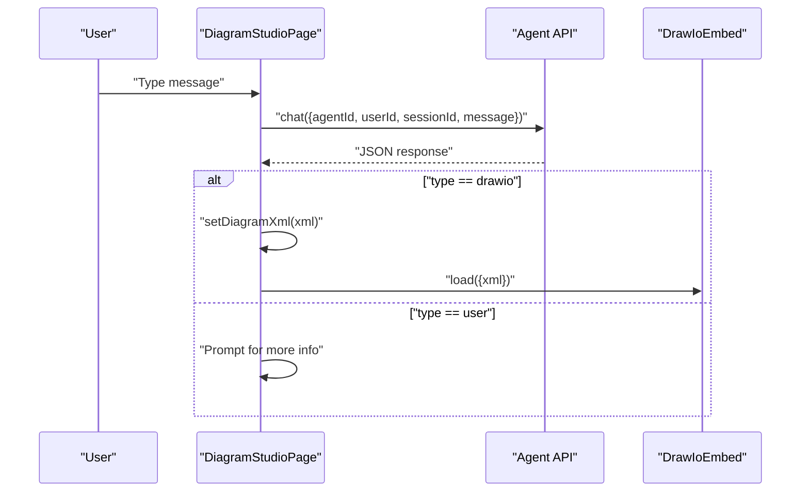

**Diagram sources**

- [page.tsx:118-233](file://src/app/page.tsx#L118-L233)
- [agent.ts:106-113](file://src/api/agent.ts#L106-L113)
- [api.ts:44-50](file://src/types/api.ts#L44-L50)

**Section sources**

- [page.tsx:118-233](file://src/app/page.tsx#L118-L233)
- [agent.ts:106-113](file://src/api/agent.ts#L106-L113)
- [api.ts:44-50](file://src/types/api.ts#L44-L50)

### Diagram Creation Workflow

- Select an AI agent from the dropdown.
- Optionally use preset prompts to seed the chat.
- Send a natural language request to generate or refine a diagram.
- The agent returns a structured response; if it contains diagram XML, the editor loads it.
- Iterate by editing in the editor and requesting refinements.

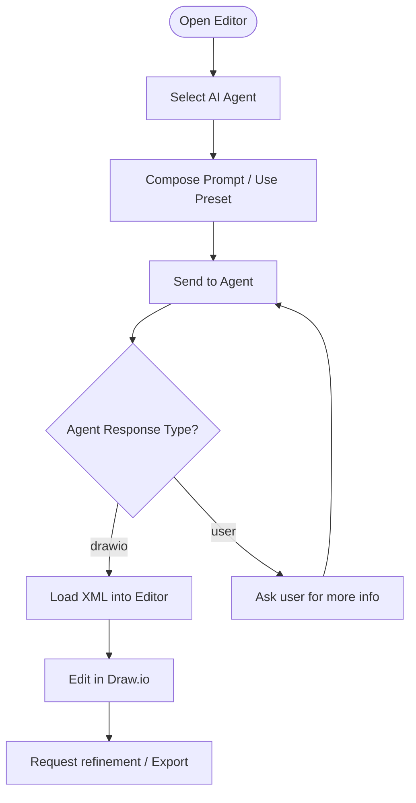

**Diagram sources**

- [page.tsx:243-248](file://src/app/page.tsx#L243-L248)
- [page.tsx:118-233](file://src/app/page.tsx#L118-L233)
- [api.ts:44-50](file://src/types/api.ts#L44-L50)

**Section sources**

- [page.tsx:243-248](file://src/app/page.tsx#L243-L248)
- [page.tsx:118-233](file://src/app/page.tsx#L118-L233)
- [api.ts:44-50](file://src/types/api.ts#L44-L50)

### Editing Capabilities

- Toolbar and UI: The editor is configured with dark UI, animated spinners, libraries, and save-and-exit toggles.
- Programmatic actions: The component can call actions such as load, configure, merge, template, layout, draft, status,
  spinner, and exportDiagram via the ref.

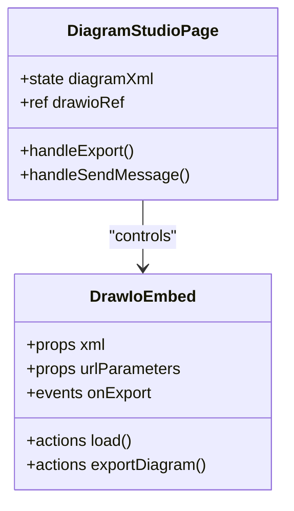

**Diagram sources**

- [page.tsx:345-355](file://src/app/page.tsx#L345-L355)
- [react-drawio.md:114-168](file://docs/react-drawio.md#L114-L168)

**Section sources**

- [page.tsx:345-355](file://src/app/page.tsx#L345-L355)
- [react-drawio.md:114-168](file://docs/react-drawio.md#L114-L168)

### Export Functionality

- Supported formats: The component exports images and XML using the editor’s export action.
- Preview modal: Exported images are shown in a modal with a download link.
- Formats: SVG, PNG, and XML are supported via the underlying component’s export options.

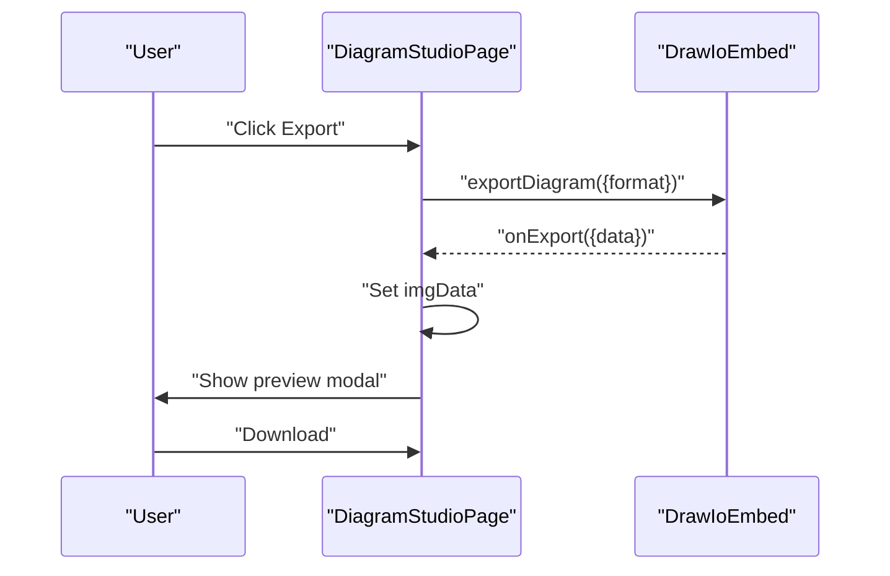

**Diagram sources**

- [page.tsx:108-115](file://src/app/page.tsx#L108-L115)
- [page.tsx:546-596](file://src/app/page.tsx#L546-L596)
- [react-drawio.md:126-129](file://docs/react-drawio.md#L126-L129)

**Section sources**

- [page.tsx:108-115](file://src/app/page.tsx#L108-L115)
- [page.tsx:546-596](file://src/app/page.tsx#L546-L596)
- [react-drawio.md:126-129](file://docs/react-drawio.md#L126-L129)

### State Management for Diagram XML

- Local state: diagramXml holds the current diagram XML.
- Prop forwarding: The editor receives xml as a prop to initialize or update the canvas.
- Agent-driven updates: When receiving a drawio-type response, the component updates diagramXml and reloads the editor.

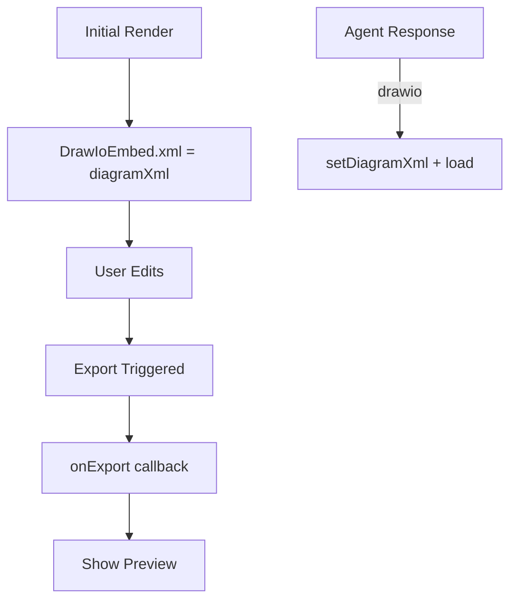

**Diagram sources**

- [page.tsx:31-36](file://src/app/page.tsx#L31-L36)
- [page.tsx:345-355](file://src/app/page.tsx#L345-L355)
- [page.tsx:171-177](file://src/app/page.tsx#L171-L177)

**Section sources**

- [page.tsx:31-36](file://src/app/page.tsx#L31-L36)
- [page.tsx:345-355](file://src/app/page.tsx#L345-L355)
- [page.tsx:171-177](file://src/app/page.tsx#L171-L177)

### Synchronization with AI Agent System

- Agent selection: Users choose an agent; selections persist locally.
- Session lifecycle: Sessions are created per agent and user to keep conversations cohesive.
- Response parsing: The component expects a JSON payload with a type field; when type equals drawio, it treats the
  content as diagram XML.

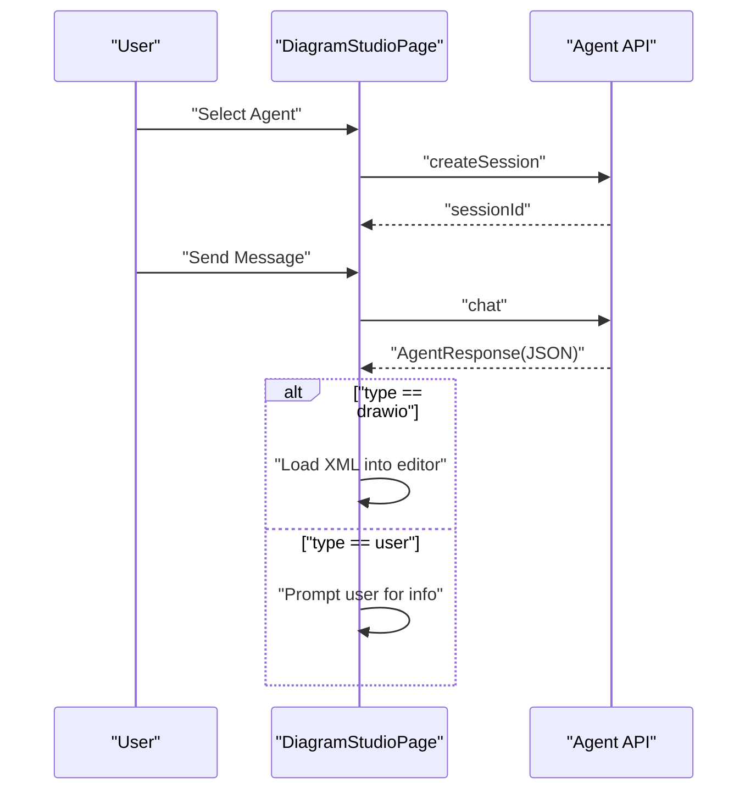

**Diagram sources**

- [page.tsx:93-100](file://src/app/page.tsx#L93-L100)
- [page.tsx:146-153](file://src/app/page.tsx#L146-L153)
- [page.tsx:164-211](file://src/app/page.tsx#L164-L211)
- [agent.ts:87-100](file://src/api/agent.ts#L87-L100)
- [agent.ts:106-113](file://src/api/agent.ts#L106-L113)
- [api.ts:44-50](file://src/types/api.ts#L44-L50)

**Section sources**

- [page.tsx:93-100](file://src/app/page.tsx#L93-L100)
- [page.tsx:146-153](file://src/app/page.tsx#L146-L153)
- [page.tsx:164-211](file://src/app/page.tsx#L164-L211)
- [agent.ts:87-100](file://src/api/agent.ts#L87-L100)
- [agent.ts:106-113](file://src/api/agent.ts#L106-L113)
- [api.ts:44-50](file://src/types/api.ts#L44-L50)

### User Interaction Patterns

- Agent selector and session status: Clear indication of selected agent and active session.
- Chat panel: Collapsible panel with typing indicators and status messages.
- Preset prompts: Quick-start prompts to guide diagram creation.
- Export preview: Modal with download button for exported images.

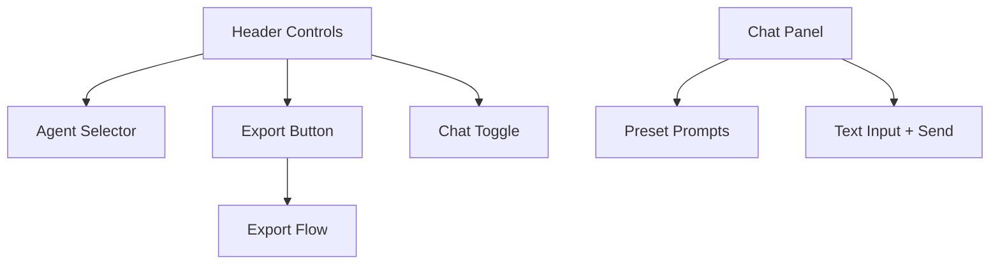

**Diagram sources**

- [page.tsx:282-306](file://src/app/page.tsx#L282-L306)
- [page.tsx:358-542](file://src/app/page.tsx#L358-L542)
- [page.tsx:243-248](file://src/app/page.tsx#L243-L248)
- [page.tsx:546-596](file://src/app/page.tsx#L546-L596)

**Section sources**

- [page.tsx:282-306](file://src/app/page.tsx#L282-L306)
- [page.tsx:358-542](file://src/app/page.tsx#L358-L542)
- [page.tsx:243-248](file://src/app/page.tsx#L243-L248)
- [page.tsx:546-596](file://src/app/page.tsx#L546-L596)

### Practical Examples

- Loading an existing diagram: Pass XML via the xml prop to prefill the editor.
- Exporting a diagram: Call exportDiagram with the desired format and handle the onExport event to preview or download.
- Template usage: Use the template action to open the template dialog in the editor.
- Collaborative editing scenario: Multiple users can share the same session ID; the agent can iteratively refine the
  diagram based on user feedback.

Note: The examples below reference the react-drawio documentation for supported actions and formats.

**Section sources**

- [react-drawio.md:63-73](file://docs/react-drawio.md#L63-L73)
- [react-drawio.md:75-106](file://docs/react-drawio.md#L75-L106)
- [react-drawio.md:148-168](file://docs/react-drawio.md#L148-L168)
- [react-drawio.md:126-129](file://docs/react-drawio.md#L126-L129)

## Dependency Analysis

The Diagram Editor depends on:

- react-drawio for embedding and controlling the draw.io editor
- Agent API service for backend communication
- API configuration and types for endpoint definitions and request/response shapes

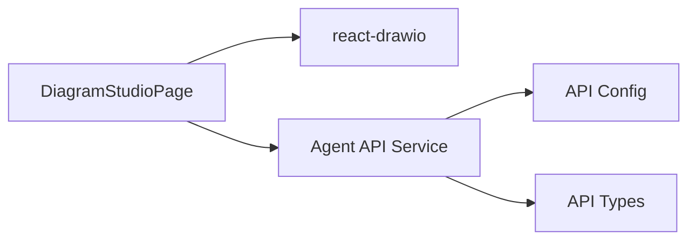

**Diagram sources**

- [page.tsx:11-600](file://src/app/page.tsx#L11-L600)
- [agent.ts:1-191](file://src/api/agent.ts#L1-L191)
- [api-config.ts:1-28](file://src/config/api-config.ts#L1-L28)
- [api.ts:1-74](file://src/types/api.ts#L1-L74)

**Section sources**

- [page.tsx:11-600](file://src/app/page.tsx#L11-L600)
- [agent.ts:1-191](file://src/api/agent.ts#L1-L191)
- [api-config.ts:1-28](file://src/config/api-config.ts#L1-L28)
- [api.ts:1-74](file://src/types/api.ts#L1-L74)

## Performance Considerations

- Large diagrams: Prefer SVG export for scalability and crisp rendering at various sizes. Use PNG for rasterized outputs
  when needed.
- Memory management: Avoid holding large base64 image strings in state longer than necessary; clear imgData after
  download.
- Browser compatibility: The embed uses a standard iframe; ensure modern browsers support the draw.io embed mode. Test
  across major browsers.
- Rendering optimization: Keep XML minimal when possible; avoid excessive nested groups or very large datasets in a
  single diagram.
- Network efficiency: Batch agent requests and reuse sessions to reduce overhead.

[No sources needed since this section provides general guidance]

## Troubleshooting Guide

- Backend connectivity: The agent API service includes a helper to detect backend unavailability errors. Use this to
  surface actionable status messages to users.
- Export failures: Verify the editor’s export action is called with a supported format and that the onExport handler is
  attached.
- Agent response parsing: Ensure the agent returns a JSON payload with a type field; only type drawio triggers XML
  loading.

**Section sources**

- [agent.ts:181-190](file://src/api/agent.ts#L181-L190)
- [page.tsx:108-115](file://src/app/page.tsx#L108-L115)
- [page.tsx:164-211](file://src/app/page.tsx#L164-L211)

## Conclusion

The Diagram Editor integrates draw.io via react-drawio to provide a powerful, AI-assisted diagramming experience. It
manages diagram XML state, synchronizes with an AI agent system for natural-language-driven creation and refinement, and
supports exporting in SVG, PNG, and XML formats. The UI combines a responsive editor with a chat panel for seamless
collaboration and iterative improvement.