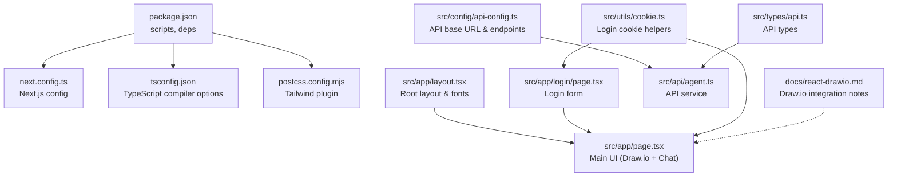
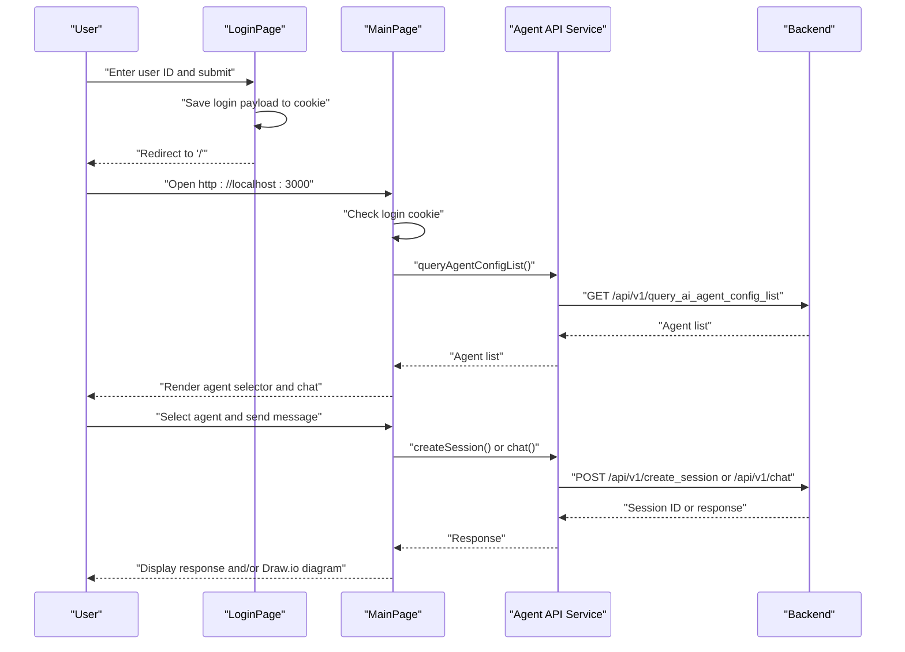
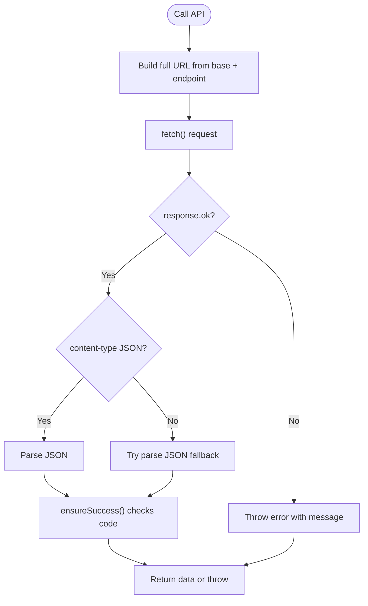
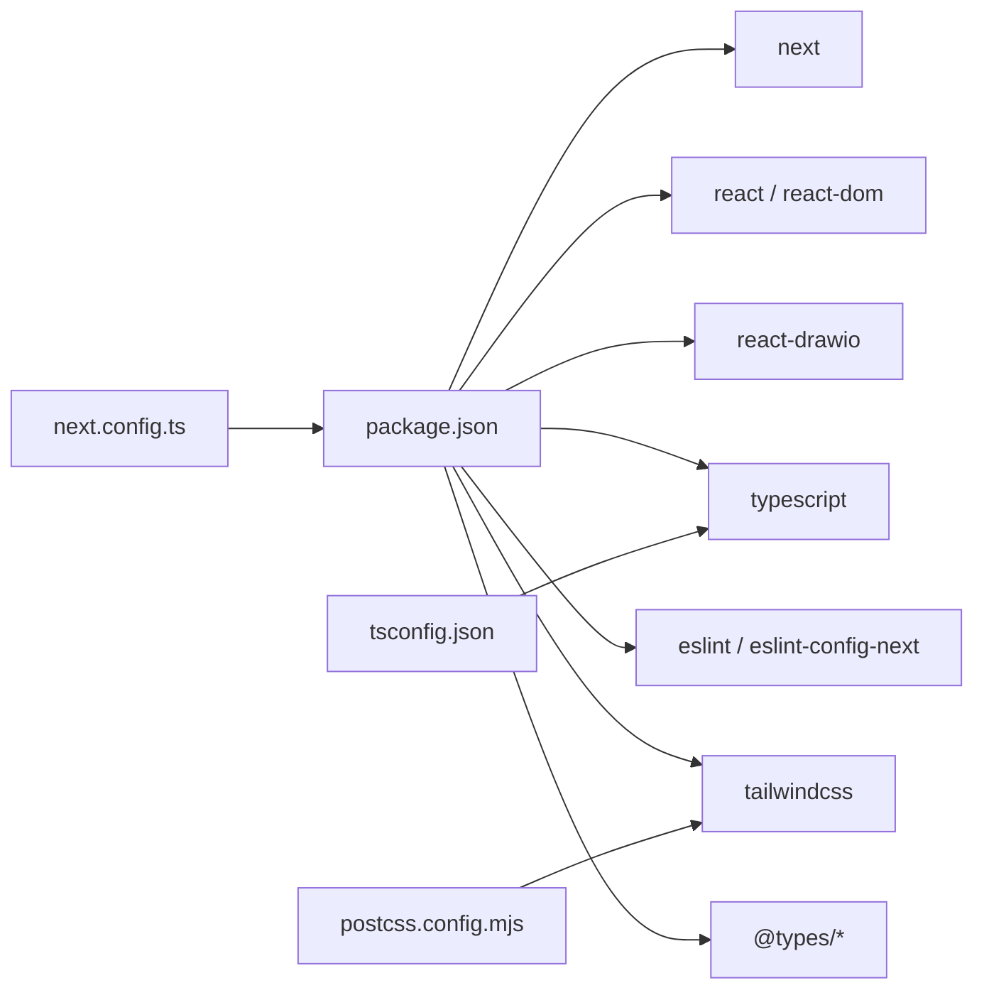

# Getting Started

<cite>
**Referenced Files in This Document**
- [package.json](file://package.json)
- [README.md](file://README.md)
- [next.config.ts](file://next.config.ts)
- [tsconfig.json](file://tsconfig.json)
- [postcss.config.mjs](file://postcss.config.mjs)
- [src/app/layout.tsx](file://src/app/layout.tsx)
- [src/app/page.tsx](file://src/app/page.tsx)
- [src/app/login/page.tsx](file://src/app/login/page.tsx)
- [src/config/api-config.ts](file://src/config/api-config.ts)
- [src/api/agent.ts](file://src/api/agent.ts)
- [src/utils/cookie.ts](file://src/utils/cookie.ts)
- [src/types/api.ts](file://src/types/api.ts)
- [docs/react-drawio.md](file://docs/react-drawio.md)
</cite>

## Table of Contents

1. [Introduction](#introduction)
2. [Project Structure](#project-structure)
3. [Core Components](#core-components)
4. [Architecture Overview](#architecture-overview)
5. [Detailed Component Analysis](#detailed-component-analysis)
6. [Dependency Analysis](#dependency-analysis)
7. [Performance Considerations](#performance-considerations)
8. [Troubleshooting Guide](#troubleshooting-guide)
9. [Conclusion](#conclusion)
10. [Appendices](#appendices)

## Introduction

This guide helps you install, configure, and run the AI Agent Scaffold Frontend locally. It covers prerequisites,
installation via npm, yarn, pnpm, or bun, environment setup, development server startup, browser access, first-run
steps (authentication and agent configuration), and troubleshooting for common issues.

## Project Structure

The project is a Next.js 16 application using React 19 and TypeScript. It integrates a Draw.io editor and communicates
with a backend API to manage agents, sessions, and chat.

**Diagram sources**

- [package.json:1-28](file://package.json#L1-L28)
- [next.config.ts:1-8](file://next.config.ts#L1-L8)
- [tsconfig.json:1-35](file://tsconfig.json#L1-L35)
- [postcss.config.mjs:1-8](file://postcss.config.mjs#L1-L8)
- [src/app/layout.tsx:1-34](file://src/app/layout.tsx#L1-L34)
- [src/app/page.tsx:1-600](file://src/app/page.tsx#L1-L600)
- [src/app/login/page.tsx:1-173](file://src/app/login/page.tsx#L1-L173)
- [src/config/api-config.ts:1-28](file://src/config/api-config.ts#L1-L28)
- [src/api/agent.ts:1-191](file://src/api/agent.ts#L1-L191)
- [src/utils/cookie.ts:1-111](file://src/utils/cookie.ts#L1-L111)
- [src/types/api.ts:1-74](file://src/types/api.ts#L1-L74)
- [docs/react-drawio.md:1-168](file://docs/react-drawio.md#L1-L168)

**Section sources**

- [package.json:1-28](file://package.json#L1-L28)
- [next.config.ts:1-8](file://next.config.ts#L1-L8)
- [tsconfig.json:1-35](file://tsconfig.json#L1-L35)
- [postcss.config.mjs:1-8](file://postcss.config.mjs#L1-L8)
- [src/app/layout.tsx:1-34](file://src/app/layout.tsx#L1-L34)

## Core Components

- Authentication and routing
    - Login page saves a user identifier to a cookie and redirects to the main page.
    - Main page enforces login and displays the Draw.io editor and chat panel.
- API integration
    - Centralized API configuration defines base URL and endpoints.
    - API service wraps requests, parses JSON, and handles errors.
- UI and UX
    - Dark-themed UI with agent selector, chat panel, and Draw.io editor.
    - Preset prompts and session management.

**Section sources**

- [src/app/login/page.tsx:1-173](file://src/app/login/page.tsx#L1-L173)
- [src/app/page.tsx:1-600](file://src/app/page.tsx#L1-L600)
- [src/config/api-config.ts:1-28](file://src/config/api-config.ts#L1-L28)
- [src/api/agent.ts:1-191](file://src/api/agent.ts#L1-L191)
- [src/utils/cookie.ts:1-111](file://src/utils/cookie.ts#L1-L111)
- [src/types/api.ts:1-74](file://src/types/api.ts#L1-L74)

## Architecture Overview

High-level flow during first run:

- User logs in via the login page and is redirected to the main page.
- Main page loads agents from the backend and renders the Draw.io editor and chat panel.
- User selects an agent, sends messages, and receives responses that may include Draw.io diagrams.

**Diagram sources**

- [src/app/login/page.tsx:1-173](file://src/app/login/page.tsx#L1-L173)
- [src/app/page.tsx:1-600](file://src/app/page.tsx#L1-L600)
- [src/api/agent.ts:1-191](file://src/api/agent.ts#L1-L191)
- [src/config/api-config.ts:1-28](file://src/config/api-config.ts#L1-L28)

## Detailed Component Analysis

### Prerequisites

- Node.js and package manager
    - Use Node.js LTS recommended by the project dependencies.
    - Any of the following package managers is supported: npm, yarn, pnpm, bun.
- Environment
    - The frontend expects a backend API reachable at a configurable base URL.

**Section sources**

- [package.json:11-26](file://package.json#L11-L26)
- [README.md:3-17](file://README.md#L3-L17)
- [src/config/api-config.ts:6-7](file://src/config/api-config.ts#L6-L7)

### Installation and Setup

- Install dependencies
    - npm: npm ci or npm install
    - yarn: yarn install
    - pnpm: pnpm install
    - bun: bun install
- Run the development server
    - npm run dev, yarn dev, pnpm dev, or bun dev
    - Open http://localhost:3000 in your browser

Notes:

- The project uses Next.js App Router conventions and TypeScript.
- Tailwind CSS is configured via PostCSS.

**Section sources**

- [README.md:5-17](file://README.md#L5-L17)
- [package.json:5-10](file://package.json#L5-L10)
- [postcss.config.mjs:1-8](file://postcss.config.mjs#L1-L8)

### Environment Configuration

- Backend API base URL
    - Configure NEXT_PUBLIC_API_BASE_URL to point to your backend server.
    - Default is a local address suitable for local development.
- Port
    - The development server runs on port 3000 by default.

**Section sources**

- [src/config/api-config.ts:6-7](file://src/config/api-config.ts#L6-L7)
- [README.md:17](file://README.md#L17)

### Initial Project Setup

- First-run authentication
    - Navigate to the login page, enter a user ID, and submit.
    - The app stores a login payload in a cookie and redirects to the main page.
- Agent configuration
    - On the main page, agents are loaded from the backend.
    - Select an agent from the dropdown to start chatting.
- Basic usage
    - Type a message, press Ctrl+Enter to send, or click Send.
    - Responses may render a Draw.io diagram in the editor.

**Section sources**

- [src/app/login/page.tsx:1-173](file://src/app/login/page.tsx#L1-L173)
- [src/app/page.tsx:37-85](file://src/app/page.tsx#L37-L85)
- [src/app/page.tsx:92-100](file://src/app/page.tsx#L92-L100)
- [src/app/page.tsx:117-233](file://src/app/page.tsx#L117-L233)

### Development Server Startup

- Start the dev server using your preferred package manager.
- Access the app at http://localhost:3000.
- The root layout applies fonts and global styles.

**Section sources**

- [README.md:5-17](file://README.md#L5-L17)
- [src/app/layout.tsx:1-34](file://src/app/layout.tsx#L1-L34)

### API Integration Details

- API configuration
    - Base URL and endpoints are centralized.
- API service
    - Wraps fetch, parses JSON, checks response codes, and throws descriptive errors.
    - Includes a streaming variant for chat.
- Error detection
    - Detects backend unavailability scenarios (network-related failures).

**Diagram sources**

- [src/api/agent.ts:17-70](file://src/api/agent.ts#L17-L70)
- [src/config/api-config.ts:24-27](file://src/config/api-config.ts#L24-L27)

**Section sources**

- [src/config/api-config.ts:1-28](file://src/config/api-config.ts#L1-L28)
- [src/api/agent.ts:1-191](file://src/api/agent.ts#L1-L191)

### Draw.io Integration Notes

- The app uses a Draw.io embed component to render and export diagrams.
- You can export diagrams in multiple formats and programmatically trigger exports.
- The editor supports dark mode and various URL parameters.

**Section sources**

- [src/app/page.tsx:344-356](file://src/app/page.tsx#L344-L356)
- [docs/react-drawio.md:1-168](file://docs/react-drawio.md#L1-L168)

## Dependency Analysis

- Core runtime dependencies
    - Next.js, React, React DOM, and react-drawio.
- Dev dependencies
    - TypeScript, ESLint, Tailwind CSS, and related type packages.
- Toolchain
    - TypeScript compiler options, PostCSS with Tailwind plugin, and Next.js configuration.

**Diagram sources**

- [package.json:11-26](file://package.json#L11-L26)
- [postcss.config.mjs:1-8](file://postcss.config.mjs#L1-L8)
- [tsconfig.json:16-23](file://tsconfig.json#L16-L23)
- [next.config.ts:1-8](file://next.config.ts#L1-L8)

**Section sources**

- [package.json:11-26](file://package.json#L11-L26)
- [tsconfig.json:16-23](file://tsconfig.json#L16-L23)
- [postcss.config.mjs:1-8](file://postcss.config.mjs#L1-L8)
- [next.config.ts:1-8](file://next.config.ts#L1-L8)

## Performance Considerations

- Keep dependencies updated to benefit from performance improvements.
- Prefer streaming responses when available for long-running chats.
- Minimize unnecessary re-renders by leveraging stable callbacks and memoization patterns.

## Troubleshooting Guide

- Cannot connect to backend
    - Verify NEXT_PUBLIC_API_BASE_URL points to a reachable backend.
    - Check for CORS issues if the frontend and backend are on different origins.
    - The app detects backend unavailability and shows a status message with the configured base URL.
- Login does not persist
    - Ensure cookies are enabled and not blocked by browser privacy settings.
    - Confirm the login payload is stored in a cookie after submitting the login form.
- Agents not loading
    - Confirm the backend endpoint for agent configuration is reachable.
    - Check network tab for errors and inspect the status message displayed on the page.
- Chat not sending
    - Ensure an agent is selected and the user is logged in.
    - Check for errors returned by the API and review the status message.
- Draw.io export fails
    - Confirm the editor is initialized and the export action is invoked.
    - Review exported image preview modal and download link behavior.

**Section sources**

- [src/config/api-config.ts:6-7](file://src/config/api-config.ts#L6-L7)
- [src/api/agent.ts:178-190](file://src/api/agent.ts#L178-L190)
- [src/app/page.tsx:53-79](file://src/app/page.tsx#L53-L79)
- [src/app/page.tsx:117-233](file://src/app/page.tsx#L117-L233)
- [src/app/login/page.tsx:13-36](file://src/app/login/page.tsx#L13-L36)

## Conclusion

You now have the essentials to install, configure, and run the AI Agent Scaffold Frontend locally, log in, select an
agent, and interact with the chat and Draw.io editor. Use the troubleshooting section to resolve common issues and
adjust the backend base URL as needed.

## Appendices

### Quick Reference

- Install dependencies: npm ci, yarn install, pnpm install, or bun install
- Start dev server: npm run dev, yarn dev, pnpm dev, or bun dev
- Open in browser: http://localhost:3000
- Configure backend: set NEXT_PUBLIC_API_BASE_URL

**Section sources**

- [README.md:5-17](file://README.md#L5-L17)
- [src/config/api-config.ts:6-7](file://src/config/api-config.ts#L6-L7)