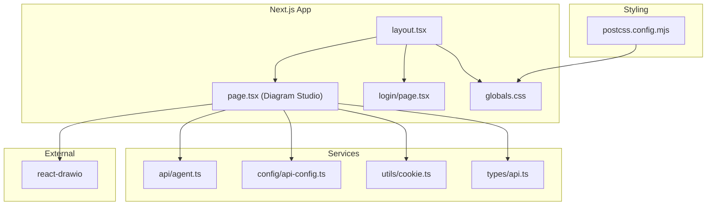
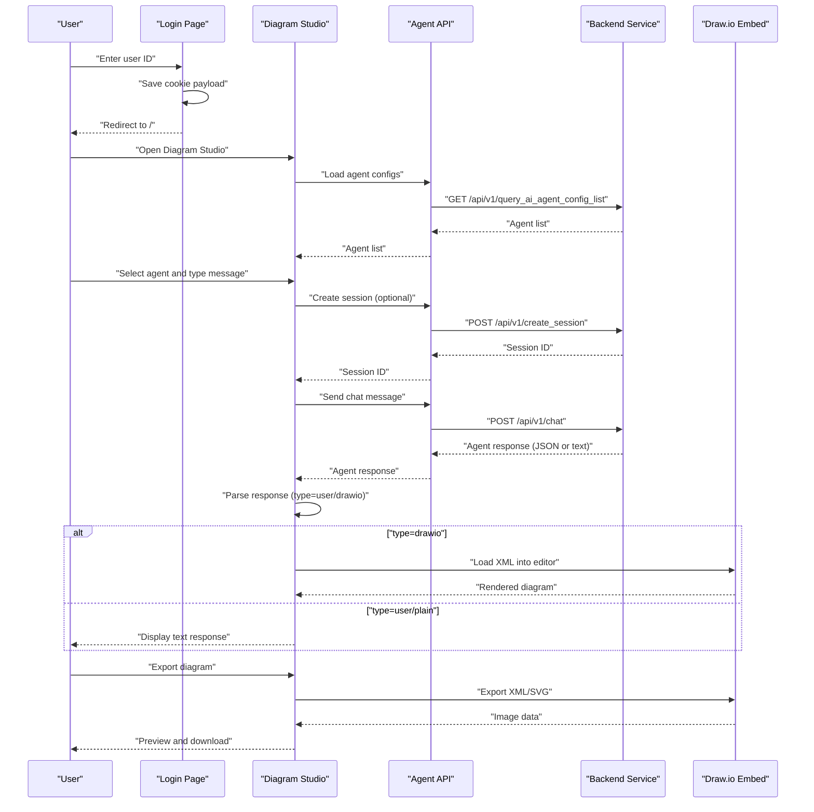
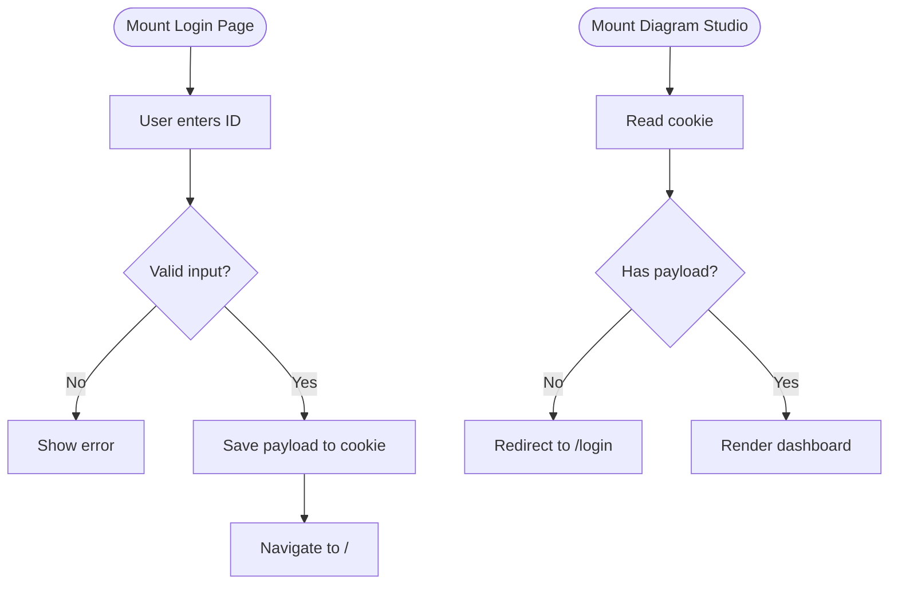
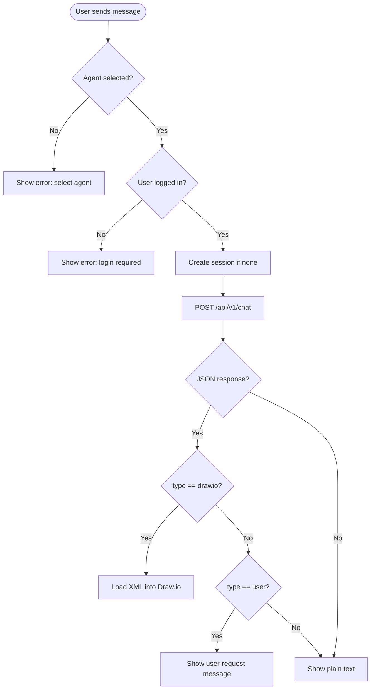
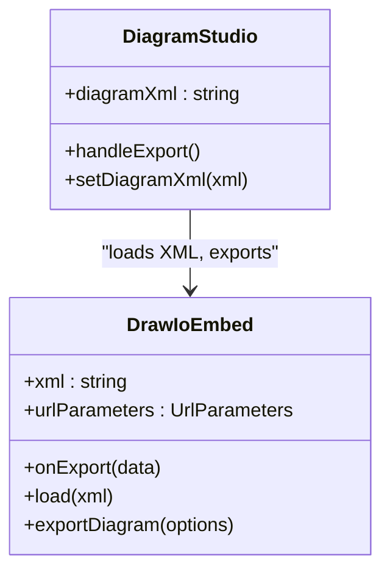
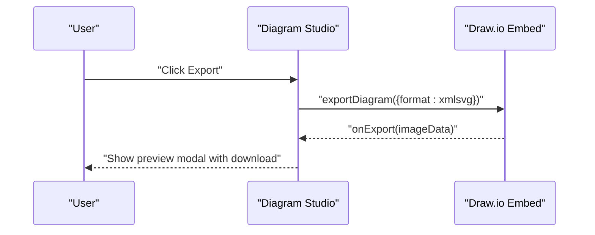
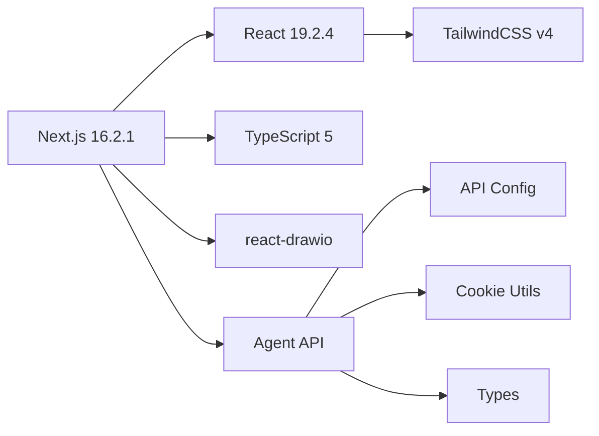

# Project Overview

<cite>
**Referenced Files in This Document**
- [README.md](file://README.md)
- [package.json](file://package.json)
- [next.config.ts](file://next.config.ts)
- [postcss.config.mjs](file://postcss.config.mjs)
- [src/app/layout.tsx](file://src/app/layout.tsx)
- [src/app/page.tsx](file://src/app/page.tsx)
- [src/app/login/page.tsx](file://src/app/login/page.tsx)
- [src/config/api-config.ts](file://src/config/api-config.ts)
- [src/api/agent.ts](file://src/api/agent.ts)
- [src/utils/cookie.ts](file://src/utils/cookie.ts)
- [src/types/api.ts](file://src/types/api.ts)
- [src/app/globals.css](file://src/app/globals.css)
- [docs/react-drawio.md](file://docs/react-drawio.md)
</cite>

## Table of Contents

1. [Introduction](#introduction)
2. [Project Structure](#project-structure)
3. [Core Components](#core-components)
4. [Architecture Overview](#architecture-overview)
5. [Detailed Component Analysis](#detailed-component-analysis)
6. [Dependency Analysis](#dependency-analysis)
7. [Performance Considerations](#performance-considerations)
8. [Troubleshooting Guide](#troubleshooting-guide)
9. [Conclusion](#conclusion)

## Introduction

This project is an AI-powered diagram creation and editing platform built with Next.js. It combines a chat-based AI
assistant with an interactive Draw.io editor to streamline the entire diagram lifecycle: ideation, collaboration,
iteration, and export. Users can select from multiple AI agents, chat with them to describe diagrams, receive
AI-generated XML that renders live in the Draw.io editor, and export the final artwork.

Key value propositions:

- AI-assisted ideation and refinement of diagrams via natural language
- Real-time collaborative editing powered by Draw.io’s embed mode
- Seamless authentication and session management for personalized experiences
- Straightforward export to SVG for high-quality visuals suitable for documentation and presentations

## Project Structure

The application follows Next.js App Router conventions with a minimal, focused structure:

- Root layout and global styles define the theme and typography
- A landing page for login and a main studio page for diagramming
- API service layer for backend communication
- Utilities for cookie-based authentication
- Strongly typed API contracts and shared types
- Tailwind CSS v4 configured via PostCSS plugin

**Diagram sources**

- [src/app/layout.tsx:1-34](file://src/app/layout.tsx#L1-L34)
- [src/app/page.tsx:1-600](file://src/app/page.tsx#L1-L600)
- [src/app/login/page.tsx:1-173](file://src/app/login/page.tsx#L1-L173)
- [src/config/api-config.ts:1-28](file://src/config/api-config.ts#L1-L28)
- [src/api/agent.ts:1-191](file://src/api/agent.ts#L1-L191)
- [src/utils/cookie.ts:1-111](file://src/utils/cookie.ts#L1-L111)
- [src/types/api.ts:1-74](file://src/types/api.ts#L1-L74)
- [src/app/globals.css:1-27](file://src/app/globals.css#L1-L27)
- [postcss.config.mjs:1-8](file://postcss.config.mjs#L1-L8)

**Section sources**

- [README.md:1-37](file://README.md#L1-L37)
- [package.json:1-28](file://package.json#L1-L28)
- [next.config.ts:1-8](file://next.config.ts#L1-L8)
- [postcss.config.mjs:1-8](file://postcss.config.mjs#L1-L8)
- [src/app/layout.tsx:1-34](file://src/app/layout.tsx#L1-L34)
- [src/app/globals.css:1-27](file://src/app/globals.css#L1-L27)

## Core Components

- Authentication and session management:
    - Cookie-based login with a dedicated payload stored in a cookie
    - Automatic redirect to login when unauthenticated
    - Timestamped login info for user visibility
- AI agent integration:
    - Dynamic agent list loading
    - Session creation per agent and user
    - Non-streaming chat with JSON-parsed responses that can carry either plain text or Draw.io XML
- Real-time diagram editing:
    - Draw.io embedded editor with dark UI and library support
    - Live XML updates and programmatic export
- Export capabilities:
    - SVG export with preview modal and download action

**Section sources**

- [src/app/login/page.tsx:1-173](file://src/app/login/page.tsx#L1-L173)
- [src/utils/cookie.ts:1-111](file://src/utils/cookie.ts#L1-L111)
- [src/config/api-config.ts:1-28](file://src/config/api-config.ts#L1-L28)
- [src/api/agent.ts:1-191](file://src/api/agent.ts#L1-L191)
- [src/app/page.tsx:1-600](file://src/app/page.tsx#L1-L600)
- [docs/react-drawio.md:1-168](file://docs/react-drawio.md#L1-L168)

## Architecture Overview

The frontend is a Next.js 16.2.1 application using React 19.2.4 with TypeScript and TailwindCSS v4. It communicates with
a backend service via a centralized API configuration. The main runtime flow integrates authentication, agent selection,
chat-driven diagram generation, and Draw.io rendering/export.

**Diagram sources**

- [src/app/login/page.tsx:1-173](file://src/app/login/page.tsx#L1-L173)
- [src/app/page.tsx:1-600](file://src/app/page.tsx#L1-L600)
- [src/config/api-config.ts:1-28](file://src/config/api-config.ts#L1-L28)
- [src/api/agent.ts:1-191](file://src/api/agent.ts#L1-L191)
- [docs/react-drawio.md:1-168](file://docs/react-drawio.md#L1-L168)

## Detailed Component Analysis

### Authentication System

- Cookie utilities manage login payload storage, retrieval, and clearing
- Login page captures user ID, validates input, and persists a timestamped payload
- Diagram studio checks for cookie presence on mount and redirects to login if missing
- User ID and formatted login time are displayed in the header

**Diagram sources**

- [src/app/login/page.tsx:1-173](file://src/app/login/page.tsx#L1-L173)
- [src/utils/cookie.ts:1-111](file://src/utils/cookie.ts#L1-L111)
- [src/app/page.tsx:1-600](file://src/app/page.tsx#L1-L600)

**Section sources**

- [src/app/login/page.tsx:1-173](file://src/app/login/page.tsx#L1-L173)
- [src/utils/cookie.ts:1-111](file://src/utils/cookie.ts#L1-L111)
- [src/app/page.tsx:1-600](file://src/app/page.tsx#L1-L600)

### AI Agent Integration and Chat

- Agent configuration list is fetched on mount and cached locally
- Sessions are created per agent and user to maintain conversational context
- Chat responses are parsed as JSON; if type is "drawio", the content is treated as XML and loaded into the editor
- If type is "user", the agent is requesting more information
- Non-JSON responses fall back to plain text display

**Diagram sources**

- [src/app/page.tsx:118-233](file://src/app/page.tsx#L118-L233)
- [src/api/agent.ts:106-113](file://src/api/agent.ts#L106-L113)
- [src/types/api.ts:44-50](file://src/types/api.ts#L44-L50)

**Section sources**

- [src/app/page.tsx:118-233](file://src/app/page.tsx#L118-L233)
- [src/api/agent.ts:75-113](file://src/api/agent.ts#L75-L113)
- [src/types/api.ts:13-74](file://src/types/api.ts#L13-L74)

### Real-time Diagram Editing with Draw.io

- The Draw.io embed is configured with a dark UI, libraries, and spinners
- XML content can be loaded from agent responses
- Export triggers capture image data for preview and download

**Diagram sources**

- [src/app/page.tsx:345-355](file://src/app/page.tsx#L345-L355)
- [docs/react-drawio.md:108-168](file://docs/react-drawio.md#L108-L168)

**Section sources**

- [src/app/page.tsx:345-355](file://src/app/page.tsx#L345-L355)
- [docs/react-drawio.md:1-168](file://docs/react-drawio.md#L1-L168)

### Export Capabilities

- Export button initiates programmatic export via the Draw.io embed
- Exported image is shown in a modal with a download link

**Diagram sources**

- [src/app/page.tsx:109-115](file://src/app/page.tsx#L109-L115)
- [src/app/page.tsx:546-596](file://src/app/page.tsx#L546-L596)
- [docs/react-drawio.md:75-106](file://docs/react-drawio.md#L75-L106)

**Section sources**

- [src/app/page.tsx:109-115](file://src/app/page.tsx#L109-L115)
- [src/app/page.tsx:546-596](file://src/app/page.tsx#L546-L596)
- [docs/react-drawio.md:75-106](file://docs/react-drawio.md#L75-L106)

## Dependency Analysis

Technology stack and external integrations:

- Next.js 16.2.1 (App Router)
- React 19.2.4 and React DOM 19.2.4
- TypeScript 5 for type safety
- TailwindCSS v4 via @tailwindcss/postcss plugin
- react-drawio for Draw.io integration
- Local cookie utilities for authentication persistence

**Diagram sources**

- [package.json:11-26](file://package.json#L11-L26)
- [src/config/api-config.ts:1-28](file://src/config/api-config.ts#L1-L28)
- [src/api/agent.ts:1-191](file://src/api/agent.ts#L1-L191)
- [src/utils/cookie.ts:1-111](file://src/utils/cookie.ts#L1-L111)
- [src/types/api.ts:1-74](file://src/types/api.ts#L1-L74)

**Section sources**

- [package.json:1-28](file://package.json#L1-L28)
- [postcss.config.mjs:1-8](file://postcss.config.mjs#L1-L8)

## Performance Considerations

- Client-side routing and static fonts minimize initial bundle overhead
- Dark theme reduces rendering costs on low-power devices
- Export previews avoid unnecessary re-renders by gating modal rendering
- API calls are kept minimal and errors are surfaced early to prevent cascading failures

## Troubleshooting Guide

Common issues and resolutions:

- Backend connectivity errors:
    - The agent API includes a helper to detect backend unavailability and surface actionable messages
    - Verify the base URL and endpoint configuration
- Session creation failures:
    - Ensure agent and user IDs are present before creating sessions
- Draw.io export issues:
    - Confirm the embed is initialized and the XML is valid before exporting
- Authentication problems:
    - Check cookie presence and payload validity; clear and re-login if needed

**Section sources**

- [src/api/agent.ts:181-190](file://src/api/agent.ts#L181-L190)
- [src/config/api-config.ts:6-7](file://src/config/api-config.ts#L6-L7)
- [src/app/page.tsx:146-153](file://src/app/page.tsx#L146-L153)
- [src/utils/cookie.ts:63-101](file://src/utils/cookie.ts#L63-L101)

## Conclusion

This project delivers a cohesive, AI-enhanced diagram creation experience by combining a streamlined chat interface with
a powerful, real-time drawing editor. Its modular architecture, strong typing, and clear separation of concerns enable
rapid iteration and reliable operation. The value lies in reducing friction between ideas and visual artifacts, enabling
teams to collaborate more effectively on diagrams without leaving the application.