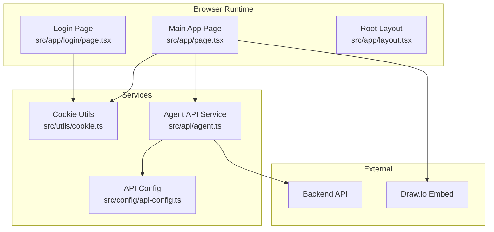
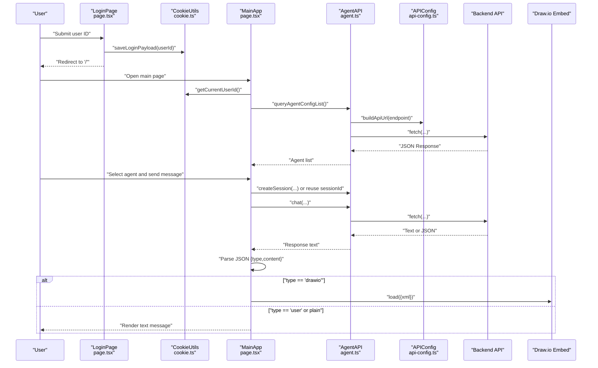
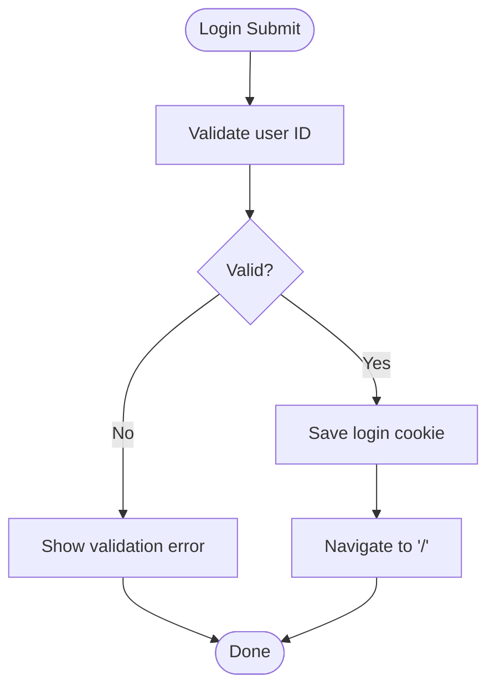
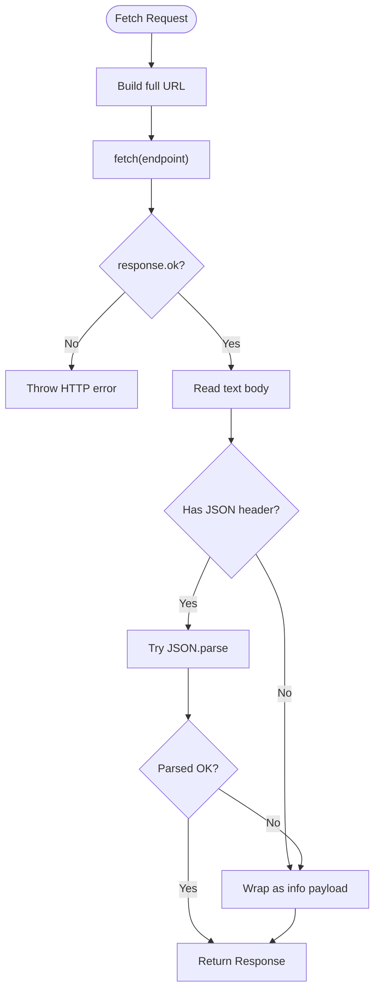
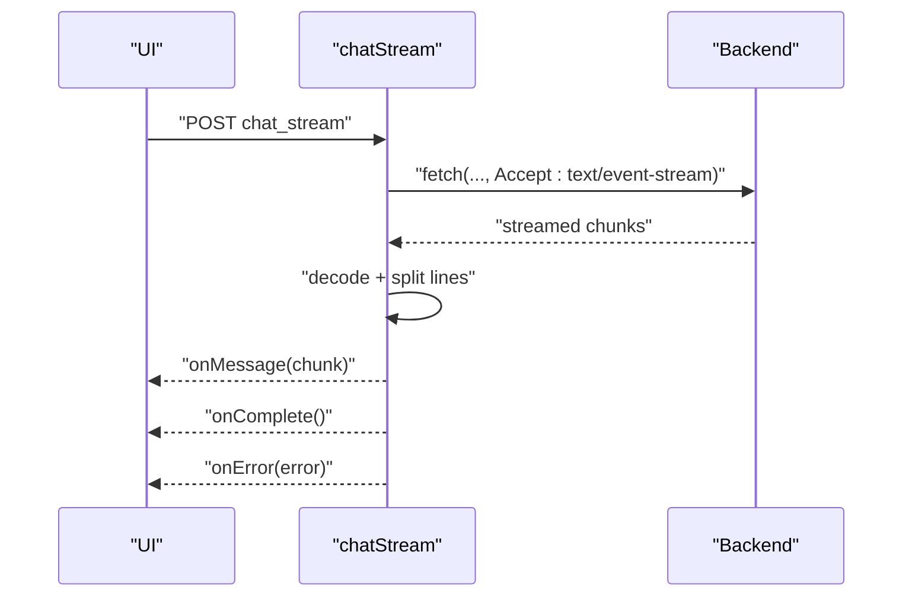
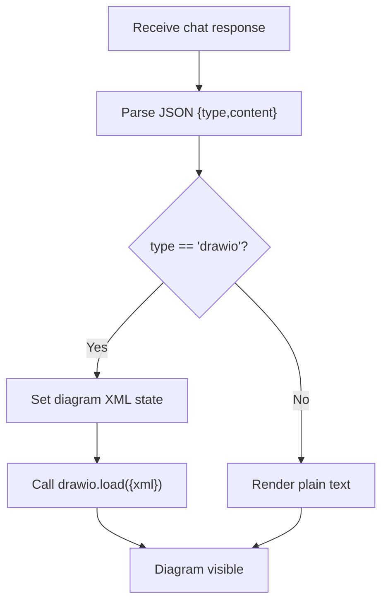
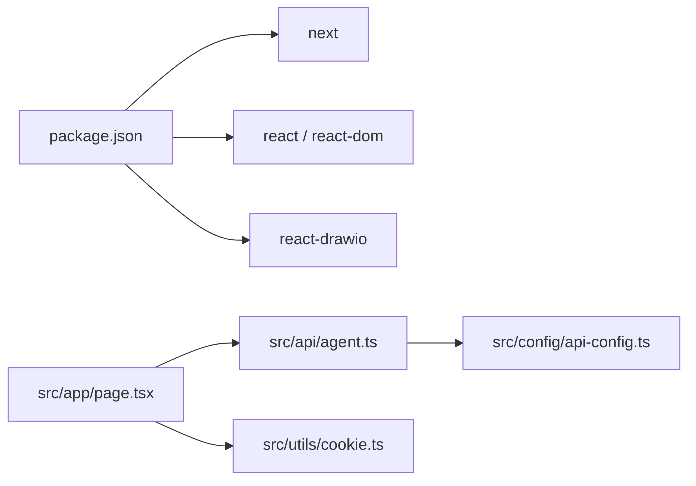

# Troubleshooting

<cite>
**Referenced Files in This Document**
- [README.md](file://README.md)
- [package.json](file://package.json)
- [next.config.ts](file://next.config.ts)
- [src/api/agent.ts](file://src/api/agent.ts)
- [src/config/api-config.ts](file://src/config/api-config.ts)
- [src/types/api.ts](file://src/types/api.ts)
- [src/utils/cookie.ts](file://src/utils/cookie.ts)
- [src/app/login/page.tsx](file://src/app/login/page.tsx)
- [src/app/page.tsx](file://src/app/page.tsx)
- [src/app/layout.tsx](file://src/app/layout.tsx)
</cite>

## Table of Contents

1. [Introduction](#introduction)
2. [Project Structure](#project-structure)
3. [Core Components](#core-components)
4. [Architecture Overview](#architecture-overview)
5. [Detailed Component Analysis](#detailed-component-analysis)
6. [Dependency Analysis](#dependency-analysis)
7. [Performance Considerations](#performance-considerations)
8. [Troubleshooting Guide](#troubleshooting-guide)
9. [Conclusion](#conclusion)
10. [Appendices](#appendices)

## Introduction

This document provides a comprehensive troubleshooting guide for the AI Agent Scaffold Frontend. It focuses on
diagnosing and resolving common issues such as authentication failures, API connectivity problems, diagram rendering
errors, and chat communication failures. It also covers systematic debugging approaches for network requests, state
management, UI rendering, error message interpretation, log analysis techniques, environment-specific fixes, browser
compatibility, performance bottlenecks, recovery procedures for corrupted sessions or partial diagram corruption, and
escalation paths.

## Project Structure

The frontend is a Next.js application with a small, focused client-side architecture:

- Authentication via a lightweight cookie-based login flow
- API service layer wrapping fetch requests and response parsing
- Centralized API configuration and endpoint constants
- Main application page orchestrating agent selection, session creation, chat, and Draw.io integration
- Minimal global layout and styling

**Diagram sources**

- [src/app/login/page.tsx:1-173](file://src/app/login/page.tsx#L1-L173)
- [src/app/page.tsx:1-600](file://src/app/page.tsx#L1-L600)
- [src/app/layout.tsx:1-34](file://src/app/layout.tsx#L1-L34)
- [src/utils/cookie.ts:1-111](file://src/utils/cookie.ts#L1-L111)
- [src/api/agent.ts:1-191](file://src/api/agent.ts#L1-L191)
- [src/config/api-config.ts:1-28](file://src/config/api-config.ts#L1-L28)

**Section sources**

- [README.md:1-37](file://README.md#L1-L37)
- [package.json:1-28](file://package.json#L1-L28)
- [next.config.ts:1-8](file://next.config.ts#L1-L8)

## Core Components

- Authentication and session persistence:
    - Cookie utilities manage login payload storage and retrieval
    - Login page writes a cookie and navigates to the main page
- API layer:
    - Centralized endpoint constants and base URL resolution
    - Unified request builder with JSON parsing and error handling
    - Non-streaming and streaming chat handlers
- Main application:
    - Agent list loading, session creation, and chat orchestration
    - Draw.io integration for diagram rendering and export
    - Status reporting and user feedback

**Section sources**

- [src/utils/cookie.ts:1-111](file://src/utils/cookie.ts#L1-L111)
- [src/app/login/page.tsx:1-173](file://src/app/login/page.tsx#L1-L173)
- [src/config/api-config.ts:1-28](file://src/config/api-config.ts#L1-L28)
- [src/api/agent.ts:1-191](file://src/api/agent.ts#L1-L191)
- [src/app/page.tsx:1-600](file://src/app/page.tsx#L1-L600)

## Architecture Overview

The frontend communicates with a backend API and renders diagrams via a Draw.io embed. The flow involves:

- Login writes a cookie and redirects to the main page
- Main page loads agent configurations, creates sessions, sends chat messages, and renders responses
- Responses may include structured content indicating diagram XML to render

**Diagram sources**

- [src/app/login/page.tsx:13-36](file://src/app/login/page.tsx#L13-L36)
- [src/utils/cookie.ts:72-78](file://src/utils/cookie.ts#L72-L78)
- [src/app/page.tsx:54-79](file://src/app/page.tsx#L54-L79)
- [src/app/page.tsx:144-233](file://src/app/page.tsx#L144-L233)
- [src/api/agent.ts:75-81](file://src/api/agent.ts#L75-L81)
- [src/api/agent.ts:87-100](file://src/api/agent.ts#L87-L100)
- [src/api/agent.ts:106-113](file://src/api/agent.ts#L106-L113)
- [src/config/api-config.ts:24-27](file://src/config/api-config.ts#L24-L27)

## Detailed Component Analysis

### Authentication Flow and Cookie Management

Common issues:

- Login does not persist or redirect fails
- Subsequent page loads show unauthenticated state
- Corrupted or missing login cookie

Diagnostic steps:

- Verify cookie presence and validity after login submission
- Confirm cookie name and payload structure
- Check SameSite/Lax behavior and domain/path settings
- Inspect browser developer tools Application/Cookies tab

Recovery:

- Clear the login cookie and re-authenticate
- Ensure environment variable for base URL is not interfering with local development

**Diagram sources**

- [src/app/login/page.tsx:13-36](file://src/app/login/page.tsx#L13-L36)
- [src/utils/cookie.ts:72-78](file://src/utils/cookie.ts#L72-L78)

**Section sources**

- [src/app/login/page.tsx:1-173](file://src/app/login/page.tsx#L1-L173)
- [src/utils/cookie.ts:1-111](file://src/utils/cookie.ts#L1-L111)

### API Connectivity and Request Handling

Common issues:

- Backend unreachable or CORS errors
- Unexpected non-JSON responses
- Session creation failures
- Chat response parsing errors

Diagnostic steps:

- Inspect network tab for request URLs, headers, and status codes
- Verify API base URL and endpoint constants
- Check response content-type and raw body
- Distinguish backend-unavailable vs. application-level errors

Recovery:

- Adjust NEXT_PUBLIC_API_BASE_URL to match backend address
- Ensure backend supports requested endpoints
- Retry after fixing CORS or proxy configuration

**Diagram sources**

- [src/api/agent.ts:20-58](file://src/api/agent.ts#L20-L58)
- [src/config/api-config.ts:24-27](file://src/config/api-config.ts#L24-L27)

**Section sources**

- [src/api/agent.ts:1-191](file://src/api/agent.ts#L1-L191)
- [src/config/api-config.ts:1-28](file://src/config/api-config.ts#L1-L28)
- [src/types/api.ts:6-11](file://src/types/api.ts#L6-L11)

### Chat Communication and Streaming

Common issues:

- Chat fails immediately or hangs
- Streaming stops unexpectedly
- Malformed or partial chunks cause errors

Diagnostic steps:

- Monitor network tab for SSE-like behavior and chunk boundaries
- Validate decoder buffer handling and line splitting
- Capture onMessage/onError callbacks for precise failure points

Recovery:

- Ensure backend returns proper text chunks
- Handle partial buffer flush at completion
- Re-create session if backend indicates stale state

**Diagram sources**

- [src/api/agent.ts:120-176](file://src/api/agent.ts#L120-L176)

**Section sources**

- [src/api/agent.ts:120-176](file://src/api/agent.ts#L120-L176)

### Diagram Rendering and Draw.io Integration

Common issues:

- Diagram not updating after agent response
- XML malformed or unsupported
- Export preview not appearing

Diagnostic steps:

- Inspect parsed response type and content
- Validate XML string and load into Draw.io embed
- Confirm embed props and URL parameters
- Check export callback and image data availability

Recovery:

- Ensure agent responds with JSON containing type "drawio" and valid XML
- Sanitize or regenerate XML if corrupted
- Trigger load again after setting XML state

**Diagram sources**

- [src/app/page.tsx:164-177](file://src/app/page.tsx#L164-L177)

**Section sources**

- [src/app/page.tsx:160-180](file://src/app/page.tsx#L160-L180)

## Dependency Analysis

- Runtime dependencies include Next.js, React, and react-drawio
- No explicit runtime dependency on the API service or config is present in the main page; they are imported
  conditionally during actions
- Environment variables drive API base URL resolution

**Diagram sources**

- [package.json:11-26](file://package.json#L11-L26)
- [src/app/page.tsx:6-9](file://src/app/page.tsx#L6-L9)
- [src/api/agent.ts:6-15](file://src/api/agent.ts#L6-L15)
- [src/config/api-config.ts:7](file://src/config/api-config.ts#L7)

**Section sources**

- [package.json:1-28](file://package.json#L1-L28)
- [src/app/page.tsx:1-600](file://src/app/page.tsx#L1-L600)
- [src/api/agent.ts:1-191](file://src/api/agent.ts#L1-L191)
- [src/config/api-config.ts:1-28](file://src/config/api-config.ts#L1-L28)

## Performance Considerations

- Network latency:
    - Minimize round trips by reusing sessions when possible
    - Batch UI updates after multiple message renders
- Rendering:
    - Debounce textarea height adjustment
    - Avoid unnecessary re-renders by memoizing derived values
- Streaming:
    - Ensure efficient chunk processing and minimal allocations
- Storage:
    - Prefer lightweight localStorage keys for agent selection
- Fonts and styles:
    - Keep Tailwind usage scoped to avoid large CSS bundles

[No sources needed since this section provides general guidance]

## Troubleshooting Guide

### Authentication Failures

Symptoms:

- Redirect loop to login
- Login form shows validation errors
- Main page appears blank or shows loading spinner

Checklist:

- Confirm user ID is non-empty on submit
- Verify cookie is set with expected name and payload
- Ensure SameSite/Lax cookie is readable by the page
- Check browser console for exceptions during cookie write/read

Actions:

- Clear the login cookie and re-enter user ID
- Confirm environment allows cookies for localhost
- If using a proxy, ensure cookie domain/path align with origin

**Section sources**

- [src/app/login/page.tsx:13-36](file://src/app/login/page.tsx#L13-L36)
- [src/utils/cookie.ts:63-85](file://src/utils/cookie.ts#L63-L85)
- [src/app/page.tsx:37-51](file://src/app/page.tsx#L37-L51)

### API Connectivity Problems

Symptoms:

- Agents fail to load with “backend unavailable” status
- Session creation or chat requests fail
- Network tab shows CORS errors or 500/503 responses

Checklist:

- Verify NEXT_PUBLIC_API_BASE_URL points to the running backend
- Confirm endpoints exist and respond with JSON
- Check Content-Type header and body format
- Distinguish network errors from application errors

Actions:

- Update API base URL to backend address
- Add CORS allowance on backend
- Retry after backend restart

**Section sources**

- [src/config/api-config.ts:7](file://src/config/api-config.ts#L7)
- [src/api/agent.ts:20-58](file://src/api/agent.ts#L20-L58)
- [src/app/page.tsx:69-75](file://src/app/page.tsx#L69-L75)

### Chat Communication Failures

Symptoms:

- Send button disabled or stuck in sending state
- Errors displayed in status bar
- No response received

Checklist:

- Ensure agent is selected and user is logged in
- Confirm sessionId exists or is created before sending
- Inspect thrown errors and backend-unavailable detection
- For streaming, verify Accept header and response body stream

Actions:

- Select an agent and retry
- Clear session state and re-create session
- Inspect network tab for SSE chunking behavior

**Section sources**

- [src/app/page.tsx:118-233](file://src/app/page.tsx#L118-L233)
- [src/api/agent.ts:87-100](file://src/api/agent.ts#L87-L100)
- [src/api/agent.ts:120-176](file://src/api/agent.ts#L120-L176)

### Diagram Rendering Errors

Symptoms:

- Agent responds with diagram but editor remains empty
- XML appears malformed or unsupported
- Export preview does not show image

Checklist:

- Validate parsed response type is "drawio"
- Confirm XML string is well-formed
- Ensure Draw.io embed receives XML and loads successfully
- Check export callback and image data availability

Actions:

- Regenerate diagram from agent if XML is invalid
- Force reload by resetting XML state and calling load again
- Verify embed URL parameters and dark mode settings

**Section sources**

- [src/app/page.tsx:164-177](file://src/app/page.tsx#L164-L177)
- [src/types/api.ts:47-50](file://src/types/api.ts#L47-L50)

### State Management Debugging

Symptoms:

- UI shows inconsistent state (e.g., agent not selected)
- Messages list grows unexpectedly
- Typing indicator stuck on

Checklist:

- Log state transitions for agents, sessionId, messages, and input
- Verify localStorage keys for agent selection
- Check useEffect dependencies and event handlers

Actions:

- Reset agent selection and clear sessionId when switching agents
- Normalize message timestamps and IDs
- Ensure refs (e.g., messagesEndRef) are attached before scroll

**Section sources**

- [src/app/page.tsx:93-100](file://src/app/page.tsx#L93-L100)
- [src/app/page.tsx:131-211](file://src/app/page.tsx#L131-L211)

### UI Rendering Issues

Symptoms:

- Layout shifts or overflow
- Textarea does not resize properly
- Chat panel not visible

Checklist:

- Confirm chatOpen state controls width and visibility
- Validate textarea auto-resize logic
- Ensure embed container has proper sizing

Actions:

- Toggle chat panel to restore layout
- Adjust CSS utilities or Tailwind classes if needed
- Re-render embed by resetting XML state

**Section sources**

- [src/app/page.tsx:359-542](file://src/app/page.tsx#L359-L542)

### Error Message Interpretation

Common patterns:

- Backend-unavailable errors detected by substring matches
- Application-level errors wrap response info
- Parsing failures fall back to raw info

Guidance:

- Use backend-unavailable detection to prompt base URL checks
- For non-JSON responses, rely on info field from wrapper
- Log raw body and content-type for diagnostics

**Section sources**

- [src/api/agent.ts:52-58](file://src/api/agent.ts#L52-L58)
- [src/api/agent.ts:63-69](file://src/api/agent.ts#L63-L69)
- [src/api/agent.ts:181-190](file://src/api/agent.ts#L181-L190)

### Log Analysis Techniques

- Browser DevTools:
    - Network: inspect request/response bodies, headers, status
    - Console: capture thrown errors and stack traces
    - Application: verify cookie and localStorage entries
- Frontend logging:
    - Wrap API calls with try/catch and log error messages
    - Track sessionId lifecycle and agent selection changes

**Section sources**

- [src/app/page.tsx:69-75](file://src/app/page.tsx#L69-L75)
- [src/app/page.tsx:213-229](file://src/app/page.tsx#L213-L229)

### Environment-Specific Problems

- Localhost vs. production:
    - Ensure NEXT_PUBLIC_API_BASE_URL matches backend host/port
    - Verify CORS policies for cross-origin requests
- Proxy and reverse proxy:
    - Confirm path routing and header forwarding
- Environment variables:
    - Validate NEXT_PUBLIC_* availability in browser bundle

**Section sources**

- [src/config/api-config.ts:7](file://src/config/api-config.ts#L7)
- [next.config.ts:1-8](file://next.config.ts#L1-L8)

### Browser Compatibility Issues

- Fetch and Streams:
    - Ensure browser supports fetch and ReadableStream
    - Polyfills may be needed for older browsers
- Cookies:
    - Confirm SameSite/Lax behavior across browsers
- CSS and layout:
    - Tailwind utilities should work consistently; test on target browsers

**Section sources**

- [src/api/agent.ts:129-145](file://src/api/agent.ts#L129-L145)
- [src/utils/cookie.ts:38](file://src/utils/cookie.ts#L38)

### Performance Bottlenecks

- Reduce re-renders by memoizing derived values
- Debounce heavy UI updates (e.g., textarea resizing)
- Minimize DOM updates during streaming message rendering
- Optimize embedded editor usage

**Section sources**

- [src/app/page.tsx:512-517](file://src/app/page.tsx#L512-L517)

### Recovery Procedures

- Corrupted session data:
    - Clear sessionId and force re-create session
    - On error, reset to initial state and retry
- Failed agent connections:
    - Switch agent or refresh agent list
    - Verify backend health and endpoint availability
- Partial diagram corruption:
    - Re-render by setting XML state again
    - Request a fresh diagram from the agent

**Section sources**

- [src/app/page.tsx:146-153](file://src/app/page.tsx#L146-L153)
- [src/app/page.tsx:171-177](file://src/app/page.tsx#L171-L177)

### Escalation Paths and Support Resources

- Internal logs:
    - Collect browser console and network logs
    - Capture API base URL and environment configuration
- Backend team:
    - Provide endpoint names and recent request IDs
    - Share error messages and response codes
- Community and documentation:
    - Review Next.js and React documentation for framework-specific issues
    - Consult react-drawio documentation for embedding issues

**Section sources**

- [README.md:23-37](file://README.md#L23-L37)
- [package.json:11-26](file://package.json#L11-L26)

## Conclusion

This guide consolidates practical, step-by-step approaches to diagnose and resolve common issues in the AI Agent
Scaffold Frontend. By focusing on authentication, API connectivity, chat communication, and diagram rendering, teams can
quickly isolate root causes, apply targeted fixes, and escalate effectively when needed.

## Appendices

### Quick Reference: Common Checks

- Authentication: cookie name, payload, SameSite/Lax
- API: base URL, endpoints, content-type, CORS
- Chat: agent selected, sessionId exists, streaming chunks
- Diagram: type "drawio", valid XML, embed load success
- State: agent selection, messages, refs, autoscroll

**Section sources**

- [src/utils/cookie.ts:8](file://src/utils/cookie.ts#L8)
- [src/config/api-config.ts:10-22](file://src/config/api-config.ts#L10-L22)
- [src/app/page.tsx:93-100](file://src/app/page.tsx#L93-L100)
- [src/types/api.ts:47-50](file://src/types/api.ts#L47-L50)